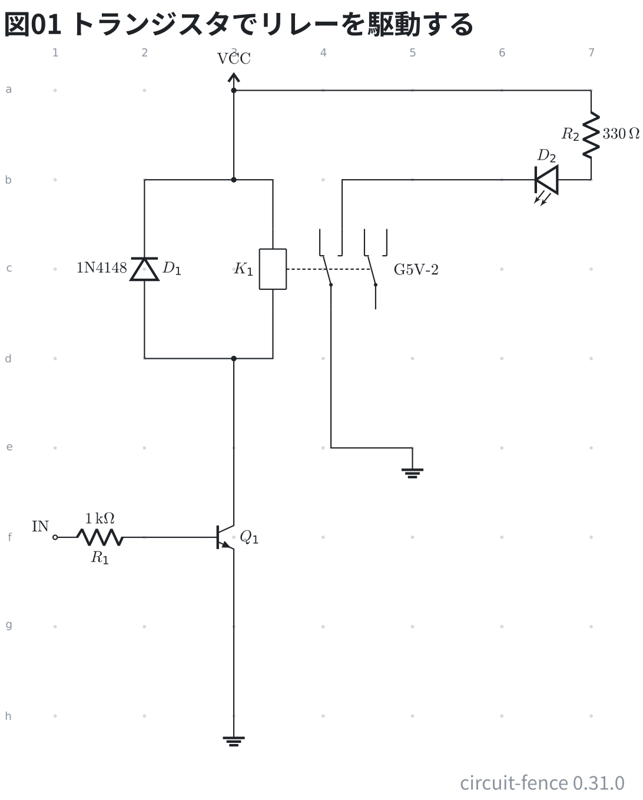
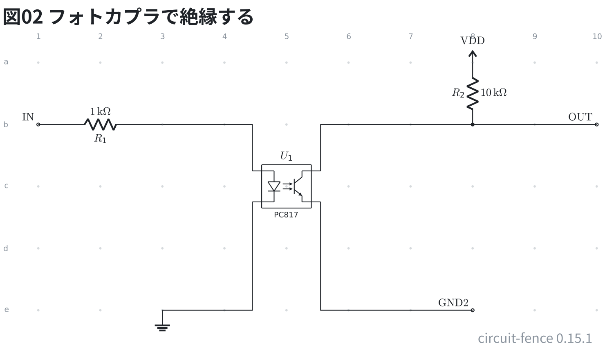
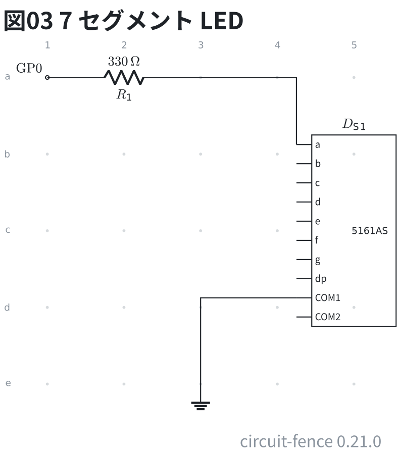

# ピンに名前のある部品 (リレー・フォトカプラ・7 セグ)

リレー (`relay`)、フォトカプラ (`photocoupler`)、7 セグメント LED (`seg7`) は、
**ピンの名前と番号が実体配線図の 2 つと同じ表**から出る。配線からは名前でも
番号でも指せる (`K1.COM1` も `K1.4` も同じ)。ネットリストには名前で出る。

```circuit
title: 図01 トランジスタでリレーを駆動する
parts:
  VCC: vcc 3,1
  D1:  diode 2,4 2,2 1N4148
  K1:  relay 4,3 G5V-2
  Q1:  npn 3,6
  R1:  resistor 1,6 2,6 1k
  IN:  port 1,6
  G1:  ground 3,8
  R2:  resistor 7,1 7,2 330
  D2:  led 7,2 6,2
  G2:  ground 5,5
wires:
  - 3,1 -- 3,2 -- 2,2
  - 3,1 -- 7,1
  - K1.A1 |- 3,2
  - K1.A2 |- 3,4
  - 2,4 -- 3,4 -- Q1.C
  - 2,6 -- Q1.B
  - Q1.E -- 3,8
  - K1.NO1 |- 6,2
  - K1.COM1 |- 5,5
style:
  grid: on
```



リレーは**左にコイル、右に c 接点 2 つ**で、コイルに電流が流れていない形
(共通 `COM` が `NC` 側) で描く。ピンは上下の辺だけに出る — 上がコイルの `A1` と
接点の `NC` `NO`、下が `A2` と `COM`。ピンの番号は G5V-2 (DIP16 の位置) のもの。
**使わない接点は ERC が言わない** — 2 回路のうち 1 つしか使わないのが普通のため。

ピンは格子の上に無いので、`|-` か `-|` で引く (上の図の `K1.NO1 |- 6,2`)。

```circuit
title: 図02 フォトカプラで絶縁する
parts:
  IN:   port 1,2
  R1:   resistor 1,2 3,2 1k
  U1:   photocoupler 5,3 PC817
  G1:   ground 3,5
  VDD:  vcc 8,1
  R2:   resistor 8,1 8,2 10k
  OUT:  port 10,2
  GND2: port 8,5
wires:
  - 3,2 -| U1.A
  - U1.K |- 3,5
  - U1.C |- 8,2
  - 8,2 -- 10,2
  - U1.E |- 8,5
style:
  grid: on
```



フォトカプラは**左に LED (`A` `K`)、右にフォトトランジスタ (`C` `E`)**。
外枠が 1 つの部品であることの印。ピンの番号は PC817 のもの
(1 `A` / 2 `K` / 3 `E` / 4 `C`)。出口の側のグラウンドは入口と別のネットに
したいので、`ground` ではなくポート (`GND2`) で書いている — `ground` はどれも
1 つのネット (`GND`) になる。

```circuit
title: 図03 7 セグメント LED
parts:
  GP0: port 1,1
  R1:  resistor 1,1 3,1 330
  DS1: seg7 5,3 5161AS
  G1:  ground 3,5
wires:
  - 3,1 -| DS1.a
  - DS1.COM1 -| 3,5
style:
  grid: on
```



7 セグは**ピンの名前を刷った箱**で描く (機器と同じ形)。並びはセグメント
`a`〜`g`、点 `dp`、共通 `COM1` `COM2` の順で、番号は 5161AS (DIP10 の位置) の
もの — `DS1.3` は `COM1`。使わないピンは ERC が言わない。
