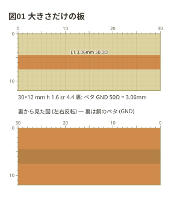
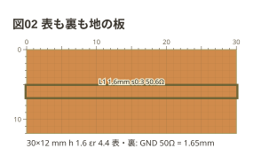
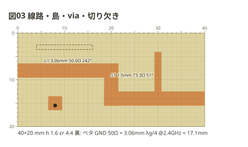
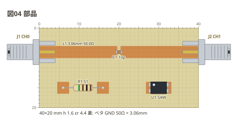
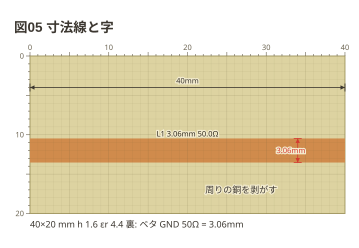

# copper フェンスの書き方

Markdown の ` ```copper ` フェンスに YAML を書くと、Markdown プレビューで
**銅張り基板の寸法図**になる — マイクロストリップ・コプレーナ・Manhattan の島を、
手で切る・剥がす・貼るための図。ここは文法の全部。
治具 1 つずつの例は [examples/](../examples/README.md) にある。

## 目次

- [板 (`board:`)](#板-board)
- [番地 (mm)](#番地-mm)
- [題 (`title:`) と周波数 (`f:`)](#題-title-と周波数-f)
- [銅の形 (`copper:`)](#銅の形-copper)
- [部品 (`parts:`)](#部品-parts)
- [配線 (`wires:`)](#配線-wires)
- [注釈 (`notes:`)](#注釈-notes)
- [見た目 (`style:`)](#見た目-style)
- [ネットリスト](#ネットリスト)
- [言われること](#言われること)
- [上限](#上限)

## 板 (`board:`)

大きさだけならスカラー、基材と地を書くならマップ。**書かなければ
40×20mm・厚さ 1.6mm・比誘電率 4.4・裏ベタ** (本の治具の大きさと、FR4 の
いちばん多い値) で描き、そう描いたことをお知らせで言う。

```copper
board: 30x12mm
title: 図01 大きさだけの板
copper:
  L1: line 0,6 30,6 3.06
```



**大きさには単位を付ける** (`40x20mm` `4x2cm`)。perfboard では同じ `40x20` が
穴の数になるので、黙って mm と読まない。辺は 5〜200mm。

| 項目 | 書くもの | 既定 |
| --- | --- | --- |
| `size` | 幅x高さ (`mm` か `cm`) | `40x20mm` |
| `h` | 基材の厚さ (mm) | `1.6` |
| `er` | 比誘電率 | `4.4` |
| `ground` | 地の在りか (`back` `front` `both` `none`) | `back` |
| `cut` | 表が地の板で、島のまわりに切る溝の幅 (mm) | `0.5` |

**地の在りか (`ground:`) で描き方と Z0 の式が変わる。**

| `ground:` | 地 | 図 | 線路の Z0 |
| --- | --- | --- | --- |
| `back` | 裏がベタ (両面板で表を剥がす) | 基材の上に銅 | マイクロストリップ |
| `front` | 表の残り (裏は使わない) | 銅の上に溝 | CPW |
| `both` | 表の残りと裏 | 銅の上に溝 | CPWG |
| `none` | 無い | 基材の上に銅 | 出さない |

```copper
board:
  size: 30x12mm
  ground: both
  cut: 0.3
title: 図02 表も裏も地の板
copper:
  L1: line 0,6 30,6 1.6
```



図の下の 1 行は板の実寸・基材・地の在りかと、**この板で 50Ω になる幅**
(表が地の板は `cut` の溝で測った幅)。`f:` を書けば λg/4 も添える。

## 番地 (mm)

位置は **mm の `x,y`**。原点は板の左上、x は右、y は下。小数は 2 桁 (0.01mm) まで。
**格子が無い板なので、文字の番地は振らない** — 板の上と左の目盛と 1mm の方眼で、
図から寸法を読んで切れる。

- 板の外も指せる (注釈・部品の端)。ただし板から 20mm まで
- 点の綴りは名前にできない (`10,5` は名前の字に入らない)

## 題 (`title:`) と周波数 (`f:`)

`title:` は図の題。文章から「図02 を直して」と指せる。

`f:` は設計の周波数 (`2.4G` `2400M` `1.575GHz` `433M`)。**書くと線路の字に電気長
(度) が付く** — 90° が λ/4。接頭辞は k・M・G だけ (m と M を取り違えると 10 億倍違う)。

## 銅の形 (`copper:`)

`名前: 形 …` を 1 行ずつ。**触れ合う形は 1 つの島 (ネット)** になる。

| 形 | 書き方 | 意味 |
| --- | --- | --- |
| `line` | `line 点 点 … 幅 [gap 溝]` | 線路。縦横の区間の折れ線と幅 (mm) |
| `pad` | `pad 中心 [幅x高さ]` | 矩形の島 (既定 4x4) |
| `via` | `via 中心 [穴の径]` | 裏の地へ落とす穴 (既定 0.8) |
| `slot` | `slot 中心 幅x高さ` | 地の切り欠き (銅ではない) |

```copper
board: 40x20mm
title: 図03 線路・島・via・切り欠き
f: 2.4G
copper:
  L1: line 0,8 20,8 20,14 40,14 3.06
  S1: line 30,14 30,4 1.5
  P1: pad 8,15 3x3
  V1: via 8,15.5
  X1: slot 10,3 12x1
```



- **線路の字は幅と Z0** (`L1 3.06mm 50.0Ω`)。表が地の板では溝の幅も
  (`1.6mm s0.3`)。`f:` があれば電気長
- 線路は**縦横だけ**。斜めの区間は断って、残りの区間は描く
- 幅を変えるときは線路を分けて書き、端を触れ合わせる (1 つの島になる)
- `via` は裏に地がある板 (`back` `both`) で島を地へ落とす。**表が地の板で
  どの銅にも触れない via は地の一部** (via の列で表と裏の地を留める)
- `slot` は表が地の板では溝、裏ベタの板では裏の物なので破線
- 平行に向かい合う線路の**隙間**は測って出す (`s0.5mm`)。基材の厚さの 2 倍より
  離れた線路には出さない

## 部品 (`parts:`)

置き方は種類で決まる。

| 種類 | 書き方 | 足 |
| --- | --- | --- |
| 端面 SMA | `sma 辺 位置 [値]` | `1` 中心導体 (縁から 1mm で銅に乗る)、`2` 外皮 (地へ) |
| 面実装 2 本足 | `種類/姿 中心 [r90] [値]` | `1` `2` (極性のある物は `1` がアノード) |
| 面実装 SOT | `種類/姿 中心 [r90] [mirror] [値]` | `1` `2` `3` (SOT-89 のタブは `2`) |
| 箱 | `box 中心 幅x高さ 足の数 [r90] [値]` | 左の辺を上から、右の辺を下から |
| 足のある部品 | `種類[/姿] 端 端 [値]` | `1` `2`。端は島の名前か点 |

```copper
board: 40x20mm
title: 図04 部品
copper:
  L1: line 0,6 40,6 3.06
  P1: pad 6,15 3x3
  P2: pad 16,15 3x3
  Q1: pad 27.5,15 1.4x3
  Q2: pad 32.5,15 1.4x3
parts:
  J1: sma left 6 CH0
  J2: sma right 6 CH1
  C1: capacitor/1608 20,6 10p
  R1: resistor P1 P2 51
  U1: box 30,15 4x3 4 SAW
```



**線路の上に置いた 2 本足の面実装は、線路を切る。** 切れ目は胴の長さの半分
(1608 で 0.8mm)。実物もカッターで切ってそこへ半田付けする。**線路と直角に
置いた物 (`r90`) は切らない** — 線路から地へ落とすシャントの置き方になる。
SOT と箱は切らない (足の落とし先は板ごとに違うので、線路は自分で分けて書く)。

書ける種類と姿。**綴りは perfboard と同じ**で、寸法も同じ表 (fence-kit) から引く。

```text
端面 SMA   sma  sma/female-edge (既定)  sma/male-edge
チップ     resistor capacitor inductor bead led     /1608 /2012 /3216
ダイオード  diode zener schottky varicap             /sod123 /sod323 /do214ac
SOT       transistor ic3 regulator                 /sot23 /sot346 /sot89
箱         box
足のある   resistor capacitor inductor led diode crystal zener schottky varicap …
```

- 別名 (`0603` `s-mini`) は綴りとしては受けず、「`0603` は `1608` と書きます」と言う
- 向きは `r90` `r180` `r270` (時計回り) と `mirror` (左右を裏返す)。perfboard と同じ語
- 略記 (`r` `c` `l` `d` `q` `tr` `reg` `xtal` `ec`) も書ける

## 配線 (`wires:`)

`- 端 -- 端 [色]`。**島どうしのジャンパ** (Manhattan の島を線でつなぐ)。
端は島 (`pad` `via`) の名前か点。**線路は配線ではなく `copper:` に書く** (幅が要る)。

## 注釈 (`notes:`)

図に印を付けて、文章から指せるようにするためのもの。回路の一員ではない。

| 印 | 書き方 | 出るもの |
| --- | --- | --- |
| `mark` | `mark 点 [色]` | 点を囲む丸 |
| `box` | `box 点 点 [色]` | 2 点を対角にした枠 |
| `arrow` | `arrow 点 点 [色]` | 1 つ目から 2 つ目への矢 |
| `dim` | `dim 点 点 [色]` | **寸法線** — 2 点の間の長さ (mm) を測って出す |
| `text` | `text 点 [色] [r90]: 字` | その点のそばの字 |
| `parts` | `parts [色]` | 部品表を図の下に |
| `source` | `source [色]` | フェンスの中身を囲みごと図の下に |

```copper
board: 40x20mm
title: 図05 寸法線と字
copper:
  L1: line 0,12 40,12 3.06
notes:
  - dim 0,4 40,4
  - dim 34,10.47 34,13.53 red
  - text 22,17: 周りの銅を剥がす
```



`text` だけは字を `:` の後ろに書く (3 つのフェンスと同じ形)。字にコロンと空白の
並びがあるときは、`:` の後ろを引用で囲む。

## 見た目 (`style:`)

| 項目 | 書くもの | 既定 |
| --- | --- | --- |
| `theme` | `light` `dark` `mono` | `light` |
| `width` | 図の横幅 (px、120〜4000) | 実寸なり |
| `grid` | 1mm の方眼 | `on` |
| `stamp` | 右下に処理系の版を刻む | `off` |
| `check` | ERC を掛ける | `on` |
| `debug` | お知らせを出す (読めなかった行は常に出る) | `on` |

名前 1 つだけなら `style: dark` とも書ける。縮尺は perfboard と同じ
(2.54mm = 20px) なので、並べると大きさが揃う。

## ネットリスト

島・地・足から導く。導通グループは 3 つ — **島** (最初に書いた形の名前、
チップで切れた線路の後ろ半分は `L1~2`)、**地** (`GND`)、どこにも乗っていない足。

```text
L1   : J1.1, C1.1
L1~2 : J2.1, C1.2
GND  : J1.2, J2.2
```

- 端面 SMA の外皮は板の地へ付く (地の無い板では自分だけのネット)
- 表が地の板では、島にも溝にも切り欠きにも無い所が地
- via は島を裏の地へ落とす
- 足が 1 本も乗っていない島 (結合線路の共振器など) はネットリストに出ない

## 言われること

読めなかった行は図の下の帯に**行番号・行の中身・綴りを指す印**つきで出る
(行番号は Markdown の行)。**板は必ず描く** (読めた所まで)。

読めたうえで、図のとおりに切って組むと動かない所は ERC が言う。止めずに描く。

| ERC | 例 |
| --- | --- |
| 銅に乗っていない足 | `C2 の 1 番の足 (29.36,16) の下に銅がありません` |
| SMA の中心導体が表の地に触れる | `J1 の中心導体 (0.05,10) が表の地に触れています` |
| 同じ部品の 2 本の足が同じ銅 | `C1 の 1 番と 2 番が同じ銅 (L1) に乗っています` |
| ジャンパの端が銅に乗っていない | `配線の端 (5,16) の下に銅がありません` |
| 手で切れない細さ (0.3mm 未満) | `L2 の幅 0.2mm は手で残すには細すぎます` |

**細さはエッチングなら正しい図**なので、お知らせとして言うだけにしてある。
読めなかった行があるうちは ERC を掛けない (掛けなかったことは言う)。
`style: check: off` で外せる。

## 上限

| 何 | 上限 |
| --- | --- |
| 板の辺 | 5〜200mm |
| 板の外 | 20mm まで |
| `copper:` の形 | 200 |
| 線路の点 | 20 |
| 幅・溝・大きさ | 0.05〜100mm |
| 部品 | 100 |
| 箱の足 | 64 |
| 配線 | 200 |
| 注釈 | 200 |
