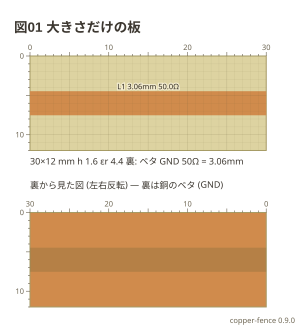
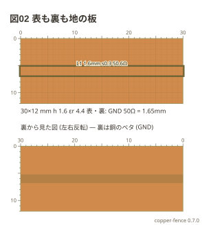
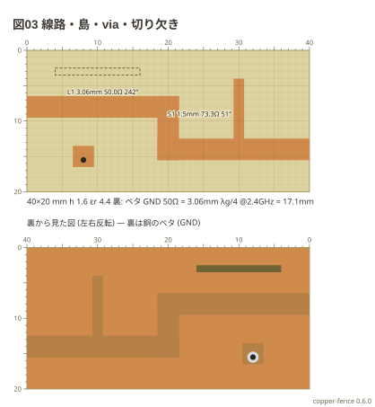
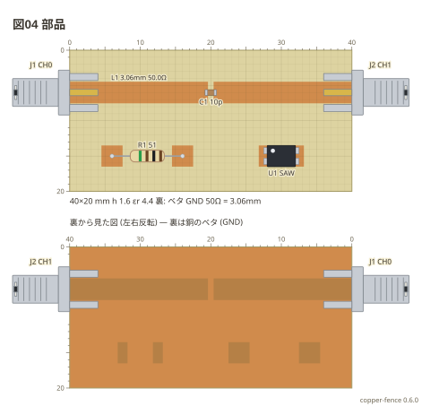
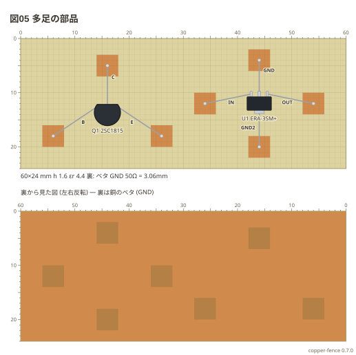
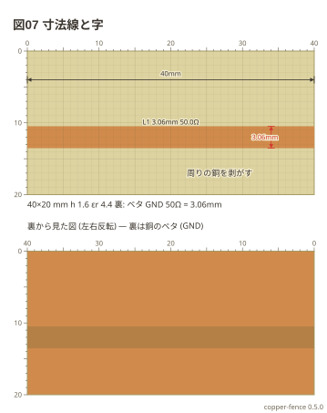

# copper フェンスの書き方

Markdown の ` ```copper ` フェンスに YAML を書くと、Markdown プレビューで
**銅張り基板の寸法図**になる — マイクロストリップ・コプレーナ・Manhattan の島を、
手で切る・剥がす・貼るための図。ここは文法の全部。
治具 1 つずつの例は [examples/](../examples/README.md) にある。

## 目次

- [基板 (`board:`)](#基板-board)
- [番地 (mm)](#番地-mm)
- [題 (`title:`) と周波数 (`f:`)](#題-title-と周波数-f)
- [銅の形 (`copper:`)](#銅の形-copper)
- [部品 (`parts:`)](#部品-parts)
- [配線 (`wires:`)](#配線-wires)
- [基板の外の機器 (`device`)](#基板の外の機器-device)
- [注釈 (`notes:`)](#注釈-notes)
- [見た目 (`style:`)](#見た目-style)
- [ネットリスト](#ネットリスト)
- [言われること](#言われること)
- [上限](#上限)

## 基板 (`board:`)

大きさだけならスカラー、基材と地を書くならマップ。**書かなければ
40×20mm・厚さ 1.6mm・比誘電率 4.4・裏ベタ** (本の治具の大きさと、FR4 の
いちばん多い値) で描き、そう描いたことをお知らせで言う。

```copper
board: 30x12mm
title: 図01 大きさだけの板
copper:
  L1: line 0,6 30,6 3.06mm
```



**大きさには単位を付ける** (`40x20mm` `4x2cm`)。perfboard では同じ `40x20` が
穴の数になるので、黙って mm と読まない。辺は 5〜200mm。

**長さはどこでも `mm` を付ける** — 基材の厚さ (`h: 1.6mm`)、溝 (`cut: 0.3mm`)、線路の幅
(`3.06mm`)、溝の幅 (`gap 0.3mm`)、島・切り欠き・箱の大きさ (`4x4mm`)、穴の径 (`0.8mm`)。
素の数 (`3`) は断る。**素の数のままでよいのは番地** (点 `20,10` と SMA の辺に沿った
位置 `sma left 10` — 基板の上の位置はいつも mm で、別の読み方が無い) と、無次元の
比誘電率 (`er: 4.4`) だけ。

| 項目 | 書くもの | 既定 |
| --- | --- | --- |
| `size` | 幅x高さ (`mm` か `cm`) | `40x20mm` |
| `h` | 基材の厚さ (`mm`) | `1.6mm` |
| `er` | 比誘電率 | `4.4` |
| `ground` | 地の在りか (`back` `front` `both` `none`) | `back` |
| `cut` | 表が地の基板で、島のまわりに切る溝の幅 (`mm`) | `0.5mm` |

**地の在りか (`ground:`) で描き方と Z0 の式が変わる。**

| `ground:` | 地 | 図 | 線路の Z0 |
| --- | --- | --- | --- |
| `back` | 裏がベタ (両面板で表を剥がす) | 基材の上に銅 | マイクロストリップ |
| `front` | 表の残り (裏は使わない) | 銅の上に溝 | CPW |
| `both` | 表の残りと裏 | 銅の上に溝 | CPWG |
| `none` | 無い | 基材の上に銅 | 出さない |

```copper
board:
  size: 30x12mm
  ground: both
  cut: 0.3mm
title: 図02 表も裏も地の板
copper:
  L1: line 0,6 30,6 1.6mm
```



図の下の 1 行は基板の実寸・基材・地の在りかと、**この基板で 50Ω になる幅**
(表が地の基板は `cut` の溝で測った幅)。`f:` を書けば λg/4 も添える。

## 番地 (mm)

位置は **mm の `x,y`**。原点は基板の左上、x は右、y は下。小数は 2 桁 (0.01mm) まで。
**格子が無い基板なので、文字の番地は振らない** — 基板の上と左の目盛と 1mm の方眼で、
図から寸法を読んで切れる。

- 基板の外も指せる (注釈・部品の端)。ただし基板から 20mm まで (基板の外の機器の中心だけは 60mm まで)
- 点の綴りは名前にできない (`10,5` は名前の字に入らない)

## 題 (`title:`) と周波数 (`f:`)

`title:` は図の題。文章から「図02 を直して」と指せる。

`f:` は設計の周波数 (`2.4G` `2400M` `1.575GHz` `433M`)。**書くと線路の字に電気長
(度) が付く** — 90° が λ/4。接頭辞は k・M・G だけ (m と M を取り違えると 10 億倍違う)。
**接頭辞も `Hz` も無い素の数 (`2400000000`) は断る** (桁を数え違えると別の周波数になる)。

## 銅の形 (`copper:`)

`名前: 形 …` を 1 行ずつ。**触れ合う形は 1 つの島 (ネット)** になる。

| 形 | 書き方 | 意味 |
| --- | --- | --- |
| `line` | `line 点 点 … 幅 [gap 溝]` | 線路。縦横の区間の折れ線と幅 (`3.06mm`、溝は `gap 0.3mm`) |
| `pad` | `pad 中心 [幅x高さ]` | 矩形の島 (`3x3mm`。既定 4x4mm) |
| `via` | `via 中心 [穴の径]` | 裏の地へ落とす穴 (`1.2mm`。既定 0.8mm) |
| `slot` | `slot 中心 幅x高さ` | 地の切り欠き (`12x1mm`。銅ではない) |

```copper
board: 40x20mm
title: 図03 線路・島・via・切り欠き
f: 2.4G
copper:
  L1: line 0,8 20,8 20,14 40,14 3.06mm
  S1: line 30,14 30,4 1.5mm
  P1: pad 8,15 3x3mm
  V1: via 8,15.5
  X1: slot 10,3 12x1mm
```



- **線路の字は幅と Z0** (`L1 3.06mm 50.0Ω`)。表が地の基板では溝の幅も
  (`1.6mm s0.3`)。`f:` があれば電気長
- 線路は**縦横だけ**。斜めの区間は断って、残りの区間は描く
- 幅を変えるときは線路を分けて書き、端を触れ合わせる (1 つの島になる)
- `via` は裏に地がある基板 (`back` `both`) で島を地へ落とす。**表が地の基板で
  どの銅にも触れない via は地の一部** (via の列で表と裏の地を留める)
- `slot` は表が地の基板では溝、裏ベタの基板では裏の物なので破線
- 平行に向かい合う線路の**隙間**は測って出す (`s0.5mm`)。基材の厚さの 2 倍より
  離れた線路には出さない

## 部品 (`parts:`)

置き方は種類で決まる。

| 種類 | 書き方 | ピン |
| --- | --- | --- |
| 端面 SMA | `sma 辺 位置 [値]` | `1` 中心導体 (縁から 1mm で銅に乗る)、`2` 外皮 (地へ) |
| 面実装 2 ピン | `種類/姿 中心 [r90] [値]` | `1` `2` (極性のある物は `1` がアノード) |
| 面実装 SOT | `種類/姿 中心 [r90] [mirror] [値]` | `1` `2` `3` (SOT-89 のタブは `2`) |
| 箱 | `box 中心 幅x高さ 足の数 [r90] [値]` | 左の辺を上から、右の辺を下から |
| ピンのある部品 | `種類[/姿] 端 端 [値]` | `1` `2`。端は島の名前か点 |
| 多ピン (3〜4 本) | `種類[/姿] 端 端 端 [端] [r90] [値]` | 種類ごとの名前 (下の表)。端はピンの並びの順 |

```copper
board: 40x20mm
title: 図04 部品
copper:
  L1: line 0,6 40,6 3.06mm
  P1: pad 6,15 3x3mm
  P2: pad 16,15 3x3mm
  Q1: pad 27.5,15 1.4x3mm
  Q2: pad 32.5,15 1.4x3mm
parts:
  J1: sma left 6 CH0
  J2: sma right 6 CH1
  C1: capacitor/1608 20,6 10p
  R1: resistor P1 P2 51
  U1: box 30,15 4x3mm 4 SAW
```



**線路の上に置いた 2 ピンの面実装は、線路を切る。** 切れ目は胴の長さの半分
(1608 で 0.8mm)。実物もカッターで切ってそこへ半田付けする。**線路と直角に
置いた物 (`r90`) は切らない** — 線路から地へ落とすシャントの置き方になる。
SOT と箱は切らない (ピンの落とし先は基板ごとに違うので、線路は自分で分けて書く)。

書ける種類と姿。**綴りは perfboard と同じ**で、寸法も同じ表 (fence-kit) から引く。

```text
端面 SMA   sma  sma/female-edge (既定)  sma/male-edge
チップ     resistor capacitor inductor bead led     /1608 /2012 /3216
ダイオード  diode zener schottky varicap             /sod123 /sod323 /do214ac
SOT       transistor ic3 regulator                 /sot23 /sot346 /sot89
多足       transistor mosfet regulator  /to92 (既定) /to220     3 本足
          mmic  /sot89                                         4 本足
箱         box
足のある   resistor capacitor inductor led diode crystal zener schottky varicap …
```

- 別名 (`0603` `s-mini`) は綴りとしては受けず、「`0603` は `1608` と書きます」と言う
- 向きは `r90` `r180` `r270` (時計回り) と `mirror` (左右を裏返す)。perfboard と同じ語
- 略記 (`r` `c` `l` `d` `q` `tr` `reg` `xtal` `ec`) も書ける

### 多ピン (3 ピン・4 ピン)

スルーホール部品の TO-92 のトランジスタなどを、島から島へピンで渡して載せる。
**端はピンの並びの順にピンの数だけ書く** (島の名前か点)。ピンの名前は種類で決まり、
`check` のネットリストにも `Q1.B` `Q1.C` `Q1.E` のように出る。

| 種類 | 姿 | ピン (端を書く順) |
| --- | --- | --- |
| `transistor` | `to92` (既定) `to220` | `B` `C` `E` |
| `mosfet` | `to92` (既定) `to220` | `G` `D` `S` |
| `regulator` | `to92` (既定) `to220` | `IN` `GND` `OUT` |
| `mmic` | `sot89` | `IN` `GND` `OUT` `GND2` (`GND2` は SOT-89 のタブ。本の 8-6 の 1・2・3・4 番) |

- 胴は 3 つ (4 つ) の端の**重心**に置き、ピンは胴から各端への直線で引く。胴は端の間に
  収まる大きさ (TO-92 は直径 4.8mm ほど)。端が一直線に並ぶと胴が線に重なるので、
  1 つをずらす
- TO-92 は丸い胴の平らな面 (D 形の平らな側) からピンが出る。**向きは書かなければピンの総延長が
  いちばん短い向き**。決めたいときは `r90` `r180` `r270` `mirror` を端のあとに書く
- 端の数が足りないときは種類がピンの数を言う (`transistor は端を 3 つ書きます (B C E の順に …)`)。
  端のあとの語は値になる
- ピンがどの島にも乗っていなければ、ほかの部品と同じく「下に銅がありません」と知らせる
- 面実装の `transistor/sot23` などは今までどおり中心の点で置く (SOT 参照)

```copper
board: 60x24mm
title: 図05 多足の部品
copper:
  B1: pad 6,18 4x4mm
  C1: pad 16,5 4x4mm
  E1: pad 26,18 4x4mm
  IN: pad 34,12 4x4mm
  G1: pad 44,4 4x4mm
  OUT: pad 54,12 4x4mm
  G2: pad 44,20 4x4mm
parts:
  Q1: transistor/to92 B1 C1 E1 2SC1815
  U1: mmic IN G1 OUT G2 ERA-3SM+
```



## 配線 (`wires:`)

`- 端 -- 端 [色]`。**島どうしのジャンパ** (Manhattan の島を線でつなぐ)。
端は島 (`pad` `via`) の名前か点。**線路は配線ではなく `copper:` に書く** (幅が要る)。
基板の外の機器のピン (`BAT.+`) も端にできる ([基板の外の機器](#基板の外の機器-device))。

## 基板の外の機器 (`device`)

電源・測定器・マイク・アンテナ線のように**基板に載らないもの**を、基板の外に箱で描き、
ピンから基板の上の島へ線を引く。`parts:` の中に**入れ子で**書く
(perfboard の `type: device` と同じ書き方・同じ `名前.足` の綴り)。

| 項目 | 書くもの | 既定 |
| --- | --- | --- |
| `type` | `device` (**必ず書く**) | — |
| `at` | **箱の中心** `x,y` (mm。基板の外) | — (必須) |
| `label` | 箱に出る言葉 | 名前そのまま |
| `pins` | ピンの名前。空白区切りか YAML の並び (ASCII 可。空白と `,` は不可) | — (必須) |
| `face` | ピンを出す辺 (`left` `right` `top` `bottom`) | 基板のいる側 |

```copper
board: 40x20mm
title: 図06 板の外の機器
copper:
  VCC: pad 8,5 6x4mm
  SIG: pad 8,15 6x4mm
  GND: pad 30,10 4x12mm
parts:
  R1: resistor VCC SIG 1k
  PWR:
    type: device
    at: 20,-9
    label: 電源 5V
    pins: + -
  GEN:
    type: device
    at: -12,15
    label: 信号源
    pins: OUT GND
wires:
  - PWR.+ -- VCC red
  - PWR.- -- GND black
  - GEN.OUT -- SIG blue
  - GEN.GND -- GND black
```


- **ピンは箱の基板のいる側の辺から出る** (箱の中心が基板の左なら右の辺)。ピンの先の丸に配線がつながる。
  ピンの名前は箱の内側に書く
- **配線の端は島の名前・点・別の機器のピン**。線路の名前も書ける — ピンの先にいちばん近い
  線路の上の点へ渡る (ふつうのジャンパは線路の名前を端にできない)
- 色は配線と同じ語 (`red` は +、`black` は GND という流儀で書く)。書かなければ既定の線色
- **配線は銅を作らない**。基板の縁をまたいで島へ届く線を、銅・部品・字の**上に**描く
  (「ピンの下に銅が無い」とは言わない)
- **ネットリストでは部品のピンと同じ**: 島につないだピンは `PWR.+` の形でその島のネットに入り、
  どこにもつながないピンは自分だけのネットになる。機器どうしを結ぶ配線は、その 2 つのピンを
  同じネットにする
- **裏から見た図には機器も配線も描かない** (機器は基板の外の物で、裏の面には置かない。
  裏の図は銅・via・切り欠きだけを見せる)
- マップ (掴む図) では機器を動かせない。`at:` を書き換える
- 名前は島・部品と同じ並びなので重ならない。機器の中心は基板の外 60mm まで、30 個まで、
  1 つのピンは 32 本まで (名前は 12 字)

## 注釈 (`notes:`)

図に印を付けて、文章から指せるようにするためのもの。回路の一員ではない。

| 印 | 書き方 | 出るもの |
| --- | --- | --- |
| `mark` | `mark 点 [色]` | 点を囲む丸 |
| `box` | `box 点 点 [色]` | 2 点を対角にした枠 |
| `arrow` | `arrow 点 点 [色]` | 1 つ目から 2 つ目への矢 |
| `dim` | `dim 点 点 [色]` | **寸法線** — 2 点の間の長さ (mm) を測って出す |
| `text` | `text 点 [色] [r90]: 字` | その点のそばの字 |
| `parts` | `parts [色]` | 部品表を図の下に |
| `source` | `source [色]` | フェンスの中身を囲みごと図の下に |

`parts` の表は、見出しのすぐ下に**基板の行**を出す (`基板` / `copper-clad` /
`40×20mm 1.6mm εr 4.4 両面`)。書かなかった値も既定のまま出す。`ground: none` は片面、
それ以外は両面。

```copper
board: 40x20mm
title: 図07 寸法線と字
copper:
  L1: line 0,12 40,12 3.06mm
notes:
  - dim 0,4 40,4
  - dim 34,10.47 34,13.53 red
  - text 22,17: 周りの銅を剥がす
```



`text` だけは字を `:` の後ろに書く (3 つのフェンスと同じ形)。字にコロンと空白の
並びがあるときは、`:` の後ろを引用で囲む。

## 見た目 (`style:`)

| 項目 | 書くもの | 既定 |
| --- | --- | --- |
| `theme` | `light` `dark` `mono` | `light` |
| `width` | 図の横幅 (px、120〜4000) | 実寸なり |
| `grid` | 1mm の方眼 | `on` |
| `back` | 裏から見た図を下に出す | `on` |
| `stamp` | 右下に処理系の版を刻む | `on` |
| `check` | ERC を掛ける | `on` |
| `debug` | お知らせを出す (読めなかった行は常に出る) | `on` |

**裏から見た図は既定で出す。** 基板を縦の軸で裏返して見た姿 (左右が入れ替わる) で、
裏に地のある基板は銅のベタ、無い基板は基材のまま、via は抜けた穴、切り欠きは溝、
端面 SMA は裏の腕だけを描く。表の銅は薄く透かして出す (裏で穴を開ける位置を
表と合わせるため)。銅張り基板は裏の地でネットが決まるので、perfboard の半田面
(既定で出さない) と逆にしてある。マップ (掴む図) には出さない。

名前 1 つだけなら `style: dark` とも書ける。縮尺は perfboard と同じ
(2.54mm = 20px) なので、並べると大きさが揃う。

## ネットリスト

島・地・ピンから導く。導通グループは 3 つ — **島** (最初に書いた形の名前、
チップで切れた線路の後ろ半分は `L1~2`)、**地** (`GND`)、どこにも乗っていないピン。

```text
L1   : J1.1, C1.1
L1~2 : J2.1, C1.2
GND  : J1.2, J2.2
```

- 端面 SMA の外皮は基板の地へ付く (地の無い基板では自分だけのネット)
- 表が地の基板では、島にも溝にも切り欠きにも無い所が地
- via は島を裏の地へ落とす
- ピンが 1 本も乗っていない島 (結合線路の共振器など) はネットリストに出ない

## 言われること

読めなかった行は図の下の帯に**行番号・行の中身・綴りを指す印**つきで出る
(行番号は Markdown の行)。**基板は必ず描く** (読めた所まで)。

読めたうえで、図のとおりに切って組むと動かない所は ERC が言う。止めずに描く。

| ERC | 例 |
| --- | --- |
| 銅に乗っていないピン | `C2 の 1 番の足 (29.36,16) の下に銅がありません` |
| SMA の中心導体が表の地に触れる | `J1 の中心導体 (0.05,10) が表の地に触れています` |
| 同じ部品の 2 本のピンが同じ銅 | `C1 の 1 番と 2 番が同じ銅 (L1) に乗っています` |
| ジャンパの端が銅に乗っていない | `配線の端 (5,16) の下に銅がありません` (機器から引いた配線は `機器から引いた配線の端 …`) |
| 機器のピンがどこにもつながっていない | `PWR.- の足がどこにもつながっていません` |
| 手で切れない細さ (0.3mm 未満) | `L2 の幅 0.2mm は手で残すには細すぎます` |

**細さはエッチングなら正しい図**なので、お知らせとして言うだけにしてある。
読めなかった行があるうちは ERC を掛けない (掛けなかったことは言う)。
`style: check: off` で外せる。

## 上限

| 何 | 上限 |
| --- | --- |
| 基板の辺 | 5〜200mm |
| 基板の外 | 20mm まで |
| `copper:` の形 | 200 |
| 線路の点 | 20 |
| 幅・溝・大きさ | 0.05〜100mm |
| 部品 | 100 |
| 箱のピン | 64 |
| 基板の外の機器 | 30 個 (ピンは 32 本、中心は基板の外 60mm まで) |
| 配線 | 200 |
| 注釈 | 200 |
