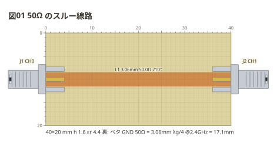

# 50Ω のスルー線路

いちばん小さな治具。両面の銅張り基板 (FR4 1.6mm) の裏をベタのまま残し、表は
幅 3.06mm の線路 1 本だけ残して剥がす。両端に端面 SMA を付けて NanoVNA の
CH0 と CH1 へ。**線路の字に出る Z0 がこの幅で 50Ω になる**ことを、図の下の
1 行 (`50Ω = 3.06mm`) と見比べる。

```copper
board: 40x20mm
title: 図01 50Ω のスルー線路
f: 2.4G
copper:
  L1: line 0,10 40,10 3.06
parts:
  J1: sma left 10 CH0
  J2: sma right 10 CH1
```



読み方:

- 位置は **mm**。`0,10` は板の左上から右へ 0mm、下へ 10mm。板の上と左の目盛と
  1mm の方眼で、図から寸法を読んで切れる
- `L1: line 0,10 40,10 3.06` は 2 点を結ぶ幅 3.06mm の線路。字の `210°` は
  `f: 2.4G` で見た電気長 (40mm は 2.4GHz の線路の中の波長の 0.58 倍)
- SMA は**辺と、辺に沿った位置**で置く (`left 10`)。中心導体が縁から 1mm の所で
  線路に乗り、外皮は裏の地へ付く
- 図の下の 1 行は板の実寸・基材・地の在りかと、**この板で 50Ω になる幅**と λg/4
