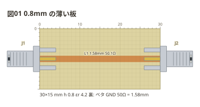
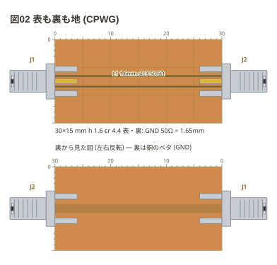

# 板と地

`board:` は大きさだけならスカラー、基材と地を書くならマップ。
**書かなければ 40×20mm・h 1.6・εr 4.4・裏ベタ** (本の治具の大きさと FR4)。

```copper
board:
  size: 30x15mm
  h: 0.8
  er: 4.2
title: 図01 0.8mm の薄い板
copper:
  L1: line 0,7.5 30,7.5 1.58
parts:
  J1: sma left 7.5
  J2: sma right 7.5
```



板が薄いと 50Ω の線路は細くなる (0.8mm・εr 4.2 で 1.58mm)。

**地の在りか (`ground:`) で描き方が変わる。** 裏ベタ (`back`) は銅を剥がした基材に
残した銅を描き、表が地の板 (`front` / `both`) は銅の板に**溝**を描く。どちらの板か、
つまり「剥がす」か「切る」かが図で分かる。

```copper
board:
  size: 30x15mm
  ground: both
  cut: 0.3
title: 図02 表も裏も地 (CPWG)
copper:
  L1: line 0,7.5 30,7.5 1.6
parts:
  J1: sma left 7.5
  J2: sma right 7.5
```



表が地の板の線路はコプレーナ (CPW) で、字に溝の幅 (`s0.3`) が付く。
Z0 は溝の幅でも変わる。

| `ground:` | 地 | 線路の式 | 図 |
| --- | --- | --- | --- |
| `back` (既定) | 裏がベタ | マイクロストリップ | 基材の上に銅 |
| `front` | 表の残り | CPW (裏なし) | 銅の上に溝 |
| `both` | 表の残りと裏 | CPWG | 銅の上に溝 |
| `none` | 無い | (Z0 を出さない) | 基材の上に銅 |
