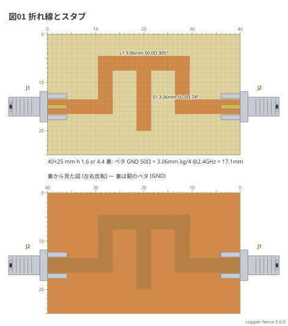
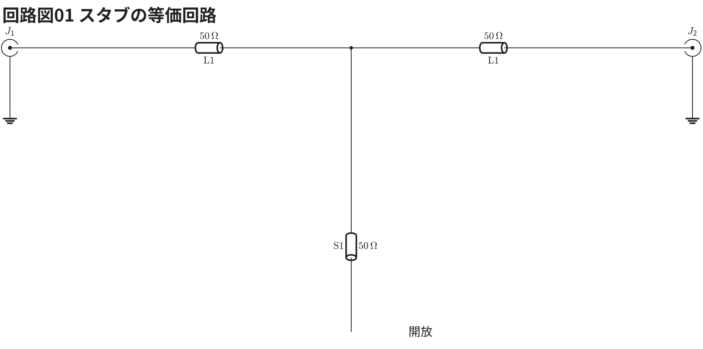
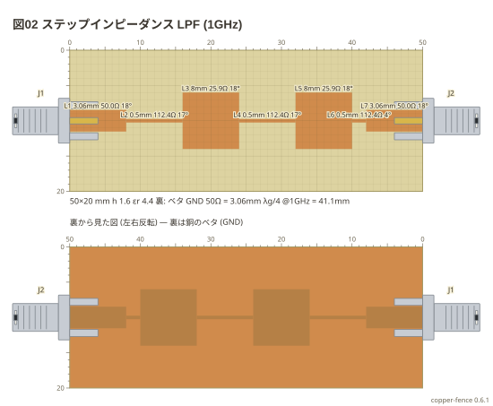
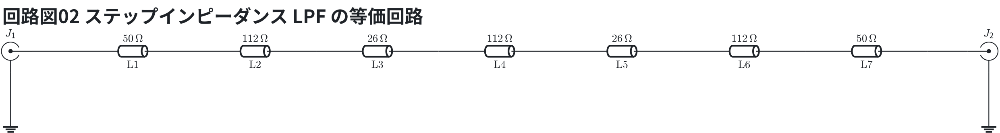

# 線路の形

線路は**縦横の区間の折れ線**。点を並べて書き、最後に幅を書く。触れ合う線路は
1 つの島 (ネット) になる。

```copper
board: 40x25mm
title: 図01 折れ線とスタブ
f: 2.4G
copper:
  L1: line 0,15 12,15 12,6 28,6 28,15 40,15 3.06mm
  S1: line 20,6 20,20 3.06mm
parts:
  J1: sma left 15
  J2: sma right 15
```



等価回路 (スタブの等価回路) — 線路は伝送線路 (`tline`、値は Z0)、SMA の外皮は地。

```circuit
title: 回路図01 スタブの等価回路
parts:
  J1: sma 2,2 mirror
  T1: tline 4,2 7,2 50 l=$\mathrm{L1}$
  T2: tline 9,2 12,2 50 l=$\mathrm{L1}$
  S1: tline 8,4 8,7 50 l=$\mathrm{S1}$
  J2: sma 14,2
  G1: ground 2,3
  G2: ground 14,3
wires:
  - J1.1 -- 4,2
  - 7,2 -- 9,2
  - 8,2 -- 8,4
  - 12,2 -- J2.1
  - J1.2 -- 2,3
  - J2.2 -- 14,3
notes:
  - text 9,7: 開放
```



L1 はスタブの付け根で 2 本に分かれて見える。S1 は先が開いた線路で、λ/4 になる周波数で付け根を短絡に見せる (ノッチ)。

S1 は L1 に T 字に触れているので同じ島。先が開いたスタブ (本の 6-16 のノッチ)。

**幅を変えるときは線路を分ける。** 触れ合っていれば 1 つの島で、字はそれぞれの
幅の Z0 を出す — 本の 6-14 のステップインピーダンス LPF。

```copper
board: 50x20mm
title: 図02 ステップインピーダンス LPF (1GHz)
f: 1G
copper:
  L1: line 0,10 8,10 3.06mm
  L2: line 8,10 16,10 0.5mm
  L3: line 16,10 24,10 8mm
  L4: line 24,10 32,10 0.5mm
  L5: line 32,10 40,10 8mm
  L6: line 40,10 42,10 0.5mm
  L7: line 42,10 50,10 3.06mm
parts:
  J1: sma left 10
  J2: sma right 10
```



等価回路 (ステップインピーダンス LPF の等価回路) — 線路は伝送線路 (`tline`、値は Z0)、SMA の外皮は地。

```circuit
title: 回路図02 ステップインピーダンス LPF の等価回路
parts:
  J1: sma 2,2 mirror
  T1: tline 3,2 5,2 50 l=$\mathrm{L1}$
  T2: tline 5,2 7,2 112 l=$\mathrm{L2}$
  T3: tline 7,2 9,2 26 l=$\mathrm{L3}$
  T4: tline 9,2 11,2 112 l=$\mathrm{L4}$
  T5: tline 11,2 13,2 26 l=$\mathrm{L5}$
  T6: tline 13,2 15,2 112 l=$\mathrm{L6}$
  T7: tline 15,2 17,2 50 l=$\mathrm{L7}$
  J2: sma 18,2
  G1: ground 2,3
  G2: ground 18,3
wires:
  - J1.1 -- 3,2
  - 17,2 -- J2.1
  - J1.2 -- 2,3
  - J2.2 -- 18,3
```



細い線路 (112Ω) は直列のコイル、太い線路 (26Ω) は地へのコンデンサとして働き、LC のはしご型 LPF になる。
