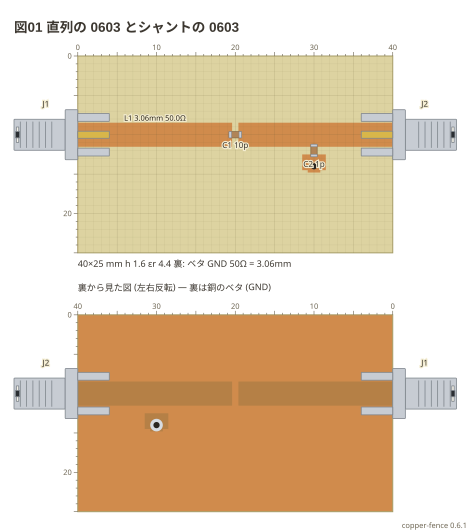
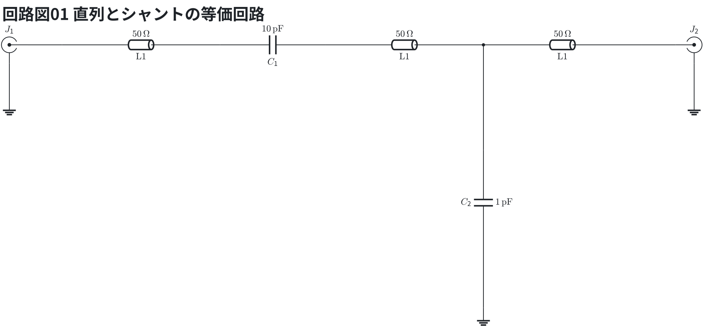
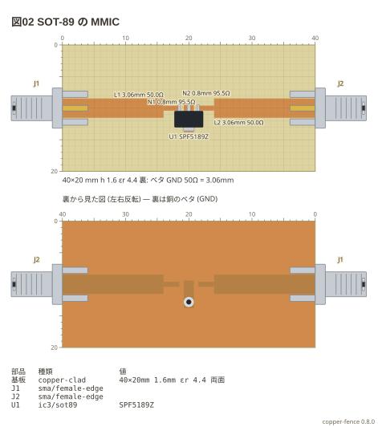
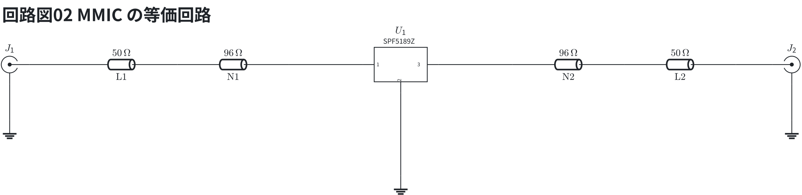

# 部品

置き方は種類で決まる。

| 種類 | 書き方 | 例 |
| --- | --- | --- |
| 同軸 (端面 SMA) | 辺と、辺に沿った位置 | `J1: sma left 10` |
| 面実装 (チップ・SOD・SOT) | 中心の点 | `C1: capacitor/1608 20,10 10p` |
| 箱 (SAW・缶・モジュール) | 中心・大きさ・ピンの数 | `U1: box 20,10 5x5mm 6` |
| ピンのある部品 | 端 2 つ (島の名前か点) | `R1: resistor P1 P2 51` |

**線路の上に置いたチップは線路を切る** (本の 4-17)。実物もカッターで切って
そこへ半田付けする。**線路と直角に置いたチップ (`r90`) は切らない** — 線路から
地へ落とすシャントの置き方になる。

```copper
board: 40x25mm
title: 図01 直列の 0603 とシャントの 0603
copper:
  L1: line 0,10 40,10 3.06mm
  P1: pad 30,13.5 3x2mm
  V1: via 30,14
parts:
  J1: sma left 10
  J2: sma right 10
  C1: capacitor/1608 20,10 10p
  C2: capacitor/1608 30,12 r90 1p
```



等価回路 (直列とシャントの等価回路) — 線路は伝送線路 (`tline`、値は Z0)、SMA の外皮は地。

```circuit
title: 回路図01 直列とシャントの等価回路
parts:
  J1: sma 2,2 mirror
  T1: tline 3,2 6,2 50 l=$\mathrm{L1}$
  C1: capacitor 6,2 8,2 10p
  T2: tline 8,2 11,2 50 l=$\mathrm{L1}$
  T3: tline 11,2 14,2 50 l=$\mathrm{L1}$
  C2: capacitor 11,4 11,6 1p
  G3: ground 11,7
  J2: sma 15,2
  G1: ground 2,3
  G2: ground 15,3
wires:
  - J1.1 -- 3,2
  - 11,2 -- 11,4
  - 11,6 -- 11,7
  - 14,2 -- J2.1
  - J1.2 -- 2,3
  - J2.2 -- 15,3
```



C1 は L1 を切って直列に、C2 は L1 から via を通って地へ落ちる。

- C1 は L1 を 0.8mm 切って直列に入る。ネットリストでは L1 が 2 つ (`L1` と `L1~2`) に分かれる
- C2 は L1 と、via で裏の地へ落ちた島 P1 に跨る

SOT-89 の MMIC (本の 8-6)。ピンは 1・2・3 が同じ辺に並び、2 番とタブが地。
線路はピンの手前で細くし (N1・N2)、2 番とタブは via で裏の地へ落とした島 G1 に載せる。

```copper
board: 40x20mm
title: 図02 SOT-89 の MMIC
copper:
  L1: line 0,10 16,10 3.06mm
  N1: line 16,10 18.5,10 0.8mm
  N2: line 21.5,10 24,10 0.8mm
  L2: line 24,10 40,10 3.06mm
  G1: pad 20,11.6 1.6x4.4mm
  V1: via 20,12.8
parts:
  J1: sma left 10
  J2: sma right 10
  U1: ic3/sot89 20,11.75 SPF5189Z
notes:
  - parts
```



等価回路 (MMIC の等価回路) — 線路は伝送線路 (`tline`、値は Z0)、SMA の外皮は地。

```circuit
title: 回路図02 MMIC の等価回路
parts:
  J1: sma 2,2 mirror
  T1: tline 3,2 5,2 50 l=$\mathrm{L1}$
  T2: tline 5,2 7,2 96 l=$\mathrm{N1}$
  U1: ic3 9,2 SPF5189Z
  T3: tline 11,2 13,2 96 l=$\mathrm{N2}$
  T4: tline 13,2 15,2 50 l=$\mathrm{L2}$
  J2: sma 16,2
  G1: ground 2,3
  G2: ground 16,3
  G3: ground 9,4
wires:
  - J1.1 -- 3,2
  - 7,2 -- U1.1
  - U1.3 -- 11,2
  - U1.2 -- 9,4
  - 15,2 -- J2.1
  - J1.2 -- 2,3
  - J2.2 -- 16,3
```



MMIC の 2 番とタブは G1 と via で地へ。実物では出力 (3 番) にバイアスを入れる (ここでは描かない)。

面実装の寸法は perfboard と同じ表 (fence-kit) から引く。書ける姿:

```text
チップ    resistor capacitor inductor bead led      1608 2012 3216
ダイオード diode zener schottky varicap              sod123 sod323 do214ac
SOT      transistor ic3 regulator                   sot23 sot346 sot89
```
