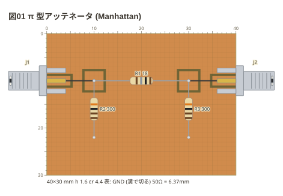
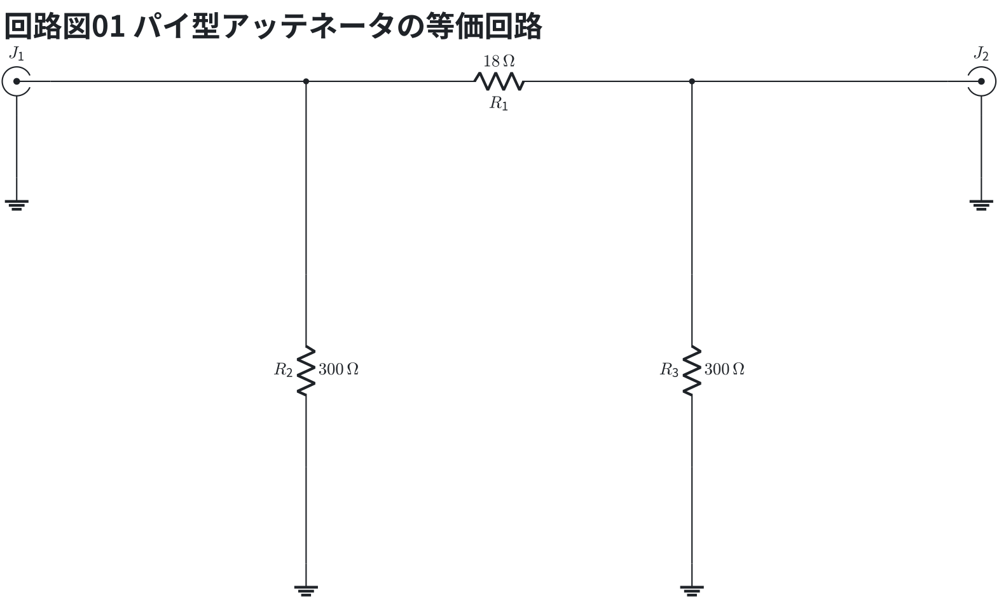

# Manhattan の島

銅の板 (表が地) に小さな島を作り、足のある部品を島から島へ渡す (本の 3-11)。
実物は島を切り出すか、別の板の小片 (MeSQUARES) を接着する。**作り方は描き分けない**
— 図にあるのは出来上がりの銅。

```copper
board:
  size: 40x30mm
  ground: front
title: 図01 π 型アッテネータ (Manhattan)
copper:
  S1: pad 2.5,10 5x2
  S2: pad 37.5,10 5x2
  P1: pad 10,10 4x4
  P2: pad 30,10 4x4
parts:
  J1: sma left 10
  J2: sma right 10
  R1: resistor P1 P2 18
  R2: resistor P1 10,22 300
  R3: resistor P2 30,22 300
wires:
  - S1 -- P1
  - P2 -- S2
```



等価回路 (π 型アッテネータの等価回路) — 線路は伝送線路 (`tline`、値は Z0)、SMA の外皮は地。

```circuit
title: 回路図01 パイ型アッテネータの等価回路
parts:
  J1: sma b2 mirror
  R1: resistor b5 b9 18
  R2: resistor d5 f5 300
  R3: resistor d9 f9 300
  J2: sma b12
  G1: ground c2
  G2: ground c12
  G3: ground g5
  G4: ground g9
wires:
  - J1.1 -- b5
  - b5 -- d5
  - b9 -- J2.1
  - b9 -- d9
  - f5 -- g5
  - f9 -- g9
  - J1.2 -- c2
  - J2.2 -- c12
```



π 型のアッテネータ。島 S1・P1 が左の節点、P2・S2 が右の節点、表の地が GND。周波数が低いうちは線路の長さを無視できる。

- SMA の中心導体は**縁まで伸びた島** (S1・S2) に載せる。縁に地が残っていると中心導体が地に触れる
- 部品の端に**点**を書くと、そこは表の地 (島にも溝にも無い所) になる
- `wires:` は島どうしのジャンパ
