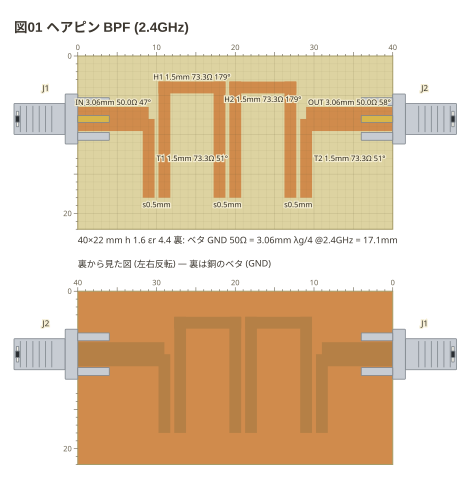
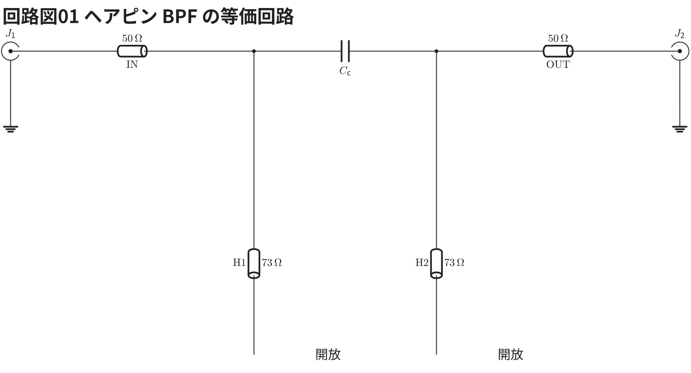

# 結合線路

平行に向かい合う線路の**隙間**は、書かせずに測って出す (`s0.5mm`)。
基材の厚さの 2 倍より離れた線路には出さない。本の 6-15 のヘアピン。

```copper
board: 40x22mm
title: 図01 ヘアピン BPF (2.4GHz)
f: 2.4G
copper:
  IN: line 0,8 9,8 3.06
  T1: line 9,8 9,18 1.5
  H1: line 11,18 11,4 18,4 18,18 1.5
  H2: line 20,18 20,4 27,4 27,18 1.5
  T2: line 29,18 29,8 1.5
  OUT: line 29,8 40,8 3.06
parts:
  J1: sma left 8
  J2: sma right 8
```



等価回路 (ヘアピン BPF の等価回路) — 線路は伝送線路 (`tline`、値は Z0)、SMA の外皮は地。

```circuit
title: 回路図01 ヘアピン BPF の等価回路
parts:
  J1: sma b2 mirror
  T1: tline b3 b5 50 l=$\mathrm{IN}$
  H1: tline d6 g6 73 l=$\mathrm{H1}$
  CC: capacitor b6 b9 l=$C_\mathrm{c}$
  H2: tline d9 g9 73 l=$\mathrm{H2}$
  T2: tline b10 b12 50 l=$\mathrm{OUT}$
  J2: sma b13
  G1: ground c2
  G2: ground c13
wires:
  - J1.1 -- b3
  - b5 -- b6
  - b6 -- d6
  - b9 -- b10
  - b9 -- d9
  - b12 -- J2.1
  - J1.2 -- c2
  - J2.2 -- c13
notes:
  - text g7: 開放
  - text g10: 開放
```



**近似。** H1・H2 は先が開いた半波長の共振器で、隙間 0.5mm の結合を結合容量 $C_c$ で表した。IN と OUT は共振器の腕にタップ (T1・T2) でつながる。

字の `°` は `f:` での電気長。ヘアピンの共振器は折れ線ぜんぶの長さ (35mm) で数え、
2.4GHz でほぼ半波長 (180°) になる。
