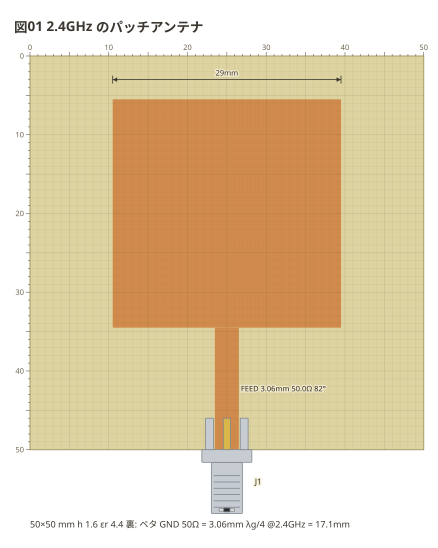
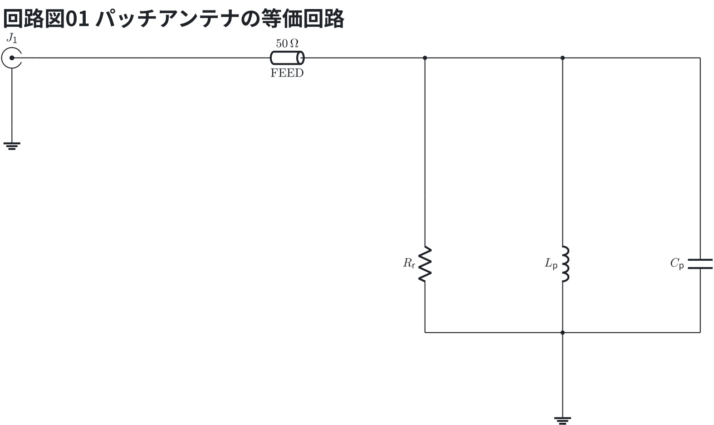
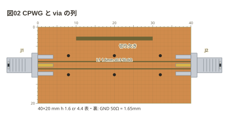
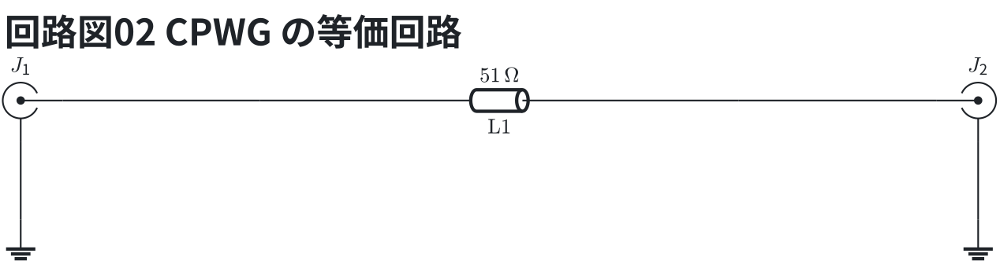

# 地の加工 — via・切り欠き・パッチ

`via` は島を裏の地へ落とす (実物は穴に線を通して両面を半田付け)。
`slot` は地の切り欠き。**裏ベタの板では裏の物なので破線**で描く。

```copper
board: 50x50mm
title: 図01 2.4GHz のパッチアンテナ
f: 2.4G
copper:
  PATCH: pad 25,20 29x29
  FEED: line 25,34.5 25,50 3.06
parts:
  J1: sma bottom 25
notes:
  - dim 10.5,3 39.5,3
```



等価回路 (パッチアンテナの等価回路) — 線路は伝送線路 (`tline`、値は Z0)、SMA の外皮は地。

```circuit
title: 回路図01 パッチアンテナの等価回路
parts:
  J1: sma b2 mirror
  T1: tline b4 b8 50 l=$\mathrm{FEED}$
  RR: resistor d8 f8 l=$R_\mathrm{r}$
  LP: inductor d10 f10 l=$L_\mathrm{p}$
  CP: capacitor d12 f12 l=$C_\mathrm{p}$
  G1: ground c2
  G2: ground g10
wires:
  - J1.1 -- b4
  - b8 -- b12
  - b8 -- d8
  - b10 -- d10
  - b12 -- d12
  - f8 -- f12
  - f10 -- g10
  - J1.2 -- c2
```



**近似。** パッチは 2.4GHz で共振する並列 RLC ($R_r$ が放射抵抗)。端で給電すると $R_r$ は 200Ω ほどで 50Ω に合わないので、実物は切り込み (インセット) で合わせる。

表が地の板では、`slot` は溝として描く。**地に打った via** (どの島にも触れない via) は
溝を掘らず、表の地と裏の地をつなぐ (via の列で線路の両脇の地を留める)。

```copper
board:
  size: 40x20mm
  ground: both
  cut: 0.3
title: 図02 CPWG と via の列
copper:
  L1: line 0,10 40,10 1.6
  X1: slot 20,3 20x1
  V1: via 8,7.5
  V2: via 20,7.5
  V3: via 32,7.5
  V4: via 8,12.5
  V5: via 20,12.5
  V6: via 32,12.5
parts:
  J1: sma left 10
  J2: sma right 10
notes:
  - text 21,5: 切り欠き
```



等価回路 (CPWG の等価回路) — 線路は伝送線路 (`tline`、値は Z0)、SMA の外皮は地。

```circuit
title: 回路図02 CPWG の等価回路
parts:
  J1: sma b2 mirror
  TL1: tline b4 b8 51 l=$\mathrm{L1}$
  J2: sma b10
  G1: ground c2
  G2: ground c10
wires:
  - J1.1 -- b4
  - b8 -- J2.1
  - J1.2 -- c2
  - J2.2 -- c10
```



線路は Z0 50.6Ω の CPWG 1 本。via の列は表の地と裏の地を留めるだけで、回路図には出ない。
