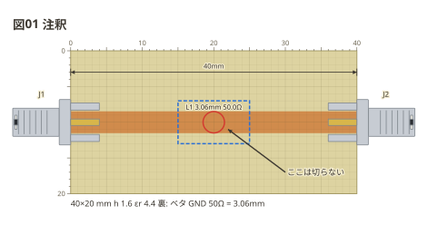
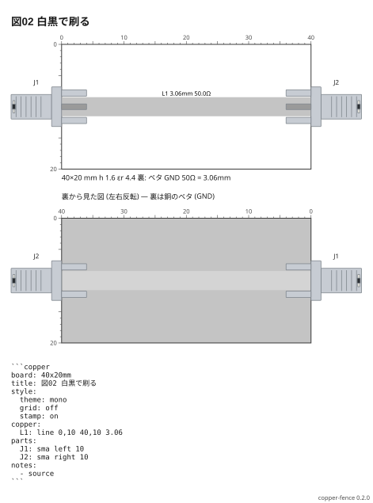

# 注釈と見た目

注釈は回路の一員ではない (ネットにもネットリストにも出ない)。
**`dim` は寸法線** — 2 点の間の長さを測って出す。手で切る板の寸法図に使う。

```copper
board: 40x20mm
title: 図01 注釈
copper:
  L1: line 0,10 40,10 3.06
parts:
  J1: sma left 10
  J2: sma right 10
notes:
  - dim 0,3 40,3
  - mark 20,10 red
  - box 15,7 25,13 blue
  - arrow 30,17 22,11
  - text 30,17: ここは切らない
```



| 印 | 書き方 | 出るもの |
| --- | --- | --- |
| `mark` | `mark 点 [色]` | 点を囲む丸 |
| `box` | `box 点 点 [色]` | 2 点を対角にした枠 |
| `arrow` | `arrow 点 点 [色]` | 1 つ目から 2 つ目への矢 |
| `dim` | `dim 点 点 [色]` | 寸法線と長さ (mm) |
| `text` | `text 点 [色] [r90]: 字` | その点のそばの字 |
| `parts` | `parts [色]` | 部品表を図の下に |
| `source` | `source [色]` | フェンスの中身を図の下に |

`style:` でテーマ (`light` `dark` `mono`)、幅、方眼 (`grid`)、刻印 (`stamp`)、
ERC (`check`) を選ぶ。

```copper
board: 40x20mm
title: 図02 白黒で刷る
style:
  theme: mono
  grid: off
  stamp: on
copper:
  L1: line 0,10 40,10 3.06
parts:
  J1: sma left 10
  J2: sma right 10
notes:
  - source
```


