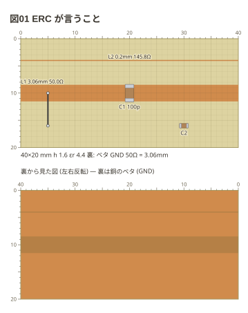

# 図のとおりに切って組むと動かないところ (ERC)

読めたうえで、図のとおりに作ると動かない所を言う。**図は止めずに描く**。

1. 銅に乗っていない足
2. 同じ部品の 2 本の足が同じ銅に乗っている (切れ目が無い)
3. ジャンパの端が銅に乗っていない
4. 手で切れない細さ (幅・溝・結合の隙間が 0.3mm 未満)

```copper
board: 40x20mm
title: 図01 ERC が言うこと
copper:
  L1: line 0,10 40,10 3.06
  L2: line 0,4 40,4 0.2
parts:
  C1: capacitor/3216 20,10 r90 100p
  C2: capacitor/1608 30,16
wires:
  - 5,10 -- 5,16
```



```text
copper: 5 行目: L2 の幅 0.2mm は手で残すには細すぎます (0.3mm から。エッチングなら描けます)
copper: 7 行目: C1 の 1 番と 2 番が同じ銅 (L1) に乗っています (線路の上に置くと切れ目ができます。向きを確かめます)
copper: 8 行目: C2 の 1 番の足 (29.36,16) の下に銅がありません
copper: 8 行目: C2 の 2 番の足 (30.64,16) の下に銅がありません
copper: 10 行目: 配線の端 (5,16) の下に銅がありません
```

回路の一部だけを描くときは `style: check: off` で外せる (既定は掛ける)。
