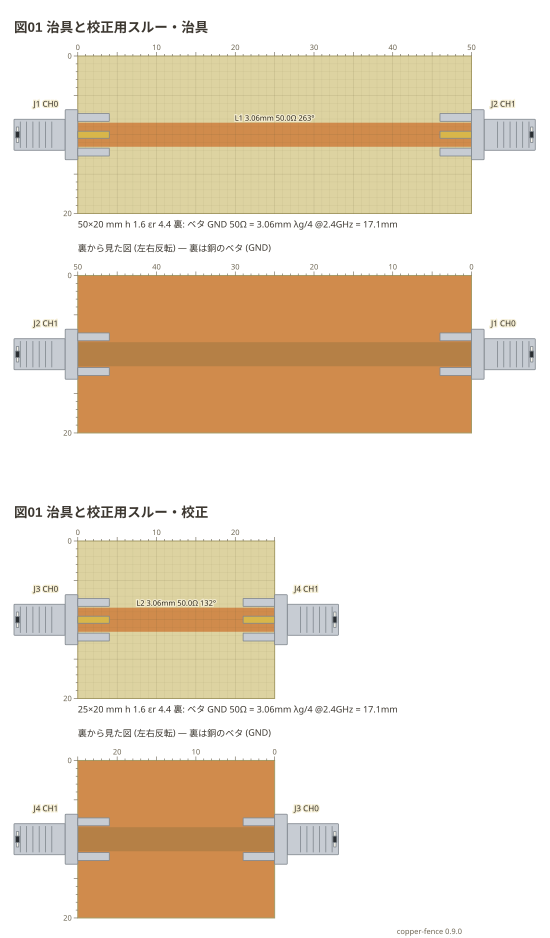

# 複数の基板 (`sheets:`)

1 つのフェンスに**銅張り基板を何枚でも**並べられる。治具の本体と、**同じ条件で切り出した
校正用のスルー線路**を 1 つの図で見せるときなどの書き方。

**枚ごとの書き方は 1 枚の図と同じ** (`board:` `f:` `copper:` `parts:` `wires:` `notes:` `style:`)。
外側に書いた `board:` `f:` `style:` は、枚が書かなかったときの既定になる。

```copper
title: 図01 治具と校正用スルー
f: 2.4G
sheets:
  - name: 治具
    board: 50x20mm
    copper:
      L1: line 0,10 50,10 3.06mm
    parts:
      J1: sma left 10 CH0
      J2: sma right 10 CH1
  - name: 校正
    board: 25x20mm
    copper:
      L2: line 0,10 25,10 3.06mm
    parts:
      J3: sma left 10 CH0
      J4: sma right 10 CH1
```



- `name:` は枚の名前。**図の題にもなる** (`図01 治具と校正用スルー・治具`)。枚が `title:` を持てばそちらを使う
- 部品の名前 (`J1`) は図全体で 1 つ。枚をまたいで同じ名前を使うとお知らせが出る
- 枚をつなぐ `links:` (`枚の名前.ネットの名前`) も書ける。ネットリストの名前を指す
