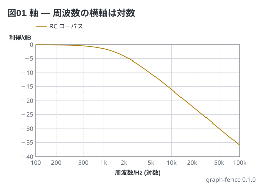
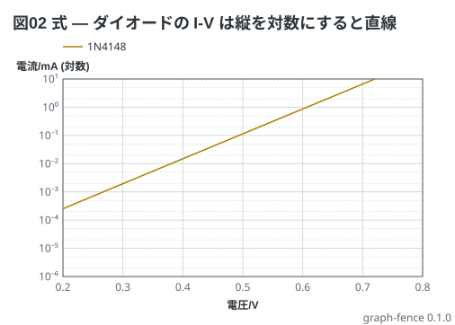
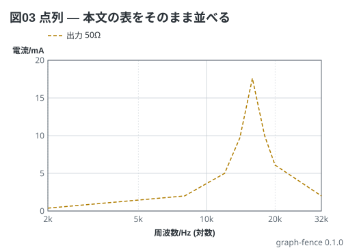
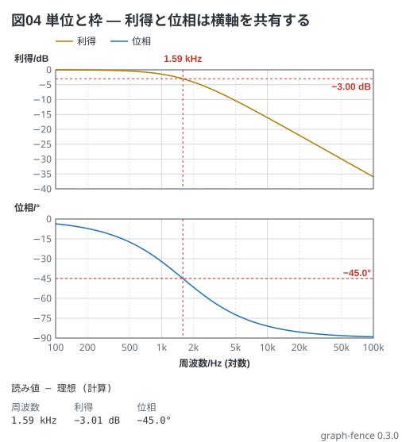
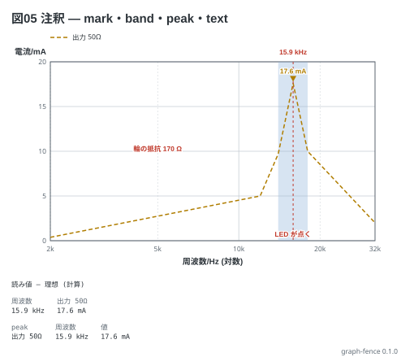

# graph フェンスの書き方

` ```graph ` フェンスは、教科書の **x-y グラフ** — 周波数応答 (共振曲線・ボード線図) と
特性曲線 (I-V・リアクタンス) — を描く。**計器の画面ではない**: 画面を見せる題は scope・spectrum・vna、
値を集めて描く題が graph。理想 (式・点列) は破線、測った値 (`data:`) は ○ で打つ。

1 画面の早見表は [02-cheatsheet.md](02-cheatsheet.md)。どのフェンスの直後にも、そのフェンスを描いた図を貼ってある
(作り直しは `npm run docs --workspace=graph-fence`)。

## 目次

- [軸 (`x:` `y:`)](#軸-x-y)
- [題 (`title:`)](#題-title)
- [線と式 (`lines:`)](#線と式-lines)
- [点列](#点列)
- [単位と枠](#単位と枠)
- [注釈 (`notes:`)](#注釈-notes)
- [測った値 (`data:`)](#測った値-data)
- [見た目 (`style:`)](#見た目-style)
- [読み値](#読み値)
- [言われること](#言われること)
- [上限](#上限)

## 軸 (`x:` `y:`)

1 行を**後ろから読む**: 最後の語が `a..b` なら範囲、その前が `log` なら対数、その前が単位、残りが名前。

```graph
title: 図01 軸 — 周波数の横軸は対数
x: 周波数 Hz log 100..100k
y: 利得 dB -40..0
lines:
  RC ローパス dB: 20*log10(1/sqrt(1+(x/1.59k)^2))
```



- 範囲の区切りは **`..`** (`2k..32k` `-40..0`)。dB・deg・℃ は負の値を持つので `-` では切れない
- 範囲の数は軸の単位を付けても省いてもよい (`2k..32k` = `2kHz..32kHz`)。**違う単位は断る**
- 範囲を省くと値から決める。**大きさの量は 0 から** (0 から始めない軸は差を大きく見せる)。
  dB と deg と、負の値を含む線は値を包む切りのよい範囲。目盛は 1・2・5 の幅で 4〜8 本 (deg は 15・30・45・90)
- 対数の軸は 10 倍ごとの主目盛と 2・5 の副目盛。**単位が接頭辞で始まる対数の軸 (mA) は `10⁻³` の形**で刷る
- 名札は「量/単位」(`周波数/Hz`)。対数なら `(対数)` が付く。`y:` を書かなければ単位だけ

## 題 (`title:`)

図の左上に 1 行。**「何が読めるか」を書く** (`15.9 kHz で山になり、輪の抵抗が小さいほど高い`)。
文章から「図03 を直して」と指せるように `図NN` で始める。60 字まで。

## 線と式 (`lines:`)

キーは「**名前 単位**」— 最後の語が単位、その前が名前 (凡例に出る)。値が字なら式。

```graph
title: 図02 式 — ダイオードの I-V は縦を対数にすると直線
x: 電圧 V 0.2..0.8
y: 電流 mA log 1u..10
lines:
  1N4148 mA: 4.4n * (exp(x / (1.9 * 25.9m)) - 1) * 1000
```



- 式は `x` (横軸の単位の数)、`pi`、数 (接頭辞つき: `1.59k` `25.9m` `4.4n` `10M`)、`+ - * / ^`、括弧、関数
  `sqrt exp ln log10 log2 sin cos tan atan atan2 abs min max pow floor ceil deg rad`
- **`m` と `M` は別** (SI のとおり)。`u` は `µ`
- **式は無次元で、値は線の単位で読む。** 上の式は A で出るので `* 1000` で mA にしている
- **掛け算の `*` は省けない** (`2x` は断る)。`^` は右結合、`-x^2` は −(x²)
- 定義域の外 (`log10` の負など) の点は描かない

## 点列

値が並びなら点列。**1 行 1 点**で `x y` (点ごとに行番号が付き、読めない点を名指せる)。

```graph
title: 図03 点列 — 本文の表をそのまま並べる
x: 周波数 Hz log 2k..32k
y: 電流 mA
lines:
  出力 50Ω mA:
    - 2k 0.38
    - 8k 2.0
    - 12k 5.0
    - 14k 9.7
    - 15.9k 17.6
    - 18k 10.0
    - 20k 6.1
    - 32k 2.0
```



点は x の順に並べ直す。同じ x が 2 つあれば断る。点の間は直線で結ぶ (対数の軸なら log x で)。

## 単位と枠

**単位が違う線は、縦に積んだ別の枠**に置き、横軸を共有する (3 つまで)。ボード線図は dB と deg の 2 枠になる。

```graph
title: 図04 単位と枠 — 利得と位相は横軸を共有する
x: 周波数 Hz log 100..100k
y:
  - 利得 dB
  - 位相 deg
lines:
  利得 dB: 20*log10(1/sqrt(1+(x/1.59k)^2))
  位相 deg: -deg(atan(x/1.59k))
notes:
  - level -3dB
  - level -45deg
  - mark 1.59k
```



`y:` は単位ごとに 1 行の並び。線の無い単位の `y:` はお知らせで言う。

## 注釈 (`notes:`)

**番地は軸の値。** y を持つ注釈 (`level` `text`) は単位でどの枠かが決まる (枠が 1 つなら単位は省ける)。

```graph
title: 図05 注釈 — mark・band・peak・text
x: 周波数 Hz log 2k..32k
y: 電流 mA
lines:
  出力 50Ω mA:
    - 2k 0.38
    - 12k 5.0
    - 14k 9.7
    - 15.9k 17.6
    - 18k 10.0
    - 32k 2.0
notes:
  - mark 15.9k
  - band 14k 18k: LED が点く
  - peak
  - text 5k 10mA: 輪の抵抗 170 Ω
```



| 書き方 | 何が出るか |
| --- | --- |
| `- mark 1.59k` | 縦の破線と、枠の上に x の値。**読み値の表に 1 行** (8 本まで)。字が重なれば省く (値は表にある) |
| `- level -3dB` | 横の破線と値 |
| `- band 14k 18k: 字` | x の帯 (字は任意。一番下の枠の下端に) |
| `- text 16k 27mA: 字` | 点に字 |
| `- peak` | 全部の線の頂点に ▽ と値。**読み値の表に線ごとに 1 行** |
| `- source` | フェンスの中身を図の下に書き出す |

## 測った値 (`data:`)

```yaml
data: 9-1.csv
```

`.md` と同じ場所の `.csv` / `.txt` だけを読む (`/` や `..` は書けない)。**実測は ○ で打ち、線で結ばない**
(手で測った 10 点ほどを結ぶと、測っていない所まで在るように見える)。

- 1 列目が x、以降が y。区切りは `,` かタブか `;`。`#` で始まる行は読み捨てる。空の欄はその点を抜く
- 最初の字を含む行が見出し。**括弧の中が単位** (`周波数 (kHz)`、`Channel 2 Magnitude (dB)`)
- **x は軸の単位に直す** — 同じならそのまま、接頭辞だけ違えば直す (kHz → Hz)、違う単位は断る
- 列は 3 段で線に当たる: 単位と名前が合う線 → 単位が合う線が 1 本だけならそれ → どれにも当たらなければ新しい線 (言う)。
  当たった実測は理想の線と同じ色で打つ。WaveForms の Network の Export は 2 段目で当たる
- 読めない・見つからないはお知らせで、図は理想だけで出る。プレビューの web 版と playground は読めない

## 見た目 (`style:`)

1 語 (`light` `dark` `mono`) か並び: `theme`、`width` (120〜4000)、`stamp` (`on` / `off`。既定は右下に処理系の版)、
`debug` (`on` / `off`。お知らせを帯に出すか)。

## 読み値

`graph-fence check` は図を描かず、読み値と言うことだけを出す。**本文の「見るべき値」の表と数で突き合わせる**。

```text
読み値 — 理想 (計算)
周波数    利得      位相
1.59 kHz  −3.01 dB  −45.0°
```

見出しが値の出どころ (理想 / 実測 / 両方) を言う。実測の列には `(実測)` が付く。

## 言われること

| 言われること | 直し方 |
| --- | --- |
| 範囲は 2k..32k / -40..0 のように .. で区切ります | `2k-32k` → `2k..32k` |
| 対数の軸は 0 より大きい値から始めます | `log 0..30` → `log 1u..30` か `log` を外す |
| 線は「名前 単位:」の形で書きます | `電流:` → `電流 mA:` |
| 式が読めません: 続きが読めません (掛け算の * は省けません) | `2x` → `2*x` |
| 式だけの図は x: に範囲を書きます | `x: 周波数 Hz log` → `x: 周波数 Hz log 100..100k` |
| dB の枠がありません | `level -3dB` の単位を線の単位に合わせる |
| x: が無いので x 0..1 で描いています (お知らせ) | `x:` を書く |

## 上限

線 8 本、点 1 本に 1001 個、式 200 字・32 段、枠 3 つ、注釈 50 個 (mark は 8 本まで読み値に)、
対数の軸 12 桁、`data:` は 1 MB・100001 行・16 列。
