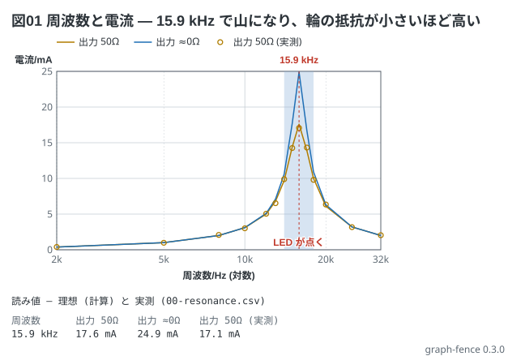

# 共振曲線 — LC 直列共振の周波数と電流

教科書 (回路の冊) 9-1 の見るべき値の表を、そのまま点列にした図。発生器の出力抵抗が 50 Ω のときと
ほぼ 0 Ω のときの 2 本を重ねると、輪の抵抗 (170 Ω と 120 Ω) の差が山の高さの差になる。
隣の `00-resonance.csv` は**実測ではない** — 50 Ω の値に ±4 % の揺れを足して計算で作った。
実測は ○ で打ち、線で結ばない。

```graph
title: 図01 周波数と電流 — 15.9 kHz で山になり、輪の抵抗が小さいほど高い
x: 周波数 Hz log 2k..32k
y: 電流 mA
lines:
  出力 50Ω mA:
    - 2k 0.38
    - 5k 1.0
    - 8k 2.0
    - 10k 3.1
    - 12k 5.0
    - 13k 6.8
    - 14k 9.7
    - 15k 14.4
    - 15.9k 17.6
    - 17k 13.9
    - 18k 10.0
    - 20k 6.1
    - 25k 3.2
    - 32k 2.0
  出力 ≈0Ω mA:
    - 2k 0.38
    - 5k 1.0
    - 8k 2.0
    - 10k 3.1
    - 12k 5.1
    - 13k 7.1
    - 14k 10.6
    - 15k 17.7
    - 15.9k 24.9
    - 17k 16.7
    - 18k 10.9
    - 20k 6.3
    - 25k 3.2
    - 32k 2.0
data: 00-resonance.csv
notes:
  - mark 15.9k
  - band 14k 18k: LED が点く
```


