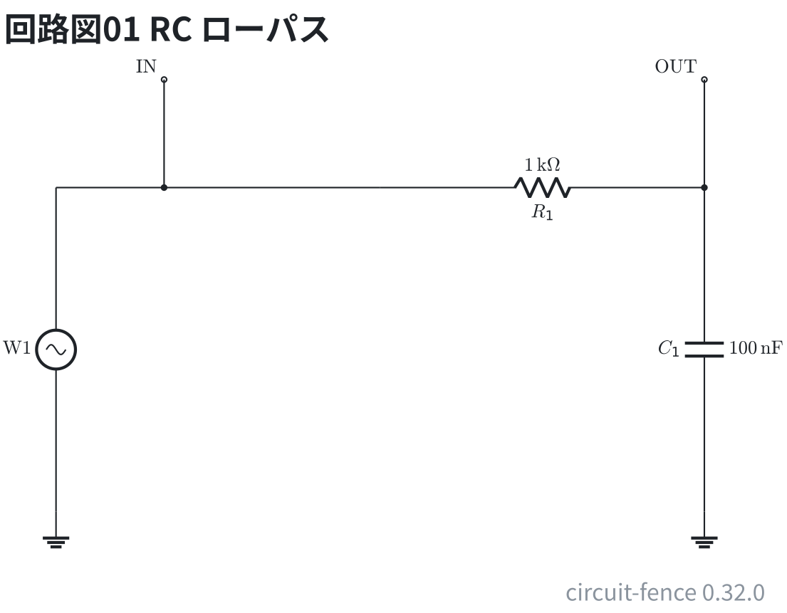
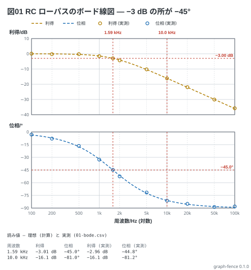

# ボード線図 — RC ローパス

教科書 (Analog Discovery の冊) 5-1 の RC ローパス (f<sub>c</sub> = 1.59 kHz)。利得 (dB) と位相 (deg) は
単位が違うので、横軸を共有した 2 つの枠に分かれる。−3 dB と −45° の水準を引き、`mark` の読み値を
本文の表と数で突き合わせる。隣の `01-bode.csv` は**実測ではない** — 理想に揺れを足して計算で作り、
見出しを WaveForms の Network の Export の形に似せた (列は単位で線に当たる)。

回路は 1 kΩ と 100 nF の RC ローパス (f<sub>c</sub> = 1.59 kHz)。

```circuit
title: 回路図01 RC ローパス
parts:
  W1: sine b1 e1 l=$\mathrm{W1}$
  G1: ground e1
  IN: port a2
  R1: resistor b4 b7 1k
  C1: capacitor b7 e7 100n
  G2: ground e7
  OUT: port a7
wires:
  - b1 -- b2
  - b2 -- b4
  - a2 -- b2
  - a7 -- b7
```



```graph
title: 図01 RC ローパスのボード線図 — −3 dB の所が −45°
x: 周波数 Hz log 100..100k
y:
  - 利得 dB
  - 位相 deg
lines:
  利得 dB: 20*log10(1/sqrt(1+(x/1.59k)^2))
  位相 deg: -deg(atan(x/1.59k))
data: 01-bode.csv
notes:
  - level -3dB
  - level -45deg
  - mark 1.59k
  - mark 10k
```


