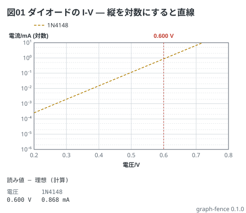

# ダイオードの電圧電流特性 — 対数で見ると直線

教科書 (電験三種の冊) 6-1 の式 (I<sub>S</sub> ≈ 4.4 nA、n ≈ 1.9、V<sub>T</sub> = 25.9 mV)。
式は A で出るので、mA の線には `* 1000` を書く (式は無次元で、値は線の単位で読む)。
縦軸を対数にすると、指数の特性がまっすぐな線になる。

```graph
title: 図01 ダイオードの I-V — 縦を対数にすると直線
x: 電圧 V 0.2..0.8
y: 電流 mA log 1u..10
lines:
  1N4148 mA: 4.4n * (exp(x / (1.9 * 25.9m)) - 1) * 1000
notes:
  - mark 0.6
```


