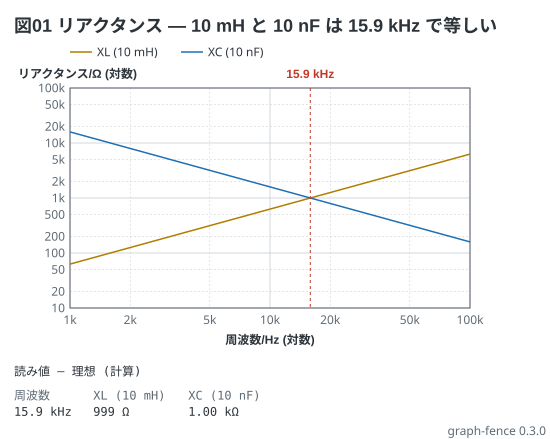

# リアクタンスの周波数特性 — X_L と X_C の交わる所が f₀

教科書 (電験三種の冊) 3-9。X<sub>L</sub> = 2πfL は周波数に比例し、X<sub>C</sub> = 1/(2πfC) は反比例する。
両方の軸を対数にすると、どちらもまっすぐな線になり、交わる所が 9-1 の共振周波数 (15.9 kHz) になる。

```graph
title: 図01 リアクタンス — 10 mH と 10 nF は 15.9 kHz で等しい
x: 周波数 Hz log 1k..100k
y: リアクタンス Ω log 10..100k
lines:
  XL (10 mH) Ω: 2*pi*x*10m
  XC (10 nF) Ω: 1/(2*pi*x*10n)
notes:
  - mark 15.9k
```


