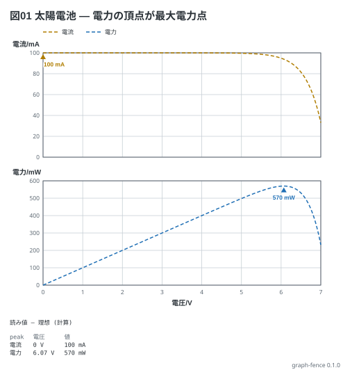

# 太陽電池の I-V と P-V — 最大電力点

教科書 (電験三種の冊) 12-1。電流 (mA) と電力 (mW) は単位が違うので 2 つの枠に分かれる。
`peak` は線ごとの頂点に印を付け、読み値に出す (電力の頂点が最大電力点)。
式は小さなパネル (短絡電流 100 mA、開放電圧 約 7 V) の近似。

```graph
title: 図01 太陽電池 — 電力の頂点が最大電力点
x: 電圧 V 0..7
y:
  - 電流 mA
  - 電力 mW
lines:
  電流 mA: 100 - 1u * (exp(x / 0.3885) - 1)
  電力 mW: x * (100 - 1u * (exp(x / 0.3885) - 1))
notes:
  - peak
```


