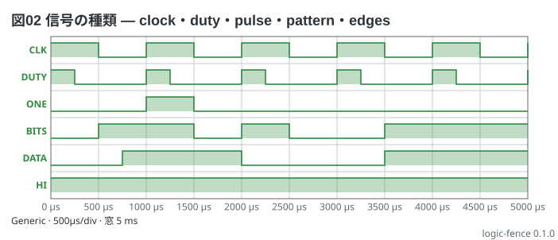
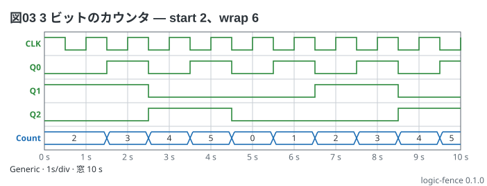
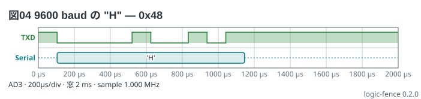
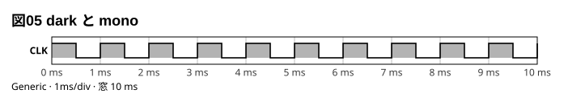
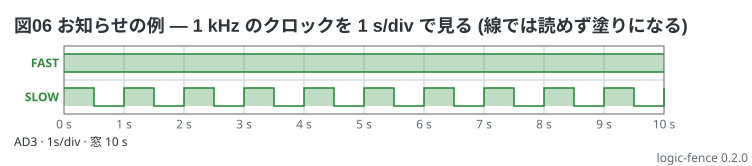

# logic フェンスの書き方

Markdown の ` ```logic ` フェンスに YAML を書くと、Markdown プレビューで
**ロジックアナライザの画面**になる。WaveForms (Analog Discovery 3) の Logic を写し、
ほかのロジックアナライザの画面にも使える。
**レーン** (1 本 1 行の高低)、**バス** (束ねた値の箱)、**時間軸** (10 目盛)、
**カーソル** (X1・X2 とその差)、**トリガの印**、**プロトコルの読み下し** (UART) を描く。
信号は波形発生器の語 (`clock 1Hz`) で書くので、測る前の「見えるはずの画面」が描ける。
ここは文法の全部。1 画面にまとめた物は [02-cheatsheet.md](02-cheatsheet.md)、
形ごとの例は [examples/](../examples/README.md) にある。

## 目次

- [例: 74HC163 のアドレス (本の 10-20)](#例-74hc163-のアドレス-本の-10-20)
- [機種 (`device:`)](#機種-device)
- [時間軸 (`time:` `window:` `start:` `sample:`)](#時間軸-time-window-start-sample)
- [題 (`title:`)](#題-title)
- [信号 (`signals:`)](#信号-signals)
- [カウンタ (`counter`)](#カウンタ-counter)
- [バス (`buses:`)](#バス-buses)
- [カーソル (`cursors:`)](#カーソル-cursors)
- [トリガ (`trigger:`)](#トリガ-trigger)
- [読み下し (`decode:`)](#読み下し-decode)
- [まだ書けないもの](#まだ書けないもの)
- [見た目 (`style:`)](#見た目-style)
- [読み値](#読み値)
- [言われること](#言われること)
- [上限](#上限)

## 例: 74HC163 のアドレス (本の 10-20)

74HC163 のクロック (1 Hz) を DIO0、出力 QA〜QD を DIO1〜DIO4 で見る。アドレスは
**1 s ごとに `0 1 2 3 4 5 3 4 5 3`**。

```logic
title: 図01 74HC163 のアドレス — 1 s ごとに 0 1 2 3 4 5 3 4 5 3
device: ad3
time: 1s/div
sample: 1kHz
signals:
  CLK: dio0 clock 1Hz
  A:   dio1..dio4 counter on CLK rising sequence 0 1 2 3 4 5 3 4 5 3
buses:
  Address: A3..A0 hex
cursors: [4.5s, 5.5s]
trigger: CLK rising at 0s
```


- 上から **レーン** (CLK、A0〜A3) → **バス** (Address)。左に名前、下に時間軸 (単位は 1 つに揃う)
- **T** (赤) はトリガ、**X1** (実線) と **X2** (破線) がカーソル。縦の線は全部の行を貫く
- 図の下の表が**カーソルの読み値** — 行ごとにその時刻の値。バスは書いた基数 (`hex` → `0x4`)。
  カーソルが 2 つなら ΔX と 1/ΔX の行が付く
- **変わり目ちょうどの時刻は新しい値** (CLK は 4.5 s で立ち下がるので X1 の読みは 0)

## 機種 (`device:`)

**`device:` は必須。** 本数と標本化の検査が変わるので、既定を作らない
(書かなければ「device: は … のどれかを書きます」と断り、格子だけ描く)。

| `device:` | 機種 | レーン | 標本化の上限 | バッファ |
| --- | --- | --- | --- | --- |
| `ad3` | Analog Discovery 3 の Logic Analyzer | 16 本 (`dio0`〜`dio15`) | 125 MS/s | 1 本あたり 32,768 標本 |
| `generic` | ほかのロジックアナライザ | 32 本まで | 検査しない | 検査しない |

- AD3 の DIO は LVCMOS 3.3 V (5 V 耐性)。標本化は最大 125 MS/s、Logic Analyzer のバッファは
  WaveForms の Device Manager の選択肢で最大 32,768 標本 (これを越える窓は Record モードが要る)。
  出典: Digilent の AD3 Specifications (Rev. 11/2023) の Digital Channels
- 機種の上限を越えたらお知らせで言う (図は描く)

## 時間軸 (`time:` `window:` `start:` `sample:`)

**目盛は 10 で固定** (WaveForms の Logic と同じ)。窓は次のどちらか**片方**で決める (どちらも書かない・両方は断る)。

| キー | 意味 | 例 |
| --- | --- | --- |
| `time:` | 1 目盛の時間。**`/div` が要る** | `time: 1s/div` `500us/div` |
| `window:` | 窓の全部の時間 (= 10 目盛) | `window: 10s` |
| `start:` | 窓の左端の時刻。書かなければ 0。負ならトリガ前が見える | `start: -3ms` |
| `sample:` | 標本化の周波数。書けば機種の上限とバッファ、2 標本より短い区間を確かめる | `sample: 1kHz` |

- 時間は**単位が要る** (`1s` `500ms` `10us`)。素の数は断る (`0` だけは単位が要らない)
- 軸の字は 1 目盛が 1 以上になる一番大きい単位に揃える (`500us/div` なら `0 µs` `500 µs` `1000 µs` …)
- **横 60 px が 1 目盛。変わり目が 3 px より近いレーンは線でなく塗りで描いて**お知らせを言う
  (線では読めない。`time:` を細かくするか、窓を狭める)。塗りにしたレーンのカーソル読みは正しく出る
- `sample:` を書かなければ標本化の検査はしない (書いていない値を推測しない)
- **`start:` の既定 (0 = 窓の左端) は、WaveForms の Logic の Position の既定と同じか確かめていない。** 実機の画面と並べるときは `start:` を書く
- 値は引用符で囲んでもよい (`window: "10s"`、`cursors: ["1s", "2s"]`)。`cursors:` は必ずリスト (`[1s, 2s]`)

## 題 (`title:`)

図の左上に載る 1 行。**`図01 …` のように番号を付け**、何を見る図かを言う
(文章から「図02 を直して」と指せる)。`": "` を含めない。

## 信号 (`signals:`)

`名前: [dioN] 種類 引数…` の並び。**名前**は英字か `_` で始め、英数字と `_ . -` で 32 字まで。
`dioN` (`dio0`〜) は書かなくてもよい (書けば重複と機種の本数を確かめ、読み値に `(DIO3)` と出る)。
行の順が図の順。

| 種類 | 書き方 | 意味 |
| --- | --- | --- |
| `clock` | `clock 1Hz` / `clock 10kHz duty 25%` | 周期の波。**t = 0 で立ち上がる** (duty の既定は 50 %) |
| `pulse` | `pulse 2s 500ms` | 開始と幅。その間だけ high |
| `pattern` | `pattern 0110 bit 1ms [from 2ms] [repeat]` | bit の並び (`_` で区切ってよい)。1 bit の長さが要る。始まる前は最初の bit、終わったら最後の bit を保つ (`repeat` なら繰り返す) |
| `high` `low` | `high` | 一定 |
| `edges` | `edges 0s=0 1.5s=1 3s=0` | 時刻=値の並び。各時刻からその値を保つ (時刻は増える順) |
| `counter` | 下の節 | クロックの edge を数える束 |

```logic
title: 図02 信号の種類 — clock・duty・pulse・pattern・edges
device: generic
time: 500us/div
signals:
  CLK:   clock 1kHz
  DUTY:  clock 1kHz duty 25%
  ONE:   pulse 1ms 500us
  BITS:  pattern 01101001 bit 500us
  DATA:  edges 0s=0 750us=1 2ms=0 3.5ms=1
  HI:    high
```



- 周波数は `1Hz` でも `1k` でもよい (**素の数は断る**)。0 Hz と 100 % の duty は書けない (`high` / `low`)

## カウンタ (`counter`)

**クロックの edge を数えて、束ねた複数のレーンを作る。** 書き方は
`名前: dioA..dioB counter on レーン rising|falling [start N] [wrap M] [sequence …] [repeat]`。

- `dio1..dio4` の範囲がビット数になり、**レーンは `名前0`〜`名前3` (LSB が `dio1`)**。DIO を書かないときは `bits 4`
- **数える edge** は `on CLK rising` (0→1) か `falling` (1→0)。**元のレーンは前に書いたもの**だけ。**t ≥ 0 の edge** を数える
- **i 番目の edge の直後の値**が i 番目の値 (最初の edge の直後が `start` か `sequence` の先頭。それより前も同じ値)
- `start N wrap M` — N から数え、M で 0 に戻る (`wrap` を書かなければ 2^ビット数)
- `sequence 0 1 2 3 4 5 3 …` — **値を順に書く** (10 進か `0x1F`)。ロードで戻るカウンタなど、規則で書けないもの。
  edge が値より多ければ最後の値を保ち (お知らせ)、`repeat` なら繰り返す。`start` `wrap` とは一緒に書けない
- `repeat` は `sequence` とだけ書ける (`start` / `wrap` は自動で繰り返す)。書くと断る
- 窓が t = 0 から遠くても、**クロックが `clock` なら式で数える** (`start: 100000s` でも数えられる)。
  `pattern` `pulse` `edges` は列挙して数える。**別の `counter` の出力を元にできるのは `start:` が 0 のときだけ** (それ以外は断る)
- 値が幅に入らない・元のレーンが無い・幅が決まらないは断る

```logic
title: 図03 3 ビットのカウンタ — start 2、wrap 6
device: generic
time: 1s/div
signals:
  CLK: clock 1Hz
  Q:   counter bits 3 on CLK falling start 2 wrap 6
buses:
  Count: Q2..Q0 dec
```



## バス (`buses:`)

`名前: レーン… 基数` — **MSB が先**、**基数は最後に必ず書く**。`A3..A0` は `A3 A2 A1 A0` の略
(同じ名前の番号を、書いた向きに並べる)。バスは 16 ビットまで。

| 基数 | 書き方 | 4 ビットで 14 のとき |
| --- | --- | --- |
| `hex` | `0x` + 大文字、ビット幅に合わせて 0 で埋める | `0xE` |
| `bin` | `0b` + ビット幅の桁 | `0b1110` |
| `dec` | 符号なしの 10 進 | `14` |
| `sint` | 2 の補数の符号つき 10 進 | `-2` |

- 値が変わる所で箱が斜めに切り替わる (WaveForms と同じ)。**同時に変わるビットは 1 回の変化**。同じ値が続けば 1 つの箱
- 箱に字が入りきらないときは字を書かない (切った字は別の値に読める)。3 px より短い区間があればお知らせ
- バスは信号の**後ろ**に描く (レーン → バス → 読み下し)。メンバーは `signals:` にあるレーン (counter の `A0` など)

## カーソル (`cursors:`)

`cursors: [4.5s, 5.5s]` — **X1・X2** (2 つまで)。書いた時刻に縦の線を引き、表に**行ごとの値**を出す。

- 2 つ書けば ΔX と 1/ΔX (周波数) の行が付く。1 つでもよい
- **変わり目ちょうどの時刻は新しい値** を読む。本文の値の所に置くなら、変わり目から離す
- 窓の外の時刻は言って描かない

## トリガ (`trigger:`)

`trigger: レーン rising|falling [at 時刻]` — トリガの印 (赤の **T** と点線)。

- **書いた edge が本当にあるか確かめる。** `at` を書いてその時刻にその向きの edge が無ければ、
  いちばん近い時刻を添えてお知らせ (印は書いた時刻に置く)
- `at` を書かなければ、窓の中で最初のその向きの edge に置く (無ければお知らせ)
- 指せるのは 1 ビットのレーン (バスは指せない)。窓の外の時刻は言って描かない

## 読み下し (`decode:`)

`decode:` は `名前: uart レーン baud 9600 8N1 [hex|ascii]`。**この版は UART だけ。**

- 形式は `8N1` (データ 5〜8 bit・パリティ `N` `E` `O`・ストップ 1〜2)。アイドルは high、
  スタートビットは low、データは LSB が先
- 窓に**全部入るフレームだけ**を箱にして中に値を書く (`hex` は `0x48`、`ascii` は `'H'`)。
  ストップビットかパリティの誤りは赤い箱で `!` を付け、お知らせも言う
- カーソルの表に、その時刻のフレームの値が出る (フレームの外は `-`)
- **窓の左端で線が low なら、窓より前から始まったフレームの途中**とみなし、データの中の立ち下がりを
  スタートビットに取らない。線が 1 フレーム分以上 high (アイドル) になってから最初のスタートビットを探し、
  お知らせを言う

```logic
title: 図04 9600 baud の "H" — 0x48
device: ad3
time: 200us/div
sample: 1MHz
signals:
  TXD: dio0 pattern 1000010010111 bit 104.17us
decode:
  Serial: uart TXD baud 9600 8N1 ascii
```



## まだ書けないもの

- **SPI と I2C の読み下し** — `decode:` に書くと「まだ書けません」と断る
- **`data:`** (WaveForms の Logic の CSV を重ねる) — 他のフェンスと同じ形で足す予定
- ランダム・Gray カウンタなど WaveForms の Pattern Generator の全部 (`edges` か `sequence` で書く)

## 見た目 (`style:`)

1 語 (`light` `dark` `mono`) か並び。

| 項目 | 値 | 意味 |
| --- | --- | --- |
| `theme` | `light` (既定) `dark` `mono` | 配色 (格子と線の位置は変わらない) |
| `width` | 120〜4000 | 図の幅 (px) |
| `stamp` | `on` (既定) `off` | 図の右下に処理系の版を刻む |
| `debug` | `on` (既定) `off` | 図の下にお知らせを出すか (エラーは常に出す) |

```logic
title: 図05 dark と mono
device: generic
time: 1ms/div
signals:
  CLK: clock 1kHz
style:
  theme: mono
  stamp: off
```



## 読み値

図の下の表がカーソルの読み値。CLI の `check` は同じ表に加えて **波形の要約** を出す
(図を見なくても本文の表と数で突き合わせられる)。

```text
読み値 — カーソル
信号     X1 4.500 s  X2 5.500 s
CLK      0           0
…
Address  0x4         0x5
ΔX       1.000 s     1/ΔX 1.000 Hz
CLK (DIO0): 変わり目 20 (立ち上がり 10・立ち下がり 10)
Address (hex): 0x0@0 s 0x1@1 s 0x2@2 s … 0x3@9 s
```

- レーンは変わり目の数、バスは**値と始まりの時刻の並び** (24 区間まで)、読み下しはフレームの並び
- 塗りで描いたレーンは `密 (変わり目を数えていません)` か `・塗りで描画`

## 言われること

読めなかった行は図の下の帯に、**行番号と行の中身と綴りの印**つきで出る (格子は必ず描く)。

| 言われること | 直し方 |
| --- | --- |
| device: は ad3 / generic のどれかを書きます | `device:` を書く |
| 時間軸を書きます (time: か window:) | `time: 1s/div` か `window: 10s` |
| 知らない種類です (…) | `clock pulse pattern high low edges counter` |
| 単位の無い数 (周波数・時間) | `1Hz` `500ms` のように単位を付ける |
| レーンの名前が重なっています / dio が使われている | 名前と DIO を変える |
| レーンは N 本までです | ad3 は 16 本 |
| counter の元のレーン X がありません | 元のレーンを**前に**書く |
| バスの最後に基数を書きます | `hex` `bin` `dec` `sint` |
| バスは 16 ビットまでです | 束ねる数を減らす |

**お知らせ** (読めているが思ったとおりには出ない。図は描く):

| お知らせ | 意味 |
| --- | --- |
| 変わり目が 3 px より近く…塗りで描きました | 線では読めない。`time:` を細かくするか窓を狭める |
| 標本化は N までです / バッファに入りません | 機種の上限 (`sample:`) |
| 最短の区間は標本化の 2 標本より短く | 実機では捉えきれない |
| カーソル / トリガの時刻が窓の外です | 描いていない |
| CLK の立ち上がりは 0.3 s にありません (いちばん近いのは …) | トリガの印が edge に載っていない |
| sequence は N 個ですが edge は M 回あります | 最後の値を保つ。`repeat` か値を足す |
| 3 px より短い値の区間があります | バスの箱に字が入らない |

```logic
title: 図06 お知らせの例 — 1 kHz のクロックを 1 s/div で見る (線では読めず塗りになる)
device: ad3
time: 1s/div
signals:
  FAST: clock 1kHz
  SLOW: clock 1Hz
```



## 上限

| 何が | 上限 |
| --- | --- |
| `signals:` の行 | 64 |
| レーン | ad3 16、generic 32 |
| バスのビット | 16 |
| `buses:` / `decode:` の行 | 16 / 8 |
| カーソル | 2 |
| `pattern` の bit / `edges` の組 / `sequence` の値 | 4096 |
| 1 レーンで数える edge | 4000 (越えたら塗り) |
| 窓 | 1,000,000 s |
| 題 | 60 字 |
| バスの 1 語 | 80 字 |

**t = 0 から遠い窓で、とても速い周波数を使うと精度が落ちる** (時刻は倍精度の実数。`start: 100000s` で 1 GHz のクロックなど。
窓の幅の 1e-9 より細かい差は同時とみなす)。
