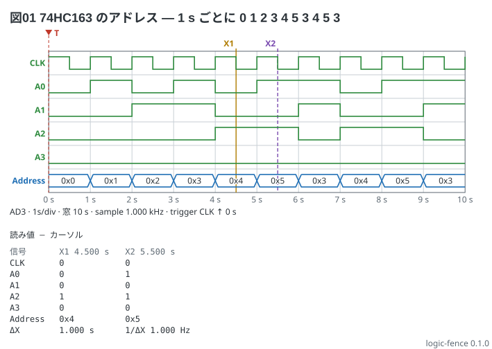

# 74HC163 が数えるアドレス — 本の 10-20

74HC163 (4 ビットの同期カウンタ) のクロックを 1 Hz にして、出力 QA〜QD をロジックアナライザ
(Analog Discovery 3) の DIO1〜DIO4 で見る。カウンタは 0 から 5 まで数えたあと、
3 にロードし直して 3 → 4 → 5 を繰り返す。**1 s ごとに `0 1 2 3 4 5 3 4 5 3`**。
DIO1〜DIO4 を束ねたバス `Address` は 16 進で読む。

```logic
title: 図01 74HC163 のアドレス — 1 s ごとに 0 1 2 3 4 5 3 4 5 3
device: ad3
time: 1s/div
sample: 1kHz
signals:
  CLK: dio0 clock 1Hz
  A:   dio1..dio4 counter on CLK rising sequence 0 1 2 3 4 5 3 4 5 3
buses:
  Address: A3..A0 hex
cursors: [4.5s, 5.5s]
trigger: CLK rising at 0s
```



読み方:

- 窓は `1s/div` の 10 目盛 = 10 s。CLK の立ち上がりが 0 s から 1 s ごとにあり、その直後にアドレスが変わる
- X1 (4.5 s) のアドレスは `0x4`、X2 (5.5 s) は `0x5`。ΔX は 1.000 s (1/ΔX = 1 Hz = クロックの周波数)
- CLK は 4.5 s ちょうどで立ち下がるので、カーソルの読みは **新しい値の 0**
  (変わり目ちょうどの時刻は新しい値を読む)
