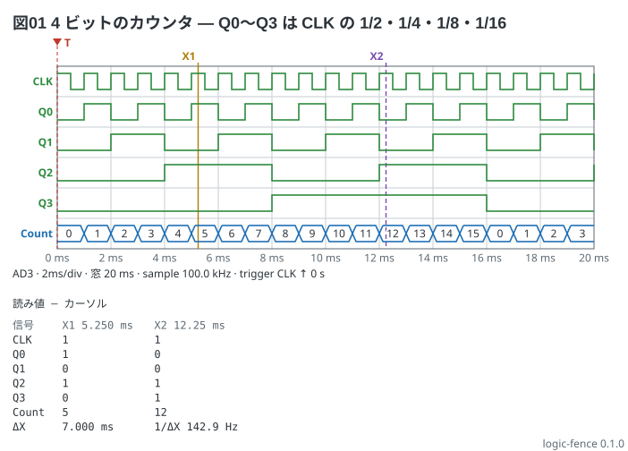

# 4 ビットの 2 進カウンタ — 分周

クロックを数える 4 ビットのカウンタ。Q0 は CLK の 1/2、Q1 は 1/4、Q2 は 1/8、Q3 は 1/16 の周波数になる。
`counter` は `start` から数え、`wrap` (書かなければ 16) で 0 に戻る。

```logic
title: 図01 4 ビットのカウンタ — Q0〜Q3 は CLK の 1/2・1/4・1/8・1/16
device: ad3
time: 2ms/div
sample: 100kHz
signals:
  CLK: dio0 clock 1kHz
  Q:   dio1..dio4 counter on CLK rising start 0
buses:
  Count: Q3..Q0 dec
cursors: [5.25ms, 12.25ms]
trigger: CLK rising at 0s
```



読み方:

- 1 目盛 2 ms に CLK が 2 周期 (1 kHz)。窓は 20 ms で、カウンタは 16 で 0 に戻る (12 ms のあたり)
- X1 (5.25 ms) は 5 回目の立ち上がりの直後で `5`、X2 (12.25 ms) は 12 回目の立ち上がりの直後で `12`
- `dec` は符号なしの 10 進。ΔX は 7.000 ms
