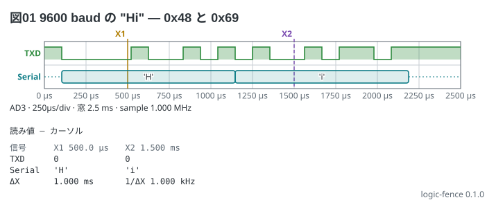

# UART の 1 バイト — プロトコルの読み下し

TXD に 9600 baud・8N1 で `H` (0x48) と `i` (0x69) を流したところ。
アイドルは high、スタートビットは low、データは LSB が先。
`decode:` の `uart` がフレームを箱にして、中に値を書く。

```logic
title: 図01 9600 baud の "Hi" — 0x48 と 0x69
device: ad3
time: 250us/div
sample: 1MHz
signals:
  TXD: dio0 pattern 10000100101010010110111 bit 104.17us
decode:
  Serial: uart TXD baud 9600 8N1 ascii
cursors: [500us, 1.5ms]
```



読み方:

- 1 bit は 1/9600 = 104.17 µs。1 フレームは 10 bit = 1.042 ms で、`H` が 104 µs から、`i` がその直後から始まる
- X1 (500 µs) は `H` の途中、X2 (1.5 ms) は `i` の途中で、読み値の `Serial` の行に `'H'` と `'i'` が出る
- `ascii` は印字できる字を `'H'` の形で、できない値を `0x0A` の形で書く。書かなければ 16 進
