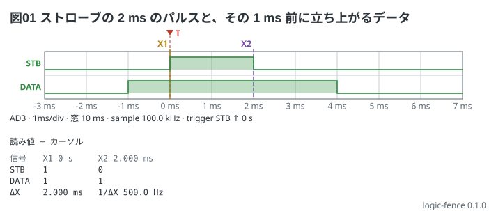

# トリガの前を見る — 窓の左端 (`start:`)

トリガの前の様子を見るには、窓の左端を負の時刻にする。`start: -3ms` なら、窓は -3 ms から 7 ms。
トリガ (T) は 0 s に立ち、その左に「トリガ前」が出る。

```logic
title: 図01 ストローブの 2 ms のパルスと、その 1 ms 前に立ち上がるデータ
device: ad3
time: 1ms/div
start: -3ms
sample: 100kHz
signals:
  STB:  dio0 pulse 0s 2ms
  DATA: dio1 edges -3ms=0 -1ms=1 4ms=0
cursors: [0s, 2ms]
trigger: STB rising at 0s
```



読み方:

- DATA は STB より 1 ms 前 (-1 ms) に立ち上がっている
- X1 = 0 s、X2 = 2 ms で、ΔX = 2.000 ms は STB の幅。X2 は STB の立ち下がりに立つので読みは新しい値の 0
