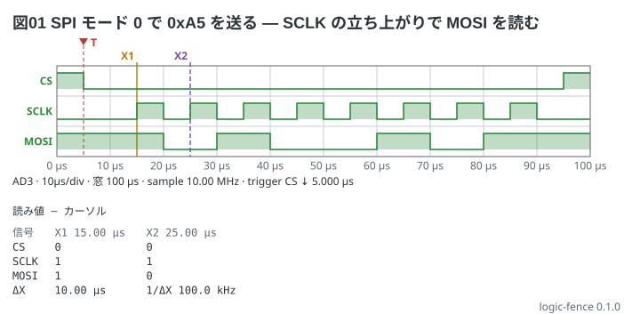

# SPI の 1 バイト — 立ち上がりで読む

SPI のモード 0 (アイドルは SCLK が low、データは SCLK の**立ち上がり**で読む) で、マスタが
`0xA5` (`1010 0101`、MSB が先) を送るところ。CS は low のあいだ有効。
MOSI は SCLK の立ち下がりで変わり、次の立ち上がりで読まれるまで動かない。
**SPI の読み下しはまだ書けない**ので、`pattern` で並べたレーンをカーソルで読む
(プロトコルの読み下しは `decode:` の `uart` だけ)。

```logic
title: 図01 SPI モード 0 で 0xA5 を送る — SCLK の立ち上がりで MOSI を読む
device: ad3
time: 10us/div
sample: 10MHz
signals:
  CS:   dio0 edges 0s=1 5us=0 95us=1
  SCLK: dio1 pattern 01010101010101010 bit 5us from 10us
  MOSI: dio2 pattern 10100101 bit 10us from 10us
cursors: [15us, 25us]
trigger: CS falling at 5us
```



読み方:

- CS が 5 µs で立ち下がり (T)、10 µs から SCLK が 8 クロック (5 µs high・5 µs low)
- MOSI は 1 bit が 10 µs で、`1 0 1 0 0 1 0 1` (MSB が先)。SCLK の立ち上がりは 15 µs・25 µs・35 µs … で、bit の真ん中
- X1 (15 µs) は 1 つ目の立ち上がりで MOSI = 1 (bit 7)、X2 (25 µs) は 2 つ目で MOSI = 0 (bit 6)。ΔX = 10 µs (100 kHz = SCLK の周波数)
