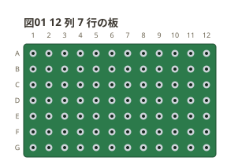
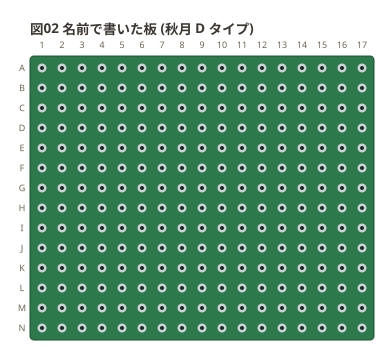
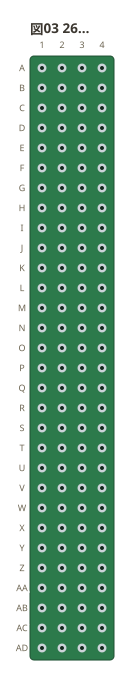
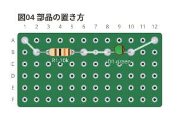
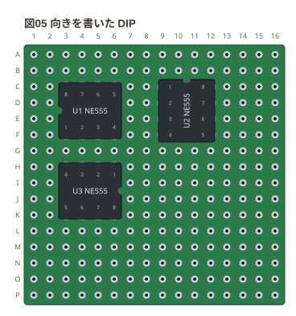
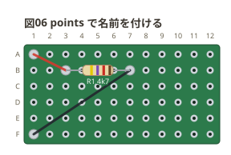
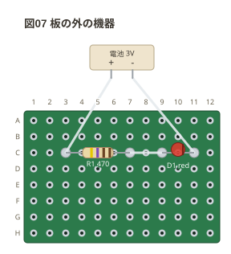

# perfboard フェンスの書き方

Markdown の ` ```perfboard ` フェンスに YAML を書くと、Markdown プレビューで
ユニバーサル基板の実体配線図になる。ここは文法の全部。
回路 1 つずつの例は [examples/](../examples/README.md) にある。

**一通り書ける。** 2 本足・3 本足・DIP・SIP の部品、板の外の機器 (`device`)、
注釈 (`notes:`)、テーマと幅 (`style:`) まで。

## 目次

- [板 (`board:`)](#板-board)
- [番地](#番地)
- [題 (`title:`)](#題-title)
- [部品 (`parts:`)](#部品-parts)
- [配線 (`wires:`)](#配線-wires)
- [穴の名前 (`points:`)](#穴の名前-points)
- [板の外の機器 (`device`)](#板の外の機器-device)
- [注釈 (`notes:`)](#注釈-notes)
- [見た目 (`style:`)](#見た目-style)
- [ネットリスト](#ネットリスト)
- [言われること](#言われること)
- [上限](#上限)

## 板 (`board:`)

**要る。** 板の大きさが決まらないと穴の数が決まらず、番地も配置も読めない。

書き方は 2 つ — **穴数**か、**板の名前**。

### 穴数で書く

**列 × 行**で書く。板が「72×47mm」と長辺 × 短辺で売られているのと同じ順。

```perfboard
board: 12x7
title: 図01 12 列 7 行の板
```



大文字の `X` と前後の空白も受ける (`28 X 18`)。上限は `120x120`。

### 名前で書く

穴数を数えてある板は、名前でも書ける。

| 名前 | 短く | 実寸 | 穴数 |
| --- | --- | --- | --- |
| `akizuki-a` | `a` | 155×114mm | 55 列 40 行 |
| `akizuki-b` | `b` | 95×72mm | 36 列 27 行 |
| `akizuki-c` | `c` | 72×47mm | 25 列 15 行 |
| `akizuki-d` | `d` | 47×36mm | 17 列 14 行 |

```perfboard
board: akizuki-d
title: 図02 名前で書いた板 (秋月 D タイプ)
```



**実寸の綴りでも同じ板が出る。** `72x47mm` も `7.2x4.7cm` も `akizuki-c` になる。

**ただし綴りが違えば別の板のこともある。** 72×47.5mm も「C タイプ」だが、
外形図の格子は 27 × 17 で 72×47mm (25 × 15) と違う。だから実寸で引けるのは、
**その綴りで売られている板を数えたとき**だけにしてある。

### 実寸から穴数は計算していない

縁の余白は板ごとにも辺ごとにも違い、取付穴がそこに入る。だから
**ミリを 2.54 で割っても穴数は出ない** (A タイプは 155×114mm で 55×40。
割り算だと 61×44)。上の表にあるのはメーカーの外形図の丸を数えた値で
(A と C は図面自身が `2200-Ø1.00NT` / `375-1.0ø NT` と穴数を書いている)、
数えていない板は名前で引けない。

そのときは近い板を挙げて返す。たとえば `board: 7x5cm` は
「近いのは `akizuki-c`」と言う — **7×5cm (70×50mm) は汎用基板の呼び名で、
秋月 C タイプ (72×47mm) とは別の板**なので、勝手に当てはめない。

**インダクタにも 3 桁コードを刷る** (`100u` なら `101`。µH 基準)。実物には色帯の
ものもあるが、**帯にすると抵抗と見分けが付かない** — 同じ形の胴なので、色だけの
違いでは読めない。

**傾けて置いた部品は、キャプションも同じだけ傾く** (縦なら時計回りに 90 度、
斜めならその角度)。横のままだと、細長い部品の脇に長い字が伸びて胴や隣の配線に
被る。**上下がひっくり返る向きへは回さない** — 実物の部品はどちら向きに挿しても
同じものなので、名前が逆さまに出る理由がない。

**足や配線が入った穴は半田で埋まる。** 図では銀の玉になり、何も入っていない穴は
黒く抜けたまま残る — **どこを半田付けするのかが図だけで分かる**ようにするため。

**単位が無ければ穴数として読む。** `board: 72x47` は 72 列 × 47 行 (3,384 穴)
になる。ミリのつもりで書いても図は出てしまうので、そこはお知らせで言う。

### スロット用の銅箔 (`slots:`)

板をマップで書くと、大きさのほかに**板そのものの性質**を足せる。いまあるのは
`slots:` 1 つで、**短いほうの両端に並ぶ細長い銅箔**を描く。

```yaml
board:
  size: 20x14
  slots: on
```

| 項目 | 書くもの | 既定 |
| --- | --- | --- |
| `size` | 穴数・名前・実寸 (スカラーで書くときと同じ綴り) | 要る |
| `color` | 板 (レジスト) の色 | `green` |
| `land` | 穴の銅箔 (ランド) の色 | `silver` |
| `slots` | 短いほうの両端の銅箔。`on` / `off` か、その色 | `off` |

```text
color  green  blue  red  black  white  yellow  purple  bare   (と #RRGGBB)
land   silver  gold  copper  tin                              (と #RRGGBB)
```

**板の色とランドの色は表を分けてある。** 混ぜると板に `gold`、ランドに `green` と
書けてしまい、綴りは通るのに実物にない板が出る。

**`slots:` は色でも書ける** (`slots: gold`)。銅箔を出すかどうかと、その色は
1 つの指定で足りる。`land:` だけ書いたときはスロットもそのめっきになる
(実物も同じ工程で仕上がる)。

**色はテーマではなく板に書く。** 図の配色 (`style: theme:`) を変えても
板の色は動かないし、板の色を変えても題や書き出しの字の色は動かない。
**板に載る字の色は板の明るさから決める** — 白い板には黒い字、緑の板には白い字。

- **穴ではないので挿せない。** 番地を持たず、ネットにもネットリストにも出ない
- 出るのは**短いほうの辺**。列が多い板では左右、行が多い板では上下
- 穴からは**穴 1 つぶん (2.54mm) 離す**。詰めると穴の列の続きに見えて、そこにも
  挿せると読める。銅箔を出した辺は、そのぶん板の縁の余白が広がる
- **銅箔には番地がある** — 穴の格子のちょうど 1 つ外なので、`c0` や `c26`
  (25 列の板) がその銅箔になる。配線を引けばネットに出る ([番地](#番地))
- **既定は描かない** — 銅箔の無い板のほうが多く、無い板に描くと
  「そこに何か付けられる」と読めてしまう
- `size:` を書かないとエラー。**大きさを当てて描くと、書いていない板の図が黙って出る**

## 番地

**行の名前 + 列の番号**で `b3`。行は `a` から、列は `1` から。
大文字でも受けて小文字に正規化する (板の印字が大文字のことがある)。

行の名前は**表計算と同じ数え方**で伸びる。`z` の次は `aa`、その次が `ab`。
ユニバーサル基板は板ごとに行数が違い、大きい板は 26 行を超えるため。

```perfboard
board: 4x30
title: 図03 26 行を超える板
```



### 板の外を指す

**番地は板の外へも出せる。** 列は `0` とマイナス (`a0` `a-1` `a-2`…)、
行は `0` とマイナスの英字 (`01` `-a1` `-b1`…)。0 を挟んで
**…-B -A 0 A B…** と間を空けずに並ぶので、板の中と外で数え方が変わらない
(`a1` の左隣が `a0`、その左が `a-1`)。

| 綴り | どこ |
| --- | --- |
| `a-1` | a 行の、1 列目から 2 つ左 |
| `00` | 0 行 0 列 (板の左上の外側の角) |
| `0-3` | 0 行の、3 つ左 |
| `-a1` | a 行の 1 つ上、1 列目 |
| `-b-2` | b 行の 2 つ上、2 つ左 |

板の外を指せないと、**縁の銅箔 (スロット) や、板から張り出す部品の行き先**を
書けない。スロットの銅箔は穴の格子のちょうど 1 つ外に並ぶので、
**`0` 列と `列数+1` 列がそのままその銅箔**になる (25 列の板なら `c0` と `c26`)。
そこへ配線を引けば**銅箔に半田付けした**ことになり、ネットにも出る。

**離れすぎは断る。** 板の外へ出られるのは 4 つ先まで。無制限にすると、
番地 1 つで画布をいくらでも伸ばせる (穴数に上限を置いたのと同じ理由)。

**板の外に穴は無い。** 図に穴は描かれず、そこに挿せるわけでもない —
指せるのは位置であって、載っているのは銅箔か、板から張り出した部品の脚。

## 題 (`title:`)

図の上に出る題。文章から「図03 を直して」と指せるようにするためのもの。

```yaml
title: 図01 RC ローパス
```

## 部品 (`parts:`)

`名前: 種類 穴 穴 値` を 1 行ずつ。部品は**2 つの穴を結ぶ線の上に寝る**。

```perfboard
board: 12x6
title: 図04 部品の置き方
points:
  IN: a1
  OUT: a12
parts:
  R1: resistor b2 b6 10k
  D1: led b8 b10 green
wires:
  - IN -- b2
  - b6 -- b8
  - b10 -- OUT
```



**名前**は英数字と `_` `-` で 32 字まで。配線から指せる形にする。
**同じ名前は 1 つだけ** — 2 つあると、配線がどちらを指すのか決まらない。

**種類**は 2 本足が 18、3 本足が 6、それに `dipN` と `sipN`。

```text
2 本足  resistor  capacitor  led  diode  inductor  crystal  buzzer
        photoresistor  thermistor  thermistor-ntc  thermistor-ptc  varistor
        zener  schottky  photodiode  fuse  lamp  sma
3 本足  transistor  potentiometer  thyristor  triac  slide-switch  regulator
パッケージ  dip4〜dip40 (偶数)  sip2〜sip40
```

**書く穴の数は形が決まる。**

| 形 | 書く穴 | 足の位置 |
| --- | --- | --- |
| 2 本足 | 2 つ | 書かれたとおり |
| 3 本足 | 3 つ | 書かれたとおり (足は曲げられる) |
| `dipN` | 1 つ (1 番ピン) | パッケージが決める。2 列の間隔は 300 mil = 3 穴 |
| `sipN` | 1 つ (1 番ピン) | パッケージが決める。1 列に並ぶ |

DIP の番号は実物と同じ付き方 — 1 番ピンから右へ、折り返して下の列を左へ戻る。
図には 1 番ピン側の切り欠きを描く (**無いと 180 度回して挿せてしまう**)。

略記も書ける (`r` `c` `l` `d` `q` `tr` `pot` `scr` `reg` `ec` `ecap` `ldr`
`ntc` `ptc` `xtal`)。
**畳んだ先の正式名しか出口には出ない** — 図・エラー・ネットリストは正式名で揃う。

**姿**は種類のあとに `/` で書く (`capacitor/ceramic`)。
書ける姿は `capacitor` が `ceramic` `film` `electrolytic` `tantalum`、
`led` が `3mm` `5mm`、3 本足の 4 種が `to92` `to220`、
`sma` が `male` `female` `male-edge` `female-edge`。
**`sma` 以外はまだ描き分けない**ので、書くとその旨のお知らせが出る。

### 同軸コネクタ (`sma`)

足は**中心導体と GND の 2 本**。実物の GND は 4 本だが、図とネットリストで意味を
持つのは「どこが中心でどこが GND か」の 2 つ。

| 姿 | 置き方 | 図 |
| --- | --- | --- |
| `male` / `female` | 板の上に立てる (縦置き) | 上から見た丸。オスは中心にピン、メスは穴 |
| `male-edge` / `female-edge` | 板の縁に載せる (横置き・端面実装) | ねじ部・ねじなし・台座 (1mm) の 3 段。台座の右端が板の縁に来て、そこから先は**凹の形** (上下にアース、中心導体が凸) |

**横置きは GND 側へ張り出す。** 実物は GND の脚が板の縁に来て、中心導体が
その内側まで伸びるので、`J1: sma/female-edge c3 c1` と**中心導体を先に、
板の縁側の GND をあとに**書く。胴は板の外へ出るぶん**画布が広がる**
(切って描くと、図を見た人は切れたことに気づけない)。

**値**は残り全部。空白を含んでよい (`100n 50V`)。
抵抗として読める値ならカラーコードを塗る (`10k` `4k7` `2.2M` `220`)。
**帯の本数は値の桁数で決まる** — 2 桁で書ける値は 4 帯 (数字 2 + 乗数 + 許容差)、
3 桁要る値は 5 帯。実物も E24 が 4 帯、E96 が 5 帯なので、書いた値がそのまま帯になる。

許容差は値のうしろに書ける (`10k 5%`)。**書かなければ ±1%** — 金属皮膜 (金皮) の
標準で、いま手に入る抵抗のほとんどがこれ。温度係数を足すと 6 帯になる
(`10k 1% 50ppm`)。**色を持っていない許容差・温度係数は帯を描かない** —
近い値へ丸めると、実物と違う帯が出て図を信じた人を間違えさせる。
読めない値では帯を描かない — 実物と違う帯は、図を信じた人を間違えさせる。
LED は値を色として読む (`red` `green` `blue` `yellow` `white` `orange`)。

**書く穴の数を超えた番地は、黙って値にせずエラーにする。** 足を 1 本多く書いた
つもりの人が、「値 b9」と書かれた図を見て気づけないまま終わるため。

ただし**どの板にも載らない番地は書き間違いではない**。型番は番地とそっくりの
綴りをしていて (`NE555` は ne 行 555 列、`C1815` は c 行 1815 列)、番地として
弾くと正しい図が毎回叱られる。上限 (120 列 × 120 行) を超える綴りは型番のほう。

## 配線 (`wires:`)

`- 穴 -- 穴` を 1 行ずつ。**2 つの穴をまっすぐ結ぶ。**
経路探索は無い — 溝もレールも無く、どの穴も同じ格子の上にあり、実物のジャンパも
2 点を最短で結ぶ。**書かれたとおりに描く**ので、はんだ付けの手順書になる。

色は後ろに書ける。名前か、`#RRGGBB` の綴り。

**書かなければ板の色に合わせて選ぶ。** 緑や黒の板には明るい線、白い板には
暗い線が出る。既定を 1 つの灰色に固定すると、**同じ濃さの板で線が沈む**ため。
板の色 (`board: color:`) を変えれば線の色も一緒に動く。
**書いた色は動かさない** — あちらは実物の被覆の色なので、読みにくくても
書いたとおりに描く (図と手元の線を見比べるためのもの)。

```text
red  black  white  gray  grey  orange  yellow  green  blue  purple  brown  pink
#ff0000  #f00  (大小は問わない)
```

**名前のほうが読んで分かる**ので、実物の被覆の色に当たるものは名前で書く。
`#RRGGBB` は手元の線の色に寄せたいときのためのもの。

**そのどちらでもない綴りは書式エラー。** 色は SVG の属性へそのまま流れるので、
`red" onload="…` のような綴りが属性を割って出ないように、
**持っている名前か、字面が厳密に色である綴り**の 2 通りだけを通す。
注釈 (`notes:`) の色も同じ語彙。

**途中で交差する線は跨いで引く。** この板は穴どうしが何もつながっていないので、
導通が生まれるのは配線の**両端の穴だけ**。線の途中で別の線と重なっても、そこは
ただの交差で何も起きない。ところが図の上では 2 本の線が同じ点で出会うので、
**半田付けした接点に見える**。あとに書いたほうを半円で跨がせて、渡っているだけだと
形で言う (実物でもジャンパは相手をまたいで渡るので、見たままでもある)。

**端が別の線の途中に乗っているものは跨がない。** そこは交差ではなく書き方の
問題で、跨いでも読めるようにはならない — 穴を通る 2 本に分けて書く。

## 穴の名前 (`points:`)

`名前: 番地` を 1 行ずつ。配線の端にその名前を書けるようになり、
**ネットの名前にもなる**。

```perfboard
board: 12x6
title: 図05 points で名前を付ける
points:
  VCC: a1
  GND: f1
parts:
  R1: resistor b3 b7 4k7
wires:
  - VCC -- b3 red
  - b7 -- GND black
```



**番地と同じ綴りは名前にできない。** `b3: c5` と書けてしまうと、`b3` がどちらを
指すのか読む人にも処理にも決まらなくなる。

名前を付けた穴は**「基板の外へ出る」意思表示**として扱う。電源や信号の出入口が
「つなぎ忘れ」と言われないようにするため。

## 板の外の機器 (`device`)

電池・スピーカー・測定器のように**盤面に載らないもの**。`parts:` の中に
**入れ子で**書く — 足の名前の並びを持つので 1 行に畳めない。

```perfboard
board: 12x8
title: 図06 板の外の機器
parts:
  R1: resistor c3 c7 470
  D1: led c9 c11 red
  BAT:
    type: device
    at: top
    label: 電池 3V
    pins: + -
wires:
  - BAT.+ -- c3
  - c7 -- c9
  - c11 -- BAT.-
```



| 項目 | 書くもの | 既定 |
| --- | --- | --- |
| `type` | `device` (**必ず書く**) | — |
| `at` | `top` / `bottom` (帯に並べる) か**番地** (そこに置く) | `top` |
| `label` | 図の箱に出る言葉 | 名前そのまま |
| `pins` | 足の名前。空白区切りか YAML の並び | — |

**`at:` に番地を書くと、その場所に置く。** 板の外の番地なので `-e1` (板の上) や
`n5` (板の下) のように書く ([番地](#番地))。**足は穴の格子に載り**、1 本目が書いた
番地の列、次が 1 穴どなり…と並ぶ。箱はその足の上に載る。こうすると
**「その足のいちばん近い穴」が迷いなく決まる**ので、機器の足からまず真下 (真上) の
穴へ落として、そこから板の上を配線できる。

帯に並べると置きたかった場所と関係なく散るので、**並べ方を自分で決めたいときは
番地で書く**。板の寸法には機器のはみ出すぶんも入るので、題や書き出しと重ならない。
**足の名前は箱の内側**に書く — 外に出すと板の列番号や配線に重なる。

**足は `+ -` のように空白で区切って 1 行に書ける。** YAML の並び (`[+, -]`) に
書くと `-` に空白が続くと箱の始まりに読まれて `["+", "-"]` と括らされる。電池の端子を
書くたびに引っかかる罠なので、1 行の書き方を正にしている。

**入れ子なら機器、とは決めない。** `type: device` を書かない入れ子は断る —
部品を書き間違えて字下げした人が、板の外に箱が出ているのを見て
気づけないまま終わるため。

配線からは `名前.足` で指す (`BAT.+`)。番地にも `points:` の名前にも `.` は
現れないので、綴りだけで機器の足だと分かる。

**機器へつなぐ配線も板の上まで線を引く。** 電池やスピーカーの線も、実物では板の穴に
半田付けする。どの穴へ行くのかが図に出ないと、帯に浮いた箱と板が結び付かず、
組む人が図から手を動かせない。色を書けばその色で引く。
**機器どうしを結んだ配線だけは板に触れない**ので線が無く、色を書いたときは
その旨のお知らせが出る (黙って消すと、効かない指定を書き続けることになる)。

## 注釈 (`notes:`)

図に印を付けて、文章から指せるようにするためのもの。**回路の一員ではない**
(ネットにもネットリストにも出ない)。

```perfboard
board: 12x8
title: 図07 注釈
points:
  IN: a1
  GND: h1
parts:
  R1: resistor c3 c7 10k
wires:
  - IN -- c3
  - c7 -- GND
notes:
  - mark c3 red
  - box b2 d8 blue
  - arrow f4 c5
  - text f6 ここから電源
```



| 印 | 書き方 | 出るもの |
| --- | --- | --- |
| `mark` | `mark 番地 [色]` | 穴を囲む丸 |
| `box` | `box 番地 番地 [色]` | 2 つの番地を対角にした枠 |
| `arrow` | `arrow 番地 番地 [色]` | 1 つ目から 2 つ目への指し棒 |
| `text` | `text 番地 言葉` | その穴のそばに出る字 |
| `source` | `source [色]` | **そのフェンスの中身**を図の下に書き出す |
| `parts` | `parts [色]` | **部品表**を図の下に出す |

**`text` には色を書けない。** 字は残り全部を言葉として取るので、色を許すと
「色の名前で始まる注釈」が黙って色になる。区別の付かない書き方は作らない。
**`source` と `parts` には書ける** — 言葉を取らないので、色と紛れる余地がない。

注釈は**一番上に描く** — 指したものが下に隠れると印の意味が無くなる。

### 書き出し (`- source`)

`- source` はそのフェンスの中身を、囲みごと図の下に写す。**図だけを貼られた人が、
同じ図をもう一度出せる**ようにするためのもの。

- **番地は書かない。** フェンス全体は板より高いのが普通で、板に重ねると穴も
  部品も読めなくなる。置き場所は図の下の帯で、選べない
- **行番号は添えない。** 値打ちは見たまま書き写せることなので、番号が混ざると
  写したものが動かない
- 板より横に長い書き出しでは、切らずに**画布のほうを広げる**
  (細い板で `…` だらけにしない)
- 色を書かなければ**図の文字色に従う**。白黒 (`mono`) の図で書き出しだけが
  浮かないようにするため
- 長いフェンスは途中で切り、**切ったことを図に書く** (黙って落とさない)
- 2 つ書いても描くのは 1 つ。**残りは無視したとお知らせする**

### 部品表 (`- parts`)

`- parts` は**何を揃えればよいか**を図の下に出す。番地と値は図の中に散らばって
いるので、拾い集めるには図を目で追うしかない。**同じフェンスから出す**ので、
部品を足したのに表を直し忘れる、が起きない。

| 欄 | 出るもの |
| --- | --- |
| 部品 | 書いた ID (`R1`) |
| 種類 | 正式名。姿を書いてあれば添える (`capacitor/ceramic`) |
| 値 | 書いた値 (`10k` / `NE555`)。機器は名札 (`電池 3V`) |
| 色 | **抵抗のカラーコードを字にしたもの** (`10k` → `茶黒橙茶`) |

- **抵抗の色は字で出す。** 実物を選ぶときに見るのは帯の色そのものだが、図の帯は
  小さく、白黒で刷ると消える。字にしておけば刷った図でも読み合わせられる。
  **値として読めない抵抗には出さない** (実物と違う帯を書かない)
- 板の外の機器も並べる。**盤面に載らないだけで、揃えるものには変わりない**
- **書いた順に並べる。** 番号で並べ直すと、図を追いながら表を読む人が行を見失う
- 置き場所は書き出しと同じ図の下の帯で、選べない (`- source` を書けば
  **部品表が上、書き出しが下**)
- 2 つ書いても描くのは 1 つ。**残りは無視したとお知らせする**

## 見た目 (`style:`)

テーマの名前 1 つだけなら、そのまま書ける。

```yaml
style: dark
```

項目で書くこともできる。

```yaml
style:
  theme: mono
  width: 720
  debug: off
  stamp: on
  check: off
  back: on
  labels:
    row: alpha
    col: numeric
    case: upper
```

| 項目 | 書くもの | 既定 |
| --- | --- | --- |
| `theme` | `light` / `dark` / `mono` | `light` |
| `width` | 図の幅 (120〜4000) | 板の大きさなり |
| `debug` | お知らせを帯に出すか | `on` |
| `stamp` | 版を SVG に刻むか | `off` |
| `check` | ERC と当たり判定を掛けるか | `on` |
| `back` | 半田面 (裏返した板) も描くか | `off` |
| `labels` | 板の外の名前の付け方 (`row` / `col` / `case` / `sides`) | 行 `alpha` / 列 `numeric` / `upper` / `left top` |

**配色だけがテーマで動く。** 穴や字の寸法は 3 つとも同じで、同じフェンスを別の
テーマで出しても部品の位置も線の通り道も動かない。`mono` は白黒で刷る資料向けで、
**色で意味を持たせない**。

`width` は書き出す画の大きさだけを変える (`viewBox` は動かない)。
`debug` と `stamp` と `check` は `on` / `off` で書く (`true` / `false` でも同じ)。

**`debug: off` で伏せられるのはお知らせだけ。** 読めなかった行はこの切り替えの
対象ではない — 伏せると「無かったこと」に化ける。

**`check: off` は伏せるのではなく、そもそも見ない。** `debug: off` が見つけたものを
帯に出さないだけなのに対し、こちらは検査を掛けないので、呼び出し側が受け取る
お知らせにも出てこない。回路の一部だけを描いた図など、**未結線が承知のうえ**の
ときに使う。図は 2 つとも同じで、変わるのは言うことだけ。
**読めなかった行はこの切り替えの対象ではない** (`debug` と同じ)。

### 板の外の名前 (`labels:`)

行と列の名前は、**英字と数字のどちらでも振れる** (`row` / `col` に `alpha` か
`numeric`)。英字は `case` で大小を選ぶ。既定は**行が英字・列が数字で、英字は
大文字** — 板のシルク (秋月 C タイプの A・E・J・O) が大文字なので、そちらに
合わせている。

**番地の書き方は変わらない。** どう印字しても `c3` は c 行 3 列で、フェンスに
書く綴りは動かない。動くのは板の外に出る名前だけで、**手元の板のシルクに
寄せて見比べる**ためのもの。

**名前を出す辺は `sides:` に空白で並べる** (`left` `right` `top` `bottom`)。
`all` で四辺、`none` で消す。**既定は左と上だけ** — 四辺に出すと、小さい板では
名前のほうが板より目立つ。大きい板で端から数え直したいときに増やす。
出す辺には**余白を空ける**ので、右と下に出しても字が画布から切れない。

### 半田面 (`back:`)

**重ね順は手前から、半田点 → 配線 → 部品。** 半田面で手を動かすときに見るのは
半田付けする穴と、そこを渡るジャンパで、部品は板の向こう側にある。部品は薄く
敷いて「どのランドがどの部品の足か」だけを伝える。

`back: on` で、**裏返した板**を図の下に足す。ユニバーサル基板は配線を裏で
半田付けするので、手を動かすときに見るのはそちら側になる。頭の中で裏返すのは
間違えやすい (1 番ピンの側を取り違えると、直すのに全部剥がすことになる)。

- **入れ替わるのは列だけ。** 板を縦軸でひっくり返すので、行はそのまま
- **字は裏返さない** (鏡文字は読めない)
- 描くのは板・穴・配線・部品。部品は板の向こう側にあって実際には見えないが、
  **どのランドがどの部品の足か**が分からないと半田付けできないので、透かして置く
- 板の外の機器と注釈は表の図の話なので出てこない
- **既定は出さない** — 要るのは実際に半田付けするときだけで、図の高さが倍になる

## ネットリスト

穴の導通と配線から導く。**全穴が独立している**ので、部品を挿しただけでは
何にもつながらず、ネットリストは書いた配線からだけ出る。

図05 のネットリストはこうなる。

```text
VCC : R1.1
GND : R1.2
```

足の名前は `部品名.番号` で、番号は書いた順。名前を付けていないネットは
`N1` `N2` と連番になる (`points:` の名前と重ならないように選ぶ)。

ネットリストは CLI の `check` / `render` が出す。プレビューには出ない。

## 言われること

**読めなかったところ**は、図の外に出る。図が 1 枚も組めなければカード、
組めたが一部が読めなかったときは帯。どちらも**行番号と、その行の中身と、
綴りを指す印**が付く。

**お知らせ**は「読めてはいるが、そのとおりに組むと動かない」もの。
帯には読めなかったものが先に並ぶ (お知らせは足 1 本につき 1 件出るので、
行順のままだと本物のエラーが打ち切りで消える)。

お知らせに出るのは 7 つ。

| 見るもの | なぜ |
| --- | --- |
| どこにもつながっていない足 | 全穴独立なので、挿しただけでは何にもつながらない (機器の足も同じ) |
| 配線で短絡した部品 | 抵抗を入れたつもりが線でまたいでいた、という取り違え |
| 部品の足を 1 つもつないでいない配線 | ネットリストから落ちるので、言わないと黙って消える |
| 胴の重なり | 足の穴が別でも胴は重なる。実物では両方を挿せない |
| 足の間隔が狭すぎる | 胴の両端から足が出る部品は、胴より狭い間隔に入らない |
| 機器が板の幅に収まらない | 帯からはみ出した箱は黙って切れる。切れた図は間違いに見えない |
| 機器どうしを結ぶ配線に書いた色 | 板に触れないので線が無く、図に出ない。黙って消すと効かない指定を書き続ける |

**読めなかったところがあるうちは、うち上の 5 つを見ない。** 落ちた配線を勘定に
入れないまま「つながっていません」と言うと、書いた配線について書き忘れを
指摘することになる。見ていないことは黙らずに言う。

## 上限

他人の書いたノートを描く前提なので、必ず頭を打たせる。

| もの | 上限 |
| --- | --- |
| 板の大きさ | 120 列 × 120 行 |
| 部品 | 200 個 |
| 配線 | 500 本 |
| `points:` の名前 | 100 個 |
| 機器 1 つの足 | 64 本 (名前は 24 字) |
| 注釈 | 200 個 (1 つ 60 字) |
| 名前の長さ | 32 字 |
| 値・題の長さ | 60 字 |
| 行の名前 / 列の番号 | 4 字 / 4 桁 |

行の名前に上限があるのは**止まらなくなるから**。無制限に受けると行番号が
桁あふれして `Infinity` になり、名前を作る桁下げが終わらない。
