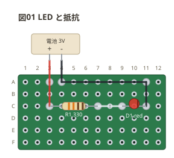

# LED と抵抗

いちばん小さな回路。電池から抵抗を通して LED を光らせる。
**同じ回路を circuit / breadboard でも描いてある** (どれも「図01 LED と抵抗」)。

```perfboard
board: 12x6
title: 図01 LED と抵抗
parts:
  R1: resistor c3 c7 330
  D1: led c9 c11 red
  BAT:
    type: device
    at: -c3
    label: 電池 3V
    pins: + -
wires:
  - BAT.+ -- a3 red
  - a3 -- c3 red
  - c7 -- c9
  - BAT.- -- a4 black
  - a4 -- a11 black
  - a11 -- c11 black
```



読み方:

- `c3` `c7` は穴番地 (行 A〜F + 列番号)。**基板は穴が 1 つずつ独立している**
  ので、ブレッドボードと違って隣の穴とはつながらない。つなぐ線は全部書く。
- `resistor c3 c7 330` の `330` はカラーコード (橙橙茶) になって帯に出る。
- 電池は板の外の機器 (`type: device`)。`at: -c3` の `-` は板の外を指す。

| ネット | つながっている端子 |
| --- | --- |
| N1 | R1.1, BAT.+ |
| N2 | R1.2, D1.1 |
| N3 | D1.2, BAT.- |
