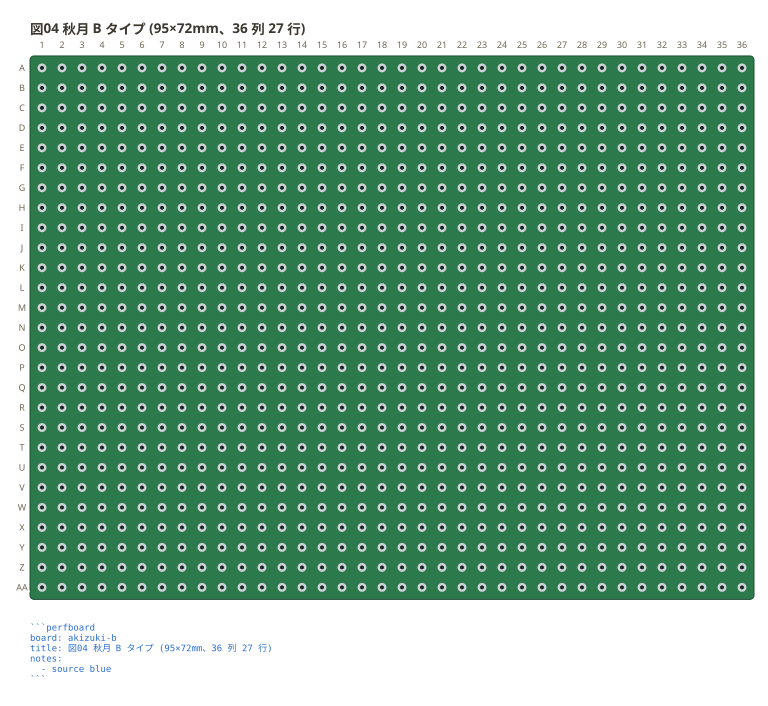
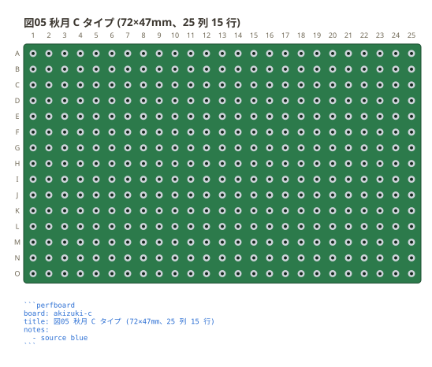
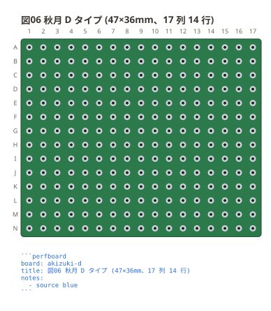
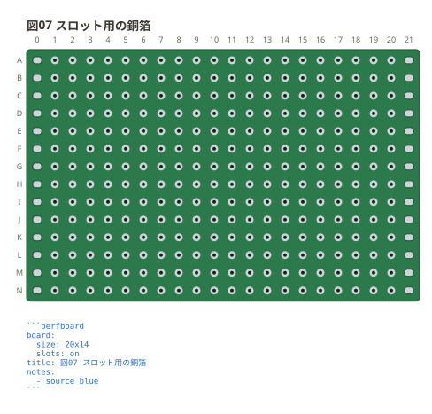
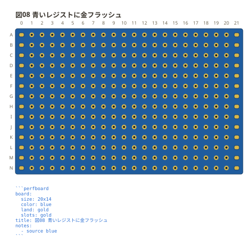

# 板と番地

`board:` に**列 × 行**で穴数を書く。板が「72×47mm」と長辺 × 短辺で
売られているのと同じ順。

```perfboard
board: 12x7
title: 図01 12 列 7 行の板
notes:
  - source blue
```


番地は**行の名前 + 列の番号**で `b3`。行の名前は表計算と同じ数え方で伸びるので、
26 行を超える板でも `aa` `ab` と続けて読める。

```perfboard
board: 4x30
title: 図02 26 行を超える板
notes:
  - source blue
```


穴数を数えてある板は、名前でも書ける。`akizuki-a` (55 列 40 行) /
`akizuki-b` (36 列 27 行) / `akizuki-c` (25 列 15 行) / `akizuki-d` (17 列 14 行)
の 4 つ。短い名前 (`a` `b` `c` `d`) でも同じ板が出る。

```perfboard
board: akizuki-a
title: 図03 秋月 A タイプ (155×114mm、55 列 40 行)
notes:
  - source blue
```


```perfboard
board: akizuki-b
title: 図04 秋月 B タイプ (95×72mm、36 列 27 行)
notes:
  - source blue
```



```perfboard
board: akizuki-c
title: 図05 秋月 C タイプ (72×47mm、25 列 15 行)
notes:
  - source blue
```



```perfboard
board: akizuki-d
title: 図06 秋月 D タイプ (47×36mm、17 列 14 行)
notes:
  - source blue
```



実寸の綴り (`47x36mm` `4.7x3.6cm`) でも同じ板が出る。

## スロット用の銅箔

実物には、**短いほうの両端に細長い銅箔**が並んでいる板がある。板をマップで書いて
`slots: on` と足すと、その銅箔が出る。大きさは今までどおり `size:` に書く。

```perfboard
board:
  size: 20x14
  slots: on
title: 図07 スロット用の銅箔
notes:
  - source blue
```



**穴ではないので挿せない。** 半田付けする面であって部品の足の行き先ではないので、
番地も持たず、ネットにもネットリストにも出ない。**既定は描かない** — 銅箔の無い板の
ほうが多く、無い板に描くと「そこに何か付けられる」と読めてしまう。

銅箔が出るのは**短いほうの辺**。列のほうが多い板 (上の図) では左右に、
行のほうが多い板では上下に並ぶ。

**穴からは穴 1 つぶん離して置く。** 詰めると穴の列の続きに見えて、そこにも
挿せると読めてしまう。銅箔を出した辺は、そのぶん板の縁の余白が広がる。

## 板の色

板は**緑にはんだメッキ** (銀) が既定。手元の板が別の色なら、`color:` と `land:`
で寄せられる。`slots:` に色を書けば、スロットの銅箔だけ別のめっきにもできる。

```perfboard
board:
  size: 20x14
  color: blue
  land: gold
  slots: gold
title: 図08 青いレジストに金フラッシュ
notes:
  - source blue
```



書けるのは `green` `blue` `red` `black` `white` `yellow` `purple` `bare` と
`#RRGGBB`、めっきは `silver` `gold` `copper` `tin` と `#RRGGBB`。**板とめっきで
表を分けてある**ので、板に `gold` とは書けない (綴りは通るのに実物にない板が出る)。

**色は板の性質**なので `style:` ではなくここに書く。テーマ (`light` / `dark` /
`mono`) を変えても板の色は動かず、板の色を変えても題や書き出しの字は動かない。
**板に載る字の色は板の明るさから決まる** — 上の図のように暗い板なら白い字になる。

**実寸から穴数は計算していない。** 縁の余白は板ごとにも辺ごとにも違い、
取付穴がそこに入るので、ミリを 2.54 で割っても穴数は出ない (C タイプは
72×47mm で 25×15。割り算だと 28×18 になる。A タイプは 155×114mm で 55×40 だが、
割り算だと 61×44)。穴数はメーカーの外形図の丸を数えて入れてある — A と C は
図面自身が穴数を書いていて (`2200-Ø1.00NT` / `375-1.0ø NT`)、数えた値と一致した。

**同じ「C タイプ」でも、板が違えば穴数が違う。** 72×47mm (ガラスコンポジット・
日本製) は 25×15 だが、72×47.5mm (片面ガラス・めっき仕上げ) の外形図は 27×17 の
格子で、四隅が取付穴に取られている。だから**実寸で引けるのは、その綴りで
売られている板を数えたときだけ**。数えていない大きさ (`7x5cm` `72x47.5mm` など)
は近い板を挙げて返すので、手元の板を数えて穴数を直に書く。
