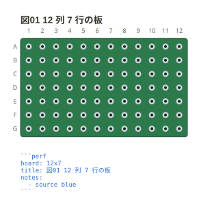
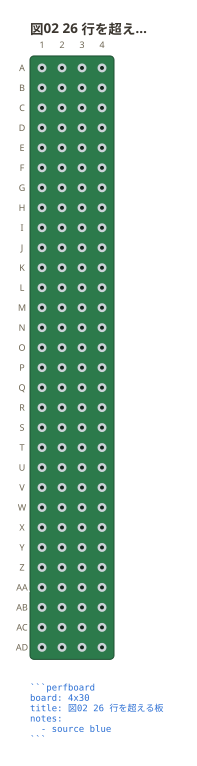
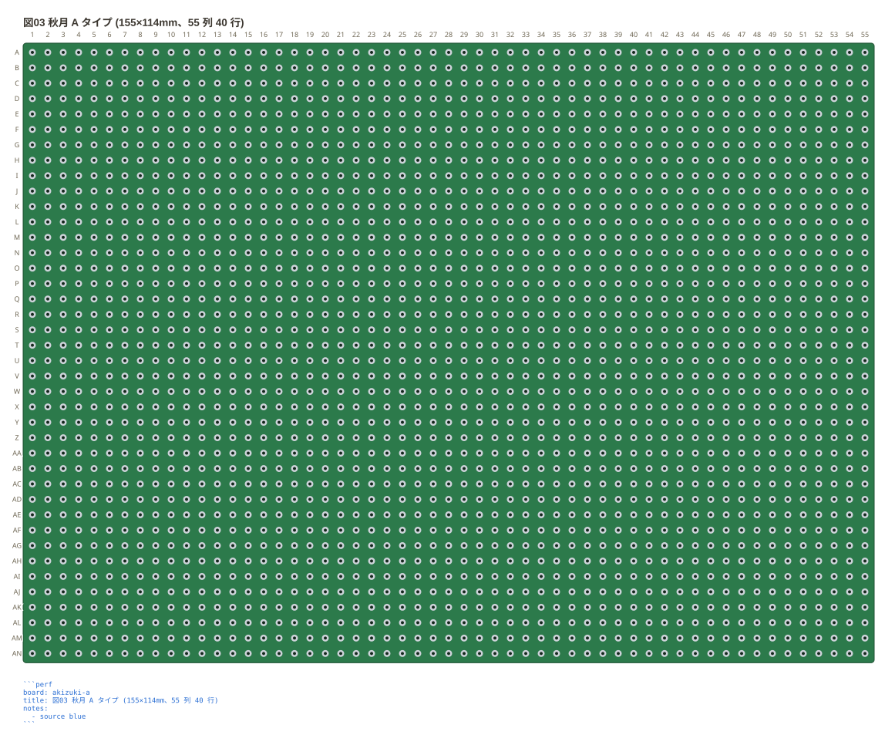

# 板と番地

`board:` に**列 × 行**で穴数を書く。板が「72×47mm」と長辺 × 短辺で
売られているのと同じ順。

```perfboard
board: 12x7
title: 図01 12 列 7 行の板
```



番地は**行の名前 + 列の番号**で `b3`。行の名前は表計算と同じ数え方で伸びるので、
26 行を超える板でも `aa` `ab` と続けて読める。

```perfboard
board: 4x30
title: 図02 26 行を超える板
```



穴数を数えてある板は、名前でも書ける。`akizuki-b` (36 列 27 行) /
`akizuki-c` (25 列 15 行) / `akizuki-d` (17 列 14 行) の 3 つ。

```perfboard
board: akizuki-d
title: 図03 名前で書いた板 (秋月 D タイプ 47×36mm)
```



実寸の綴り (`47x36mm` `4.7x3.6cm`) でも同じ板が出る。秋月が同じ板を複数の
寸法で書いている (C タイプは 72×47mm・72×47.5mm・72×48mm) ので、
**実寸は 1 つに決まらない**ため、どれもその板の別名として引く。

**実寸から穴数は計算していない。** 縁の余白は板ごとにも辺ごとにも違い、
取付穴がそこに入るので、ミリを 2.54 で割っても穴数は出ない (C タイプは
72×47mm で 25×15。割り算だと 28×18 になる)。名前で引けるのは商品写真から
数えた板だけで、数えていない大きさ (`7x5cm` など) は近い板を挙げて返す。
