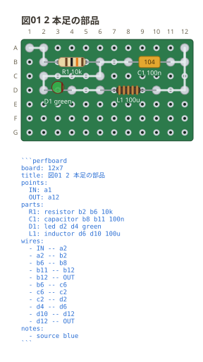
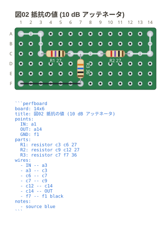
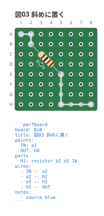
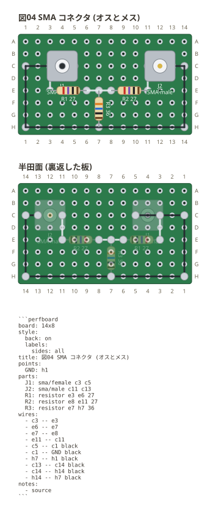
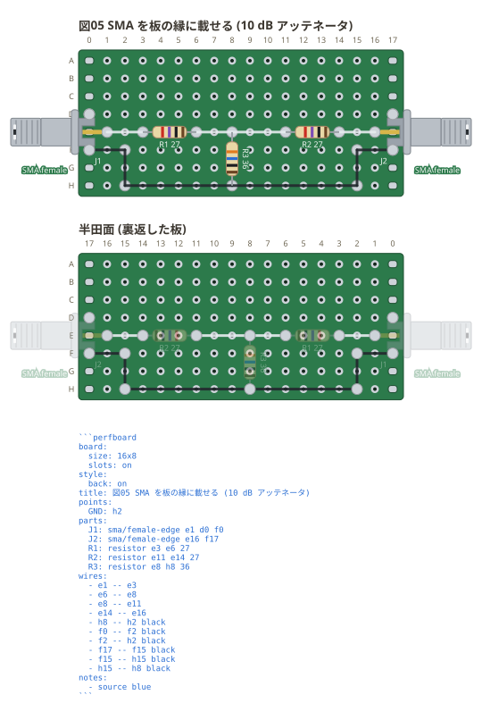

# 部品を置く

`parts:` に `名前: 種類 穴 穴 値` と書く。部品は**2 つの穴を結ぶ線の上に寝る**。

```perfboard
board: 12x7
title: 図01 2 本足の部品
points:
  IN: a1
  OUT: a12
parts:
  R1: resistor b2 b6 10k
  C1: capacitor b8 b11 100n
  D1: led d2 d4 green
  L1: inductor d6 d10 100u
wires:
  - IN -- a2
  - a2 -- b2
  - b6 -- b8
  - b11 -- b12
  - b12 -- OUT
  - b6 -- c6
  - c6 -- c2
  - c2 -- d2
  - d4 -- d6
  - d10 -- d12
  - d12 -- OUT
notes:
  - source blue
```



抵抗は**値が抵抗として読めればカラーコードを塗る**。`10k` は茶・黒・橙に、
許容差の茶 (±1%) が付いた 4 帯。**帯の本数は値の桁数で決まる** — 3 桁要る値
(`4k99`) は 5 帯になり、温度係数を書くと 6 帯 (`10k 1% 50ppm`)。
許容差を書かなければ ±1% (金属皮膜の標準)、`10k 5%` と書けば金の帯になる。
読めない値のときは帯を描かない — 実物と違う帯は、図を信じた人を間違えさせる。

LED は書かれた色で光る (図01 の `green`)。知らない色でも既定の赤で描く
(足の位置は変わらない)。

下は **50Ω 系の 10 dB T 型アッテネータ** — 直列に 26.1Ω が 2 本、分岐に 35.7Ω。
測定器の前に挟んで電力を 1/10 (電圧で約 1/3) に落とす。値はどれも 2 桁では
書けない E96 の並びなので**5 帯**になり、`26r1` は赤・青・茶の 3 桁に、
乗数の金 (×0.1) と許容差の茶が付く。`r` は小数点の代わりで、`4k7` の `k` と
同じ書き方。

```perfboard
board: 14x6
title: 図02 抵抗の値 (10 dB アッテネータ)
points:
  IN: a1
  OUT: a14
  GND: f1
parts:
  R1: resistor c3 c6 26r1
  R2: resistor c9 c12 26r1
  R3: resistor c7 f7 35r7
wires:
  - IN -- a3
  - a3 -- c3
  - c6 -- c7
  - c7 -- c9
  - c12 -- c14
  - c14 -- OUT
  - f7 -- f1 black
notes:
  - source blue
```



同じ T 型は図05 にもう一度出てくる。あちらは 6 dB で、値が 2 桁で書ける
(`16` `68`) ので 4 帯になる — **帯の本数を選ぶ書き方は無く、書いた値が決める**。

斜めにも置ける。胴は 2 穴を結ぶ線の傾きのまま寝る。

```perfboard
board: 8x8
title: 図03 斜めに置く
points:
  IN: a1
  OUT: h8
parts:
  R1: resistor b2 e5 1k
wires:
  - IN -- a2
  - a2 -- b2
  - e5 -- h5
  - h5 -- OUT
notes:
  - source blue
```



## 同軸コネクタ (SMA)

`sma` は**中心導体と GND の 2 本足**で書く。実物の GND は 4 本だが、図と
ネットリストで意味を持つのは「どこが中心でどこが GND か」の 2 つ。
姿に `male` / `female` を書くと、**中心がピンか穴かで描き分ける** — 図を見て
挿す人が、合う相手を取り違えないように。

```perfboard
board: 14x8
style:
  back: on
  labels:
    sides: all
title: 図04 SMA コネクタ (オスとメス)
points:
  GND: h1
parts:
  J1: sma/female c3 c5
  J2: sma/male c10 c12
  R1: resistor e5 e10 50
wires:
  - c3 -- e3
  - e3 -- e5
  - c5 -- c1 black
  - c1 -- GND black
  - e10 -- c10
  - c12 -- c1 black
  - c1 -- GND black
notes:
  - source
```



**胴は足を広げても伸びない。** 六角の胴 (6.35mm) を持つ金物なので、玉の部品
(LED) と同じ扱いで、大きさは足の間隔で変わらない。**穴 2 つに載る形ではない**ので、
当たり判定は胴の大きさで見る (隣に部品を置くと重なりとして言われる)。

`-edge` を付けると**横置き** (端面実装)。板の縁に載せて、首から先を板の外へ出す。
**載せる辺は番地が決める** — 凹の先端を左の銅箔 (`d0` `f0`) に書けば左向き、
右の銅箔 (`d17` `f17`) に書けば右向きに出る。
図は実物の外形図と同じ 3 段 — 左から**ねじ部** (1/4-36UNS の筋)、**ねじなし**、
**台座**。**台座の右端が板の縁**に来る (実物もそこで板を挟む。台座の厚さは 1mm)。
そこから先は**凹の形**で、**上下にアース**が伸び、その間から**中心導体が凸に**
出て、先の穴に入る。**足は 3 本** — 中心導体と、凹の両端の先端。先端は中心線の
上下の行の縁の銅箔に来て、そこに白い接点が出る。

```perfboard
board:
  size: 16x8
  slots: on
style:
  back: on
title: 図05 SMA を板の縁に載せる (6 dB アッテネータ)
points:
  GND: h2
parts:
  J1: sma/female-edge e1 d0 f0
  J2: sma/female-edge e16 f17
  R1: resistor e3 e6 16
  R2: resistor e11 e14 16
  R3: resistor e8 h8 68
wires:
  - e1 -- e3
  - e6 -- e8
  - e8 -- e11
  - e14 -- e16
  - h8 -- h2 black
  - f0 -- f2 black
  - f2 -- h2 black
  - f17 -- f15 black
  - f15 -- h15 black
  - h15 -- h8 black
notes:
  - source blue
```



**張り出すのは GND の側。** 実物は凹の腕が板の縁を挟み、中心導体がその内側まで
伸びるので、**中心導体を先に、凹の両端の先端をあとに**書く。

上の図のアースは **`d0` `f0`** と **`d17` `f17`** — どれも板の外の番地で、
**縁の銅箔 (スロット) の位置**にあたる。銅箔は穴の格子のちょうど 1 つ外に並んで
いるので、`0` 列と `17` 列がそのままその銅箔になる。中心導体は `e` 行、凹の
先端はその上下の `d` 行と `f` 行。つまり**腕の先端を銅箔に半田付けした**
ことになり、ネットにもそう出る。凹は 1 つの金物なので、**上下の先端は配線を
引かなくても同じネット** (`J1.2` と `J1.3`) — ジャンパは下の先端にだけ付けてある。
**先端は片方だけ書けばよい** — `J2` は `f17` だけ書いていて、`d17` は中心線を
挟んで反対側に補われる。

```text
N1  : J1.1, R1.1
GND : J1.2, J1.3, J2.2, J2.3, R3.2
N2  : J2.1, R2.2
N3  : R1.2, R2.1, R3.1
```

**アースは脚を銅箔の上で結ぶ。** 実物の銅箔は 1 枚続きなので脚どうしは
つながっているが、**この板では穴も銅箔も 1 つずつが独立**していて、
図の上で結ばれていないものは組む人にも結ばれていない。線を引いておけば、
どこを半田付けするのかが図に出る。

中身は **50Ω 系の 6 dB T 型アッテネータ** (直列 16Ω が 2 本、分岐に 68Ω)。
図02 と同じ形で、値と入口だけが違う。測定器の前に挟んで反射を抑える、
板 1 枚で作れるものの代表。

胴が板の外へ出るぶん、**画布のほうが広がる**。切って描くと、図を見た人は
切れたことに気づけない。

3 本足・DIP・SIP は [06-ic.md](06-ic.md)。まだ置けない種類 (`button` `device`)
は「知らない」ではなく**「まだ置けません」**と言う — 綴りを疑うべきものと、
待つべきものとでは次にやることが違う。
