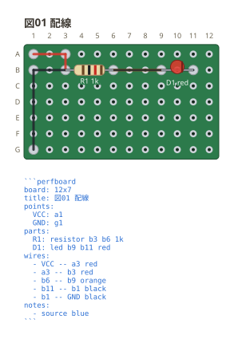
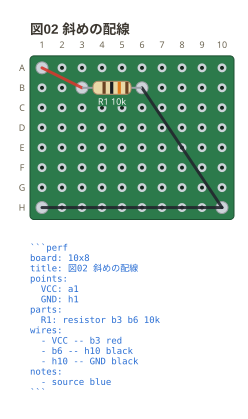

# 配線とネットリスト

`wires:` に `- 穴 -- 穴` と書く。**2 つの穴をまっすぐ結ぶ。**
ブレッドボードのような経路探索は無い — 溝もレールも無く、どの穴も同じ格子の
上にあり、実物のジャンパも 2 点を最短で結ぶ。

```perfboard
board: 12x7
title: 図01 配線
points:
  VCC: a1
  GND: g1
parts:
  R1: resistor b3 b6 1k
  D1: led b9 b11 red
wires:
  - VCC -- a3 red
  - a3 -- b3 red
  - b6 -- b9 orange
  - b11 -- b1 black
  - b1 -- GND black
notes:
  - source blue
```



**配線が入った穴は半田で埋まる。** 図では銀の玉になり、空いた穴は黒く抜けたまま。
部品の足が入った穴も同じで、どこを半田付けするのかが図だけで読める。

色は後ろに書ける。**書かなければ板の色に合わせた色**が自動で選ばれる —
緑や黒の板には明るい線、白い板には暗い線。板の色を変えれば線の色も一緒に動くので、
色を書かない線が板に沈まない。**書いた色は動かさない** (実物の被覆の色なので、
読みにくくても書いたとおりに描く)。**知らない色は書式エラー**にして受け取らない
(色は属性へ流れるので、持っている名前だけを通す)。

**全穴が独立している。** 部品を挿しただけでは何にもつながらず、ネットリストは
書いた配線からだけ出る。上の図のネットリストはこうなる。

```text
VCC : R1.1
N1  : R1.2, D1.1
GND : D1.2
```

ブレッドボードは列の 5 穴が最初から導通しているので、同じ列に挿すだけで
1 つのネットになる。**ここが物理の違いで、設計の分かれ目**。

**この例では行と列に沿って引き、折れるところで 2 本に分けている。** 斜めに 1 本で
引くほうが短いが、穴の格子に沿っていたほうが実物のジャンパを曲げる形と合い、
どの穴を通っているかも読みやすい。

斜めにも引ける。

```perfboard
board: 10x8
title: 図02 斜めの配線
points:
  VCC: a1
  GND: h1
parts:
  R1: resistor b3 b6 10k
wires:
  - VCC -- b3 red
  - b6 -- h10 black
  - h10 -- GND black
notes:
  - source blue
```


