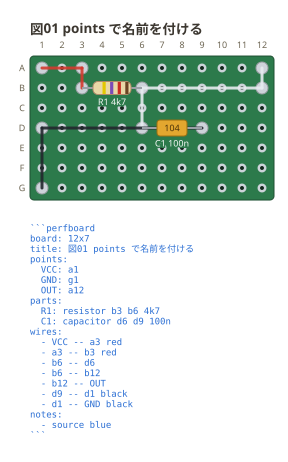

# 穴に名前を付ける

`points:` に `名前: 番地` と書くと、配線の端にその名前を書ける。
**ネットの名前にもなる**ので、意図した回路と突き合わせやすくなる。

```perfboard
board: 12x7
title: 図01 points で名前を付ける
points:
  VCC: a1
  GND: g1
  OUT: a12
parts:
  R1: resistor b3 b6 4k7
  C1: capacitor d6 d9 100n
wires:
  - VCC -- a3
  - a3 -- b3
  - b6 -- d6
  - b6 -- b12
  - b12 -- OUT
  - d9 -- d1
  - d1 -- GND
notes:
  - source blue
```



ネットリストは連番ではなく書いた名前で出る。

```text
VCC : R1.1
OUT : R1.2, C1.1
GND : C1.2
```

**名前を付けた穴は「基板の外へ出る」意思表示**として扱う。電源や信号の出入口を
つなぎ忘れと言われないようにするため (ERC の項を見る)。

番地と同じ綴りは名前にできない。`b3: c5` と書けてしまうと、`b3` がどちらを
指すのか読む人にも処理にも決まらなくなる。
