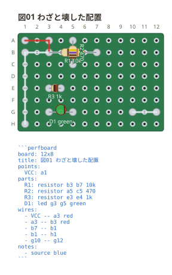

# 図のとおりに組むと動かないところ

**ユニバーサル基板は全穴が独立している。** 部品を挿しただけでは何にも
つながらないので、**つなぎ忘れが図の上で沈黙する**。そこを見張るのが ERC。

読めなかった行と違って、**図は描ける**。言っているのは「そのとおりに組むと
動かない」ことなので、お知らせとして出る。

```perfboard
board: 12x8
title: 図01 わざと壊した配置
points:
  VCC: a1
parts:
  R1: resistor b3 b7 10k
  R2: resistor a5 c5 470
  R3: resistor e3 e4 1k
  D1: led g3 g5 green
wires:
  - VCC -- a3 red
  - a3 -- b3 red
  - b7 -- b1
  - b1 -- h1
  - g10 -- g12
notes:
  - source blue
```



この図はこう言われる。

```text
perfboard: 7 行目: R2.1 (a5) がどこにもつながっていません。…
perfboard: 7 行目: R2.2 (c5) がどこにもつながっていません。…
perfboard: 7 行目: R1 と R2 の胴が重なっています (実物では両方を挿せません)
perfboard: 8 行目: R3 (resistor) の足の間隔が狭すぎます (e3 と e4)。…
perfboard: 9 行目: D1.1 (g3) がどこにもつながっていません。…
perfboard: 12 行目: g10 -- g12 は部品の足を 1 つもつないでいません
```

見ているのは 5 つ。

| 見るもの | なぜ |
| --- | --- |
| どこにもつながっていない足 | 全穴独立なので、挿しただけでは何にもつながらない |
| 配線で短絡した部品 | 抵抗を入れたつもりが線でまたいでいた、という取り違え |
| 部品の足を 1 つもつないでいない配線 | ネットリストから落ちるので、言わないと黙って消える |
| 胴の重なり | 足の穴が別でも胴は重なる。実物では両方を挿せない |
| 足の間隔が狭すぎる | 胴の両端から足が出る部品は、胴より狭い間隔に入らない |

**読めなかったところがあるうちは掛けない。** 落ちた配線を勘定に入れないまま
「つながっていません」と言うと、書いた配線について書き忘れを指摘することになる。

## 外したいとき

回路の一部だけを描いた図など、**未結線が承知のうえ**のときは `style:` で外せる。

```yaml
style:
  check: off
```

**既定は掛ける** (`on`)。全穴独立の板では繋ぎ忘れが図の上で沈黙するので、
見張りを外すのは書いた人がそう言ったときだけにする。

`debug: off` との違いは、**伏せるか、そもそも見ないか**。`debug: off` は
見つけたものを帯に出さないだけで、呼び出し側にはお知らせが渡る。
`check: off` は検査を掛けないので、どこにも出てこない。図はどちらも同じで、
変わるのは言うことだけ。**読めなかった行はどちらの対象でもない。**
