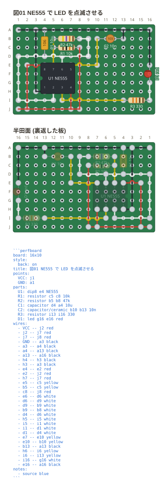
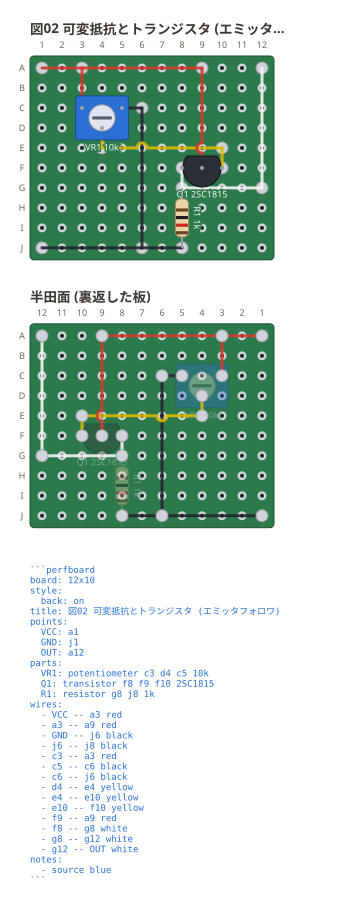

# IC と 3 本足の部品

DIP と SIP は**アンカーを 1 つだけ書く**。足の位置はパッケージが決めていて、
書く人が選べないため — 8 個の穴を書かせるのは、選べないものを書かせること。

```perfboard
board: 16x10
title: 図01 DIP と 3 本足
points:
  VCC: a1
  GND: j1
parts:
  U1: dip8 c4 NE555
  Q1: transistor h3 h4 h5 2SC1815
  R1: resistor c2 f2 10k
wires:
  - VCC -- a4
  - a4 -- c4
  - c2 -- c4
  - f2 -- f1
  - f1 -- GND
  - f4 -- f3
  - f3 -- h3
  - h5 -- h1
  - h1 -- GND
notes:
  - source blue
```



`dip8 c4` の `c4` は**1 番ピン**。そこから右へ 1〜4、折り返して下の列を
左へ戻って 5〜8 と並ぶ (実物の番号の付き方そのまま)。2 列の間隔は
**300 mil = 3 穴**。図の左端の切り欠きが 1 番ピン側の目印で、
これが無いと図を見ながら 180 度回して挿せてしまう。

**3 本足は穴を 3 つ書く。** 足は曲げられるので、列に並べても三角に開いても
挿さる — どちらで書いたかを図に出したい。

```perfboard
board: 12x8
title: 図02 3 本足の並べ方
points:
  IN: a1
  OUT: a12
parts:
  Q1: transistor c3 c4 c5 2SC1815
  VR1: potentiometer f3 g4 f5 10k
wires:
  - IN -- a3
  - a3 -- c3
  - c5 -- d5
  - d5 -- d3
  - d3 -- f3
  - f5 -- f12
  - f12 -- OUT
  - c4 -- g4
notes:
  - source blue
```



足の名前は `部品名.番号` で、**番号は書いた順** (DIP と SIP はパッケージの順)。
ネットリストにはこの名前が出る。

SIP (片側だけの列) も同じくアンカーを 1 つ書く。dip と違って**奇数でよい**。
