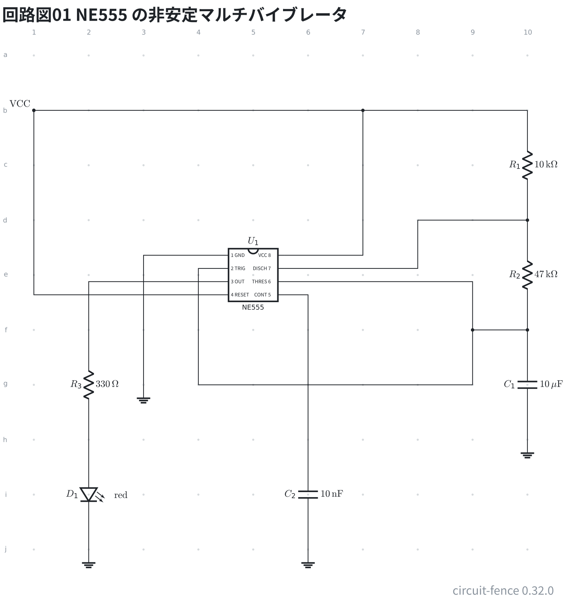
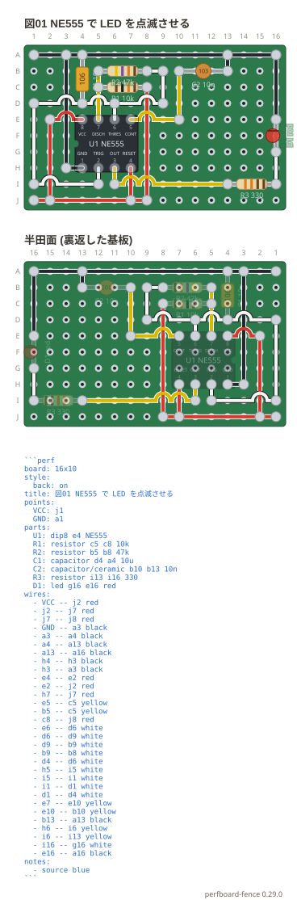
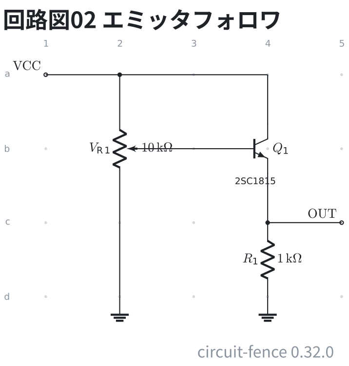
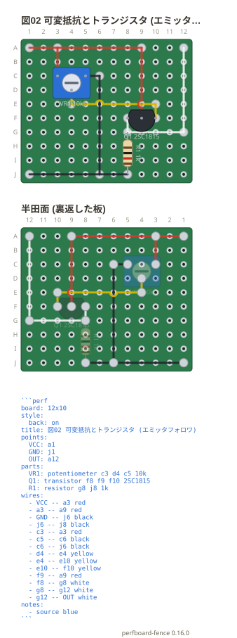
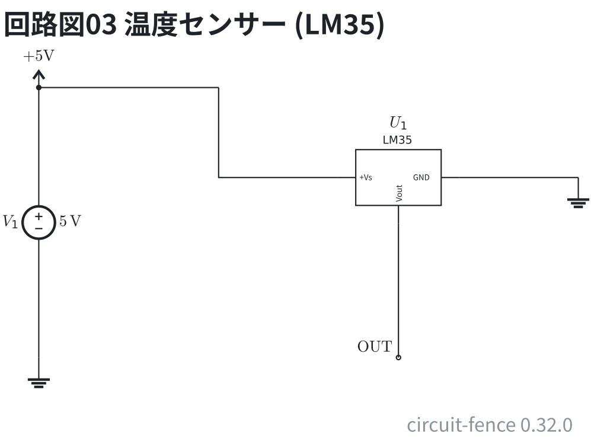
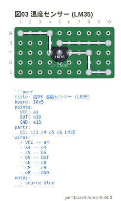

# IC と 3 ピンの部品

DIP と SIP は**アンカーを 1 つだけ書く**。ピンの位置はパッケージが決めていて、
書く人が選べないため — 8 個の穴を書かせるのは、選べないものを書かせること。

**配線は網ごとに色を分けてある** — 赤が +、黒が GND、残りを黄と白に振った。
同じ色の線は同じ網で、色が違えば別の網。交差する線は跨いで引くが、**跨ぎだけでは
「どの線がどこへ行くのか」までは追えない**ので、色で網をたどれるようにしてある
(実物でも被覆の色を分けて挿し、赤と黒は電源に取っておく)。

**基板の図の前に回路図を置く。** 実体配線図だけでは「なぜその穴なのか」が
読めないので、先に回路を見せてから基板に落とす。回路図は
[circuit-fence](../../circuit-fence/) の ` ```circuit ` フェンスで、
図は `npm run schematics --workspace=perfboard-fence` で作り直す
(描くのに TeX が要るので、基板の図とは別の工程になっている)。
**2 つの図のネットリストは同じ**になる — 違っていたら、どちらかが間違っている。

```circuit
title: 回路図01 NE555 の非安定マルチバイブレータ
parts:
  VCC: port 1,2
  U1: dip8 5,5 NE555
  G1: ground 3,7
  R3: resistor 2,6 2,8 330
  D1: led 2,8 2,10 red
  G3: ground 2,10
  C2: capacitor 6,8 6,10 10n
  G2: ground 6,10
  R1: resistor 10,2 10,4 10k
  R2: resistor 10,4 10,6 47k
  C1: capacitor 10,6 10,8 10u
  G4: ground 10,8
wires:
  - 1,2 -- 10,2
  - U1.4 -| 1,2
  - U1.1 -| 3,7
  - U1.3 -| 2,6
  - U1.2 -| 4,7
  - 4,7 -- 9,7
  - 9,7 -- 9,6
  - U1.8 -| 7,2
  - U1.7 -| 8,4
  - 8,4 -- 10,4
  - U1.6 -| 9,6
  - 9,6 -- 10,6
  - U1.5 -| 6,8
style:
  grid: on
```



```perf
board:
  size: 16x10
  h: 1.6mm
  material: FR-4
  slots: on
style:
  back: on
title: 図01 NE555 で LED を点滅させる
points:
  VCC: j1
  GND: a1
parts:
  U1: dip8 e4 NE555
  R1: resistor c5 c8 10k
  R2: resistor b5 b8 47k
  C1: capacitor d4 a4 10u
  C2: capacitor/ceramic b10 b13 10n
  R3: resistor i13 i16 330
  D1: led g16 e16 red
  V1:
    type: device
    at: e-5
    label: 電源 5V
    pins: "- +"
wires:
  - V1.+ -- j0 red
  - j0 -- VCC red
  - V1.- -- a0 black
  - a0 -- GND black
  - VCC -- j2 red
  - j2 -- j7 red
  - j7 -- j8 red
  - GND -- a3 black
  - a3 -- a4 black
  - a4 -- a13 black
  - a13 -- a16 black
  - h4 -- h3 black
  - h3 -- a3 black
  - e4 -- e2 red
  - e2 -- j2 red
  - h7 -- j7 red
  - e5 -- c5 yellow
  - b5 -- c5 yellow
  - c8 -- j8 red
  - e6 -- d6 white
  - d6 -- d9 white
  - d9 -- b9 white
  - b9 -- b8 white
  - d4 -- d6 white
  - h5 -- i5 white
  - i5 -- i1 white
  - i1 -- d1 white
  - d1 -- d4 white
  - e7 -- e10 yellow
  - e10 -- b10 yellow
  - b13 -- a13 black
  - h6 -- i6 yellow
  - i6 -- i13 yellow
  - i16 -- g16 white
  - e16 -- a16 black
notes:
  - source blue
```



`dip8 e4` の `e4` は**胴の左上の穴** (8 番ピン)。1 番ピンはその 3 行下の左下
(`h4`) で、下の列を右へ 1〜4、折り返して上の列を左へ戻って 5〜8 と並ぶ
(切り欠きを左にした実物を上から見た番号の付き方)。2 列の間隔は
**300 mil = 3 穴**。図の左端の切り欠きが 1 番ピン側の目印で、
これが無いと図を見ながら 180 度回して挿せてしまう。

**3 ピンは穴を 3 つ書く。** ピンは曲げられるので、列に並べても三角に開いても
挿さる — どちらで書いたかを図に出したい。

```circuit
title: 回路図02 エミッタフォロワ
parts:
  VCC: port 1,1
  VR1: potentiometer 2,1 2,3 10k
  G1: ground 2,4
  Q1: npn 4,2 2SC1815
  R1: resistor 4,3 4,4 1k
  G2: ground 4,4
  OUT: port 5,3
wires:
  - 1,1 -- 4,1
  #- b3 -- c3
  - 2,3 -- 2,4
  - VR1.w -- 3,2
  - 3,2 |- Q1.B
  - 4,1 |- Q1.C
  - Q1.E -| 4,3
  - 4,3 -- 5,3
style:
  grid: on
```



```perf
board:
  size: 12x10
  h: 1.6mm
  material: FR-4
  slots: on
style:
  back: on
title: 図02 可変抵抗とトランジスタ (エミッタフォロワ)
points:
  VCC: a1
  GND: j1
  OUT: a12
parts:
  VR1: potentiometer c3 d4 c5 10k
  Q1: transistor f8 f9 f10 2SC1815
  R1: resistor g8 j8 1k
  V1:
    type: device
    at: e-5
    label: 電源 5V
    pins: "- +"
wires:
  - V1.+ -- a0 red
  - a0 -- VCC red
  - V1.- -- j0 black
  - j0 -- GND black
  - VCC -- a3 red
  - a3 -- a9 red
  - GND -- j6 black
  - j6 -- j8 black
  - c3 -- a3 red
  - c5 -- c6 black
  - c6 -- j6 black
  - d4 -- e4 yellow
  - e4 -- e10 yellow
  - e10 -- f10 yellow
  - f9 -- a9 red
  - f8 -- g8 white
  - g8 -- g12 white
  - g12 -- OUT white
notes:
  - source blue
```



ピンの名前は `部品名.番号` で、**番号は書いた順** (DIP と SIP はパッケージの順)。
ネットリストにはこの名前が出る。

SIP (片側だけの列) も同じくアンカーを 1 つ書く。dip と違って**奇数でよい**。

## 3 ピンの IC (`ic3`)

ホール素子・温度センサー・メロディ IC のような**ピンの名前が品ごとに違う
3 ピンの IC** は `ic3` で書く。置き方はトランジスタと同じで、ピンは書いた順に
`1` `2` `3`。姿は `to92` (既定) と `to220`。

```circuit
title: 回路図03 温度センサー (LM35)
parts:
  V1: vsource 2,2 2,5 5
  VCC: vcc 2,2 5V
  G1: ground 2,5
  U1:
    type: ic3
    at: 6,3
    label: LM35
    pins: [+Vs, Vout, GND]
  OUT: port 6,5
  G2: ground 8,3
wires:
  - 2,2 -- 4,2
  - U1.1 -| 4,2
  - U1.2 -- 6,5
  - U1.3 -| 8,3
```



```perf
title: 図03 温度センサー (LM35)
board:
  size: 10x5
  h: 1.6mm
  material: FR-4
  slots: on
points:
  VCC: a1
  OUT: b10
  GND: e10
parts:
  U1: ic3 c4 c5 c6 LM35
  V1:
    type: device
    at: c-5
    label: 電源 5V
    pins: "- +"
wires:
  - V1.+ -- a0 red
  - a0 -- VCC red
  - V1.- -- e0 black
  - e0 -- e8 black
  - VCC -- a4
  - a4 -- c4
  - c5 -- b5
  - b5 -- OUT
  - c6 -- c8
  - c8 -- e8
  - e8 -- GND
notes:
  - source blue
```



LM35 のピンは 1 = `+Vs`、2 = `Vout`、3 = `GND`。名前は部品の側に持たせず、
回路図 (` ```circuit ` の `pins:`) か本文で示す。
