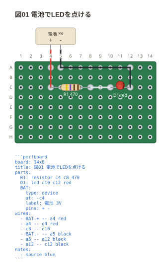
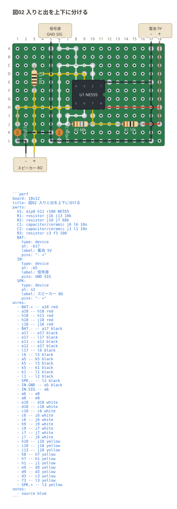

# 板の外の機器

電池・スピーカー・測定器のように**盤面に載らないもの**は `device` で書く。
`parts:` の中に**入れ子で**書く — 足の名前の並びを持つので 1 行に畳めない。

```perfboard
board: 14x8
title: 図01 電池でLEDを点ける
parts:
  R1: resistor c4 c8 470
  D1: led c10 c12 red
  BAT:
    type: device
    at: top
    label: 電池 3V
    pins: + -
wires:
  - BAT.+ -- c4
  - c8 -- c10
  - c12 -- BAT.-
notes:
  - source blue
```



`type: device` は必ず書く。**入れ子なら機器、とは決めない** — 部品を書き
間違えて字下げした人が、板の外に箱が出ているのを見て気づけないまま終わる。

配線からは `BAT.+` のように `名前.足` で指す。番地にも `points:` の名前にも
`.` は現れないので、綴りだけで機器の足だと分かる。

**足は `+ -` と空白で区切って書く。** YAML の並び (`[+, -]`) に書くと `-` に続く空白が
箱の始まりに読まれて `["+", "-"]` と括らされる。電池の端子を書くたびに
引っかかるので、1 行の書き方を正にしている。

**機器へつなぐ配線も板の上まで線を引く。** 電池の線も実物では板の穴に半田付け
するので、どの穴へ行くのかが図に出ないと、帯に浮いた箱と板が結び付かない。
色を書けばその色で引く。**機器どうしを結んだ配線だけは板に触れない**ので線が無く、
色を書いたときはその旨のお知らせが出る。

```text
N1 : R1.1, BAT.+
N2 : R1.2, D1.1
N3 : D1.2, BAT.-
```

## 上と下に分ける

`at:` で板のどちら側の帯に置くかを選ぶ。入る側と出る側を分けると、
信号の流れが図の上から下へ読める。

```perfboard
board: 16x10
title: 図02 入りと出を上下に分ける
parts:
  U1: dip8 d5 NE555
  R1: resistor b3 b7 10k
  C1: capacitor/ceramic h3 h5 10n
  IN:
    type: device
    at: top
    label: 信号源
    pins: sig gnd
  SPK:
    type: device
    at: bottom
    label: スピーカー 8Ω
    pins: 1 2
wires:
  - IN.sig -- b3
  - b7 -- b5
  - b5 -- d5
  - IN.gnd -- h3
  - h5 -- SPK.1
  - g8 -- SPK.2
notes:
  - source blue
```



足の名前は空白を含まなければ何でもよい (`+` `-` `sig` `gnd` `1` `2`)。
実物の端子に書いてある綴りをそのまま使うと、組むときに読み替えずに済む。
