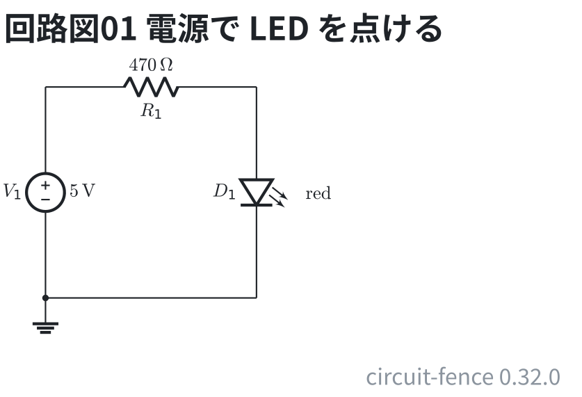
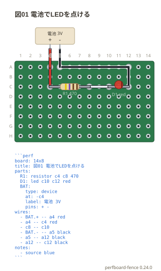
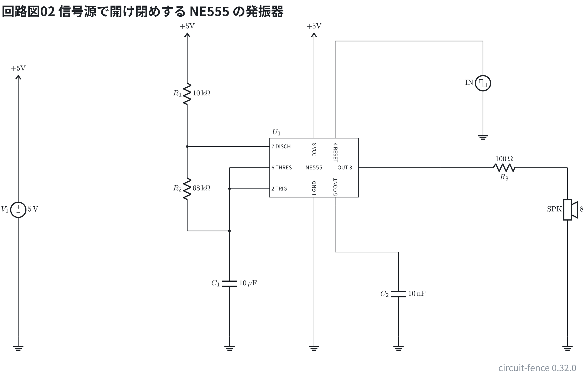
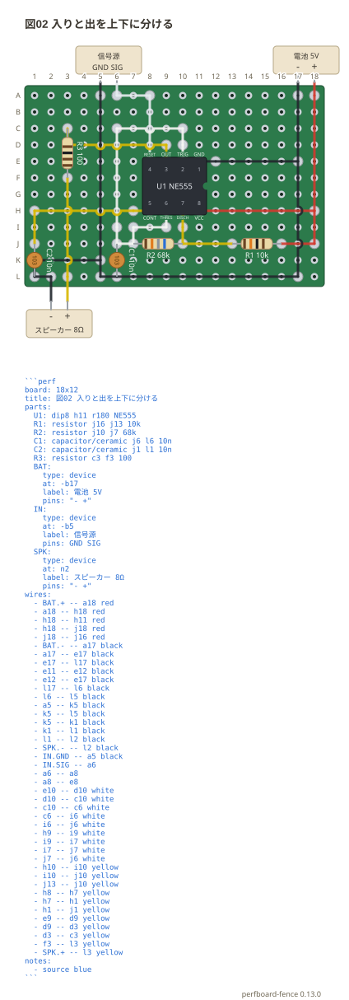

# 基板の外の機器

電源・スピーカー・測定器のように**盤面に載らないもの**は `device` で書く。
`parts:` の中に**入れ子で**書く — ピンの名前の並びを持つので 1 行に畳めない。

```circuit
title: 回路図01 電源で LED を点ける
parts:
  V1: vsource 1,1 1,3 5
  R1: resistor 1,1 3,1 470
  D1: led 3,1 3,3 red
  G1: ground 1,3
wires:
  - 1,3 -- 3,3
```



```perf
board:
  size: 14x8
  h: 1.6mm
  material: FR-4
  slots: on
title: 図01 電源で LED を点ける
parts:
  R1: resistor c4 c8 470
  D1: led c10 c12 red
  V1:
    type: device
    at: -c4
    label: 電源 5V
    pins: + -
wires:
  - V1.+ -- a4 red
  - a4 -- c4 red
  - c8 -- c10
  - V1.- -- a5 black
  - a5 -- a12 black
  - a12 -- c12 black
notes:
  - source blue
```



`type: device` は必ず書く。**入れ子なら機器、とは決めない** — 部品を書き
間違えて字下げした人が、基板の外に箱が出ているのを見て気づけないまま終わる。

配線からは `V1.+` のように `名前.ピン名` で指す。番地にも `points:` の名前にも
`.` は現れないので、綴りだけで機器のピンだと分かる。

**ピンは `+ -` と空白で区切って書く。** YAML の並び (`[+, -]`) に書くと `-` に続く空白が
箱の始まりに読まれて `["+", "-"]` と括らされる。電源の端子を書くたびに
引っかかるので、1 行の書き方を正にしている。

**機器へつなぐ配線も基板の上まで線を引く。** 電源の線も実物では基板の穴に半田付け
するので、どの穴へ行くのかが図に出ないと、帯に浮いた箱と基板が結び付かない。
色を書けばその色で引く。**機器どうしを結んだ配線だけは基板に触れない**ので線が無く、
色を書いたときはその旨のお知らせが出る。

```text
N1 : R1.1, V1.+
N2 : R1.2, D1.1
N3 : D1.2, V1.-
```

## 上と下に分ける

`at:` で置き場所を選ぶ。`top` / `bottom` なら基板の上下の帯に並び、**番地を書けば
その場所**に置ける (箱の左上がその番地)。入る側と出る側を分けると、信号の流れが
図の上から下へ読める。

下の図は `-b17` `-b5` (基板の上) と `n2` (基板の下)。帯に並べると置きたかった場所と
関係なく散るので、**並べ方を自分で決めたいときは番地で書く**。

**ピンは穴の格子に載る**ので、機器のピンからまず真下 (真上) の穴へ落として、そこから
基板の上を配線できる (`IN.SIG -- a6`、`a6 -- a8`…)。斜めに 1 本で引くより、
どの穴を通っているかが読みやすい。

```circuit
title: 回路図02 信号源で開け閉めする NE555 の発振器
parts:
  V1: vsource 3,3 3,9 5
  VCC: vcc 3,3 5V
  G1: ground 3,9
  VCC: vcc 7,2 5V
  R1: resistor 7,2 7,4.5 10k
  R2: resistor 7,4.5 7,6.5 68k
  C1: capacitor 8,6.5 8,9 10u
  G3: ground 8,9
  U1: ic 10,5 NE555
  VCC: vcc 10,2 5V
  C2: capacitor 12,7 12,9 10n
  G2: ground 10,9
  G5: ground 12,9
  IN: square 14,2 14,4 l=$\mathrm{IN}$
  G6: ground 14,4
  R3: resistor 13,5 16,5 100
  SPK: speaker 16,5 16,7 8 l=$\mathrm{SPK}$
  G4: ground 16,9
wires:
  - U1.8 |- 10,2
  - U1.4 |- 10.5,2
  - 10.5,2 -- 14,2
  - U1.7 -| 7,4.5
  - U1.6 -| 8,5
  - U1.2 -| 8,5.5
  - 8,5 -- 8,6.5
  - 7,6.5 -- 8,6.5
  - U1.1 |- 10,9
  - U1.5 |- 10.5,7
  - 10.5,7 -- 12,7
  - U1.3 -| 13,5
  - 16,7 -- 16,9
```



```perf
board:
  size: 18x12
  h: 1.6mm
  material: FR-4
  slots: on
title: 図02 入りと出を上下に分ける
parts:
  U1: dip8 h11 r180 NE555
  R1: resistor j16 j13 10k
  R2: resistor j10 j7 68k
  C1: capacitor/ceramic j6 l6 10n
  C2: capacitor/ceramic j1 l1 10n
  R3: resistor c3 f3 100
  V1:
    type: device
    at: -b17
    label: 電源 5V
    pins: "- +"
  IN:
    type: device
    at: -b5
    label: 信号源
    pins: GND SIG
  SPK:
    type: device
    at: n2
    label: スピーカー 8Ω
    pins: "- +"
wires:
  - V1.+ -- a18 red
  - a18 -- h18 red
  - h18 -- h11 red
  - h18 -- j18 red
  - j18 -- j16 red
  - V1.- -- a17 black
  - a17 -- e17 black
  - e17 -- l17 black
  - e11 -- e12 black
  - e12 -- e17 black
  - l17 -- l6 black
  - l6 -- l5 black
  - a5 -- k5 black
  - k5 -- l5 black
  - k5 -- k1 black
  - k1 -- l1 black
  - l1 -- l2 black
  - SPK.- -- l2 black
  - IN.GND -- a5 black
  - IN.SIG -- a6
  - a6 -- a8
  - a8 -- e8
  - e10 -- d10 white
  - d10 -- c10 white
  - c10 -- c6 white
  - c6 -- i6 white
  - i6 -- j6 white
  - h9 -- i9 white
  - i9 -- i7 white
  - i7 -- j7 white
  - j7 -- j6 white
  - h10 -- i10 yellow
  - i10 -- j10 yellow
  - j13 -- j10 yellow
  - h8 -- h7 yellow
  - h7 -- h1 yellow
  - h1 -- j1 yellow
  - e9 -- d9 yellow
  - d9 -- d3 yellow
  - d3 -- c3 yellow
  - f3 -- l3 yellow
  - SPK.+ -- l3 yellow
notes:
  - source blue
```



ピンの名前は空白を含まなければ何でもよい (`+` `-` `SIG` `GND` など)。
`-` で始まる並び (`- +`) は YAML の箇条書きと読まれるので引用符で囲む。

NE555 は `r180` で切り欠きを右に向けて挿している (`dip8 h11 r180`)。電源を右上に、
信号源を左上に置いたので、4 番ピン (RESET) が信号源の側に来る向きにした。
実物の端子に書いてある綴りをそのまま使うと、組むときに読み替えずに済む。

中身は **NE555 の非安定マルチバイブレータ**で、`R1` `R2` `C1` が周波数を決める
(1.44 / ((10k + 2×68k) × 10n) ≒ 1 kHz)。**信号源は 4 番ピン (RESET) を開け閉め
する** — H の間だけ発振してスピーカーが鳴り、L で止まる。`C2` は 5 番ピン
(CONT) の安定用、`R3` は 555 の出力電流を 8Ω に対して抑えるための直列抵抗。
