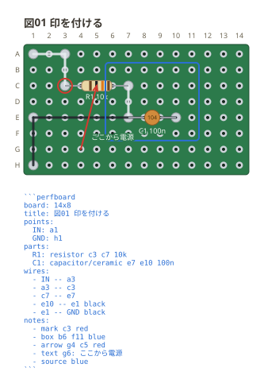
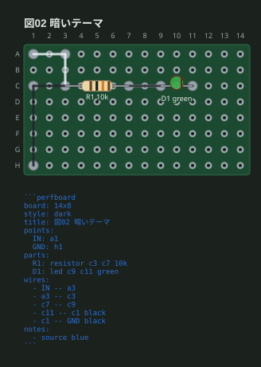
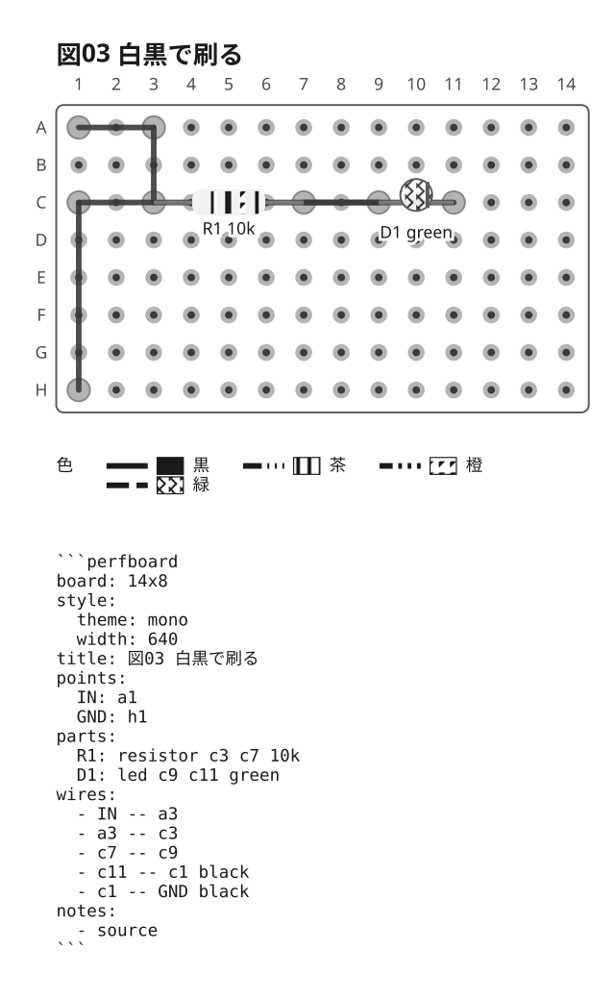
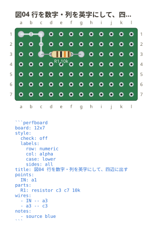
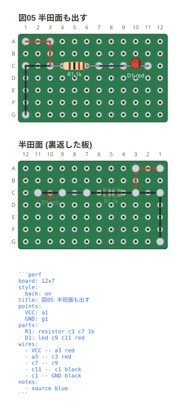
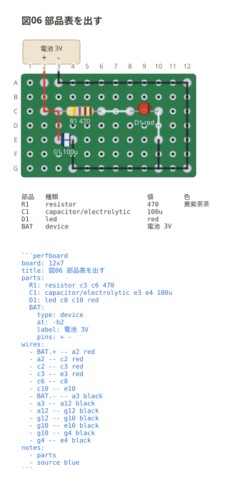

# 注釈と見た目

## 注釈 (`notes:`)

図に印を付けて、文章から指せるようにするためのもの。**回路の一員ではない** —
ネットにもネットリストにも出ないので、印を足しても配線は変わらない。

```perfboard
board: 14x8
title: 図01 印を付ける
points:
  IN: a1
  GND: h1
parts:
  R1: resistor c3 c7 10k
  C1: capacitor/ceramic e7 e10 100n
wires:
  - IN -- a3
  - a3 -- c3
  - c7 -- e7
  - e10 -- e1 black
  - e1 -- GND black
notes:
  - mark c3 red
  - box b6 f11 blue
  - arrow g4 c5 red
  - text g6 ここから電源
  - source blue
```



| 印 | 書き方 | 出るもの |
| --- | --- | --- |
| `mark` | `mark 番地 [色]` | 穴を囲む丸 |
| `box` | `box 番地 番地 [色]` | 2 つの番地を対角にした枠 |
| `arrow` | `arrow 番地 番地 [色]` | 1 つ目から 2 つ目への指し棒 |
| `text` | `text 番地 言葉` | その穴のそばに出る字 |
| `source` | `source [色]` | そのフェンスの中身を図の下に書き出す |
| `parts` | `parts [色]` | 部品表を図の下に出す (下の図06) |

**`text` には色を書けない。** 字は残り全部を言葉として取るので、色を許すと
「色の名前で始まる注釈」が黙って色になる。区別の付かない書き方は作らない。
**`source` には書ける** — 言葉を取らないので、色と紛れる余地がない。

`- source` は**そのフェンスの中身**を、囲みごと図の下に写す。この例のどの図にも
入れてあるのがそれで、図だけを見た人が同じ図をもう一度出せるようにするためのもの。
番地は書かない (フェンスは板より高いので、重ねると穴も部品も読めなくなる)。
色を書かなければ図の文字色に従う — 下の図03 (`mono`) がその形で、
**白黒の図に色を混ぜない**ようにしてある。

## 見た目 (`style:`)

テーマの名前 1 つだけなら、そのまま書ける。

```perfboard
board: 14x8
style: dark
title: 図02 暗いテーマ
points:
  IN: a1
  GND: h1
parts:
  R1: resistor c3 c7 10k
  D1: led c9 c11 green
wires:
  - IN -- a3
  - a3 -- c3
  - c7 -- c9
  - c11 -- c1 black
  - c1 -- GND black
notes:
  - source blue
```



白黒で刷る資料には `mono` を選ぶ。**色で意味を持たせない**ので、
コピーしても読めるものだけが残る。

**色は網と線の型に移る。** 配線の色・LED の色・抵抗のカラーコードは実物の色
なのでテーマでは動かないが、白黒の図にそこだけ色が残ると `mono` の値打ちが
消える。かといって落とすと「同じ色の線は同じ網」が読めなくなるので、
**色ごとに線の型と網を決めて**、引き当てる凡例を図の下に出す。
凡例に並ぶのは**その図が使った色だけ**で、色を書かなければ凡例も出ない。

```perfboard
board: 14x8
style:
  theme: mono
  width: 640
title: 図03 白黒で刷る
points:
  IN: a1
  GND: h1
parts:
  R1: resistor c3 c7 10k
  D1: led c9 c11 green
wires:
  - IN -- a3
  - a3 -- c3
  - c7 -- c9
  - c11 -- c1 black
  - c1 -- GND black
notes:
  - source
```



**配色だけがテーマで動く。** 穴も字も寸法は 3 つとも同じなので、同じフェンスを
別のテーマで出しても部品の位置も線の通り道も動かない (図02 と図03 は色だけが違う)。

## 板の外の名前 (`labels:`)

行と列の名前は、**英字と数字のどちらでも振れる**。英字は大文字が既定で、
`case: lower` で小文字にできる。手元の板のシルクに寄せて、図と実物を
見比べやすくするためのもの。

```perfboard
board: 12x7
style:
  check: off
  labels:
    row: numeric
    col: alpha
    case: lower
    sides: all
title: 図04 行を数字・列を英字にして、四辺に出す
points:
  IN: a1
parts:
  R1: resistor c3 c7 10k
wires:
  - IN -- a3
  - a3 -- c3
notes:
  - source blue
```



**番地の書き方は変わらない。** どう印字しても `c3` は c 行 3 列で、
フェンスに書く綴りは動かない — 動くのは板の外に出る名前だけ。
既定は**行が英字・列が数字**で、上の図02・図03 がその形。

**名前を出す辺は `sides:` で選ぶ。** 既定は**左と上だけ** — 四辺に出すと、
小さい板では名前のほうが板より目立つ。大きい板で端から数え直したいときに
`sides: all` (上の図) や `sides: left top right` のように増やす。
`none` で消せる。

## 半田面 (`back:`)

`back: on` で、**裏返した板**を図の下に足せる。ユニバーサル基板は配線を裏で
半田付けするので、手を動かすときに見るのはそちら側になる。

```perfboard
board: 12x7
style:
  back: on
title: 図05 半田面も出す
points:
  VCC: a1
  GND: g1
parts:
  R1: resistor c3 c7 1k
  D1: led c9 c11 red
wires:
  - VCC -- a3 red
  - a3 -- c3 red
  - c7 -- c9
  - c11 -- c1 black
  - c1 -- GND black
notes:
  - source blue
```



**入れ替わるのは列だけ** (板を縦軸でひっくり返すので、行はそのまま)。
字は裏返さない — 鏡文字は読めない。部品は板の向こう側にあって実際には
見えないが、**どのランドがどの部品の足か**が分からないと半田付けできないので、
透かした形で置いてある。板の外の機器と注釈は表の図の話なので出てこない。

**既定は出さない。** 要るのは実際に半田付けするときだけで、図の高さが倍になる。

`width` は書き出す画の大きさだけを変える。`debug: off` でお知らせを伏せられるが、
**読めなかった行はこの切り替えの対象ではない** — 伏せると「無かったこと」に化ける。

## 部品表 (`- parts`)

`- parts` は**何を揃えればよいか**を図の下に出す。番地と値は図の中に散らばって
いるので、拾い集めるには図を目で追うしかない。同じフェンスから出すので、
**部品を足したのに表を直し忘れる**、が起きない。

**抵抗の色は字で出す** (`470` → `黄紫茶茶`)。実物を選ぶときに見るのは帯の色
そのものだが、図の帯は小さく、白黒で刷ると消える。字にしておけば刷った図でも
手元の部品と読み合わせられる。**値として読めない抵抗には出さない** —
実物と違う帯を書くと、図を信じた人が違う抵抗を挿す。

```perfboard
board: 12x7
title: 図06 部品表を出す
parts:
  R1: resistor c3 c6 470
  C1: capacitor/electrolytic e3 e4 100u
  D1: led c8 c10 red
  BAT:
    type: device
    at: -b2
    label: 電池 3V
    pins: + -
wires:
  - BAT.+ -- a2 red
  - a2 -- c2 red
  - c2 -- c3 red
  - c3 -- e3 red
  - c6 -- c8
  - c10 -- e10
  - BAT.- -- a3 black
  - a3 -- a12 black
  - a12 -- g12 black
  - g12 -- g10 black
  - g10 -- e10 black
  - g10 -- g4 black
  - g4 -- e4 black
notes:
  - parts
  - source blue
```



**板の外の機器も並ぶ。** 盤面に載らないだけで、揃えるものには変わりない。
並びは書いた順 — 番号で並べ直すと、図を追いながら表を読む人が行を見失う。
`- source` と一緒に書いたときは**部品表が上、書き出しが下**になる。
