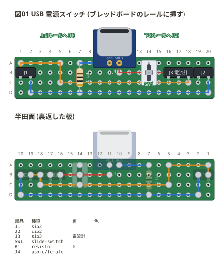
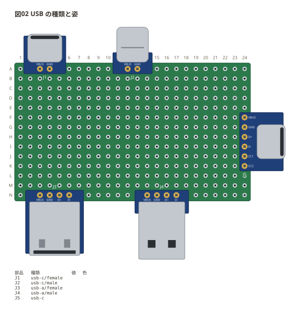

# USB コネクタ

USB の受け口・差し込みを**変換基板ごと**置く (`usb-a` / `usb-c`)。
**穴は足の名前の順に書く** — `VBUS GND D+ D-`、Type-C はそのあと `CC1 CC2`。
書いた数だけ足があるので、電源だけの変換基板は 2 つで書ける。
書き方の全部は [docs/01-syntax.md](../docs/01-syntax.md#usb-コネクタ-usb-a--usb-c)。

## 電源スイッチの基板

ブレッドボードの電源レールに挿す、USB 給電の小さな基板。Type-C の受け口の
+5V をスライドスイッチで入り切りし、スイッチを切ったときは L ピンヘッダ (`J3`)
に電流計をつないで電流を測れる。

- Type-C は**電源だけの変換基板** — 穴は `VBUS GND` の 2 つ (`a11 a10`)
- 両端の `sip2` がブレッドボードのレールに挿すピン (1 番が +5V、2 番が −)
- `J3` は中央のピンを抜いた L ピンヘッダ。ERC が「`J3.2` がつながっていない」と
  言うのは承知のうえ (スイッチの `SW1.1` も使っていない)
- `R1` の 0Ω は GND を B・C 行の配線の上をまたいで D 行へ渡すジャンパ
- 受け口は板の上の縁から外へ出る。**題と板の間を空けて描く**

```perfboard
board: 20x4
title: 図01 USB 電源スイッチ (ブレッドボードのレールに挿す)
points:
  VBUS: a11
  5V: a1
  GND: d2
parts:
  J1: sip2 b1
  J2: sip2 b19
  J3: sip3 b16 電流計
  SW1: slide-switch a14 b14 c14
  R1: resistor a7 d7 0
  J4: usb-c/female a11 a10
wires:
  - a11 -- b11 red
  - b11 -- b14 red
  - b14 -- b16 red
  - a10 -- a7 blue
  - d7 -- d20 blue
  - d20 -- b20 blue
  - d7 -- d2 blue
  - d2 -- b2 blue
  - c14 -- c18 orange
  - c18 -- b18 orange
  - b18 -- b19 orange
  - c14 -- c5 orange
  - c5 -- a5 orange
  - a5 -- a1 orange
  - a1 -- b1 orange
notes:
  - text -a3: 上のレールへ (J1)
  - text -a17: 下のレールへ (J2)
  - parts
style:
  back: on
```



ネットリストでは足が名前で出る (`J4.VBUS` `J4.GND`)。半田面 (`back: on`) では
受け口が同じ上の縁から出る — 裏返すのは左右だけ。

## 種類と姿

`usb-a` と `usb-c` に、それぞれ差し込み (`male`) と受け口 (`female`、既定) がある。
**差し込み口は板の中心から遠い側**を向く — 上の縁に近ければ上、下なら下、
縦に並べて右の縁に近ければ右。

```perfboard
board: 24x14
title: 図02 USB の種類と姿
parts:
  J1: usb-c/female a3 a4
  J2: usb-c/male a12 a13
  J3: usb-a/female n3 n4 n5 n6
  J4: usb-a/male n14 n15 n16 n17
  J5: usb-c f24 g24 h24 i24 j24 k24
notes:
  - parts
style:
  check: off
```



| 姿 | 図 |
| --- | --- |
| `female` (受け口、既定) | 金物が変換基板に載り、縁から少し出る。Type-C は口が長丸、Type-A は角で天板にばねの窓 |
| `male` (差し込み) | 金物が変換基板の縁から長く出る。Type-A は天板に 2 つの角窓 |

`J5` は Type-C の 6 本 (`VBUS GND D+ D- CC1 CC2`) を縦に書いた形。
足の名前は変換基板に刷る。
