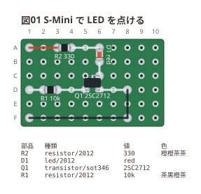
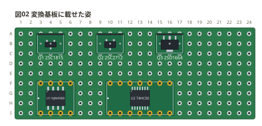
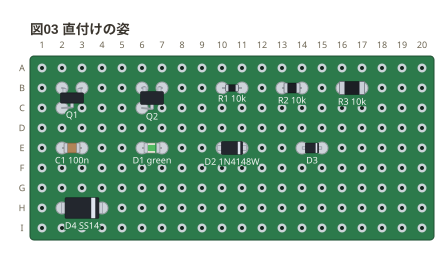

# 面実装の部品

面実装の部品は 2 通りで置ける。**変換基板に載せた姿** (`transistor/sot346-dip`、
`dip8/sop`) と、**この板に直付けした姿** (`transistor/sot346`、`resistor/2012`)。
変換基板の姿は breadboard と同じ綴りで書ける。直付けはユニバーサル基板だけのもの。
書き方の全部は [docs/01-syntax.md](../docs/01-syntax.md#面実装-sot346-dip--sot346--2012)。

## S-Mini のトランジスタで LED を点ける

東芝の S-Mini (SC-59 / SOT-346) のトランジスタ 2SC2712 を、チップ抵抗と
チップ LED と一緒に板へ直付けした。`IN` に 5V を入れると LED が点く。

- `Q1` は**三角に置く** — 1 番 (ベース) と 2 番 (エミッタ) を隣の穴 (`d5 d6`)、
  3 番 (コレクタ) を上の行の 2 番の隣 (`c6`)。SOT の 1 番と 2 番の足の間は 1.9mm で、
  隣の穴 (2.54mm) のランドにちょうど載る
- チップ (`2012`) は**隣の穴に跨いで**付ける。縦にも横にも置ける
- 足の並びは品種ごとに違う (2SC2712 は 1 = B、2 = E、3 = C)。図は主張しないので、
  どの穴がどの足かはデータシートで確かめる

```perfboard
board: 10x6
title: 図01 S-Mini で LED を点ける
points:
  VCC: a1
  IN: d1
  GND: f1
parts:
  R2: resistor/2012 a3 a4 330
  D1: led/2012 a6 b6 red
  Q1: transistor/sot346 d5 d6 c6 2SC2712
  R1: resistor/2012 d2 d3 10k
wires:
  - a1 -- a3 red
  - a4 -- a6
  - b6 -- c6
  - d1 -- d2
  - d3 -- d5
  - d6 -- d8
  - d8 -- f8 black
  - f8 -- f1 black
notes:
  - parts
```



## 変換基板に載せた姿

面実装の部品を変換基板 (秋月の「DIP 化基板」など) に載せたまま挿す。
**基板ごと 1 つの部品**として描き、載っている物は実寸で描く — S-Mini (`sot346`) は
SOT-23 (`sot23`) より胴が 0.3mm 広い。

```perfboard
board: 24x9
title: 図02 変換基板に載せた姿
parts:
  Q1: transistor/sot23-dip b3 b4 b5 2SC1815
  Q2: transistor/sot346-dip b9 b10 b11 2SC2712
  Q3: transistor/sot89-dip b15 b16 b17 2SD1664
  U1: dip8/sop f3 NJM4580
  U2: dip14/tssop f10 74HC00
style:
  check: off
```



- 3 本足 (`sot23-dip` `sot346-dip` `sot89-dip`) は**穴を 3 つ書く** — ピンヘッダの足で、
  差し込み型のトランジスタと同じ。
- `dipN` の姿 (`sop` `tssop`) は **DIP 化した変換基板に載った IC**。書くのは DIP と
  同じくアンカー 1 つで、足の番号も DIP と同じ。向きは 1 番側の端の白い点と、
  IC の 1 番の窪みで示す。
- SSOP の変換基板は列の間隔が 600mil (7 穴) で、`dipN` の 300mil に載らないので
  まだ無い。

## 直付けの姿

チップ・SOD・SOT を板に直付けした姿。**どれも実寸で描く** — 足の間隔を広く
書いても胴は伸びない。

```perfboard
board: 20x9
title: 図03 直付けの姿
parts:
  Q1: transistor/sot23 b2 b3 c2
  Q2: transistor/sot346 b6 b7 c6
  R1: resistor/1608 b10 b11 10k
  R2: resistor/2012 b13 b14 10k
  R3: resistor/3216 b16 b17 10k
  C1: capacitor/2012 e2 e3 100n
  D1: led/2012 e6 e7 green
  D2: diode/sod123 e10 e11 1N4148W
  D3: zener/sod323 e14 e15
  D4: schottky/do214ac h2 h4 SS14
style:
  check: off
```



| 置き方 | 姿 | 書く穴 |
| --- | --- | --- |
| 隣の穴に跨ぐ | `1608` `2012` `3216` `sod123` `sod323` | 隣り合う 2 つ (上下か左右) |
| 2 穴離す | `do214ac` | 間に 1 穴空けた 2 つ |
| 三角 | `sot23` `sot346` | 1 番と 2 番を隣の穴、3 番を次の行の 1 番か 2 番の隣 |

置き方が違えば**お知らせで言う** (図はそのまま描く)。
`resistor/2012 b3 b6` は「隣の穴 (上下か左右) に跨いで付けます」、3 つを 1 列に並べた
SOT は「三角に置きます」。
