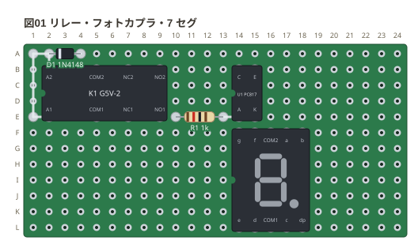

# 足に名前のある DIP 型

リレー・フォトカプラ・7 セグは、**DIP の足の位置のうち、足のある所に名前が付いた物**
として置く (`K1: relay b2`)。足の名前と並びは実物のデータシートどおりで、
ネットリストでは `K1.COM1` のように名前で出る。書き方の決まりは
[文法リファレンス](../docs/01-syntax.md) の「足に名前のある DIP 型」。

リレー (G5V-2) のコイルの両端 (`A1` と `A2`) には、**還流ダイオード** (D1) を逆向きに
入れる。フォトカプラ (PC817) の LED 側 (`A`) には電流を決める抵抗 (R1)。
7 セグ (5161AS) は列の間が 6 穴で、面に 8 の字を描く。

```perfboard
title: 図01 リレー・フォトカプラ・7 セグ
board: 24x12
parts:
  K1: relay b2
  D1: diode a4 a2 1N4148
  U1: photocoupler b14
  R1: resistor e13 e10 1k
  DS1: seg7 f14
wires:
  - a2 -- b2
  - a4 -- a1
  - a1 -- e1
  - e1 -- e2
  - e13 -- e14
```



- **G5V-2 の足は DIP16 の 16 か所のうち 8 か所**。足の無い位置の穴は空いている
- 使わない足は空けたままでよい。この図は部品の並びを見せるためのもので、接点・
  フォトカプラの出力・7 セグの足は配線していない (ERC はつながっていない足を言う)
