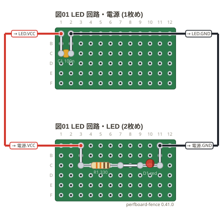

# 複数の基板 (`sheets:`)

1 つのフェンスに**基板を何枚でも**並べられる。電源の基板と負荷の基板を別々に作って、
線でつなぐときのための書き方。

**枚ごとの書き方は 1 枚の図と同じ** (`board:` `points:` `parts:` `wires:` `notes:` `style:`)。
枚をまたぐ線は `links:` に**節点の名前** (`points:` に書いた名前) で書く。
線は図の脇を通して描き、基板を出た所に行き先の札 (`→ LED.VCC`) を付ける。

```perf
title: 図01 LED 回路
board: 12x6
sheets:
  - name: 電源
    points:
      VCC: a1
      GND: a2
    parts:
      C1: capacitor c1 c2 100n
    wires:
      - a1 -- c1
      - a2 -- c2
  - name: LED
    points:
      VCC: a3
      GND: a11
    parts:
      R1: resistor c3 c7 330
      D1: led c9 c11 red
    wires:
      - a3 -- c3
      - c7 -- c9
      - c11 -- a11
links:
  - 電源.VCC LED.VCC
  - 電源.GND LED.GND
```



- `name:` は枚の名前。**図の題にもなる** (`図01 LED 回路・電源`)。枚が `title:` を持てばそちらを使う
- 外側の `board:` `style:` は、枚が書かなかったときの既定。枚が自分で書けばそちらが勝つ
- `links:` は `枚の名前.節点の名前` を 2 つ以上並べる。**ネットリストでは 1 つのネット**になる
- 線の色は、+ の電源 (`VCC`) は赤、GND は黒。ほかの線は末尾に色の名前を書ける (`- 電源.SIG LED.SIG yellow`)
- 1 つの図は 3 枚までを勧める (4 枚以上はお知らせが出る)
- 部品の名前 (`R1`) は図全体で 1 つ。枚をまたいで同じ名前を使うとエラーになる

| ネット | つながっている端子 |
| --- | --- |
| VCC | C1.1, R1.1 |
| GND | C1.2, D1.2 |
| LED.N1 | R1.2, D1.1 |
