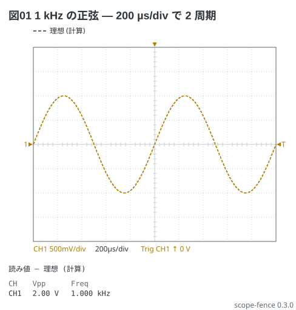
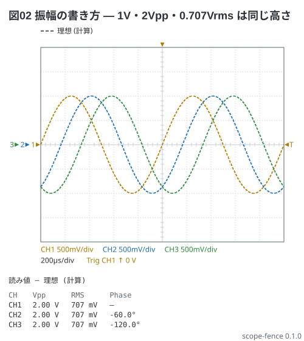
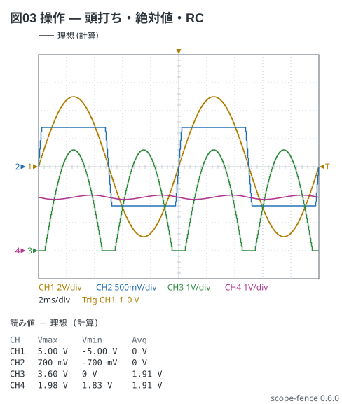
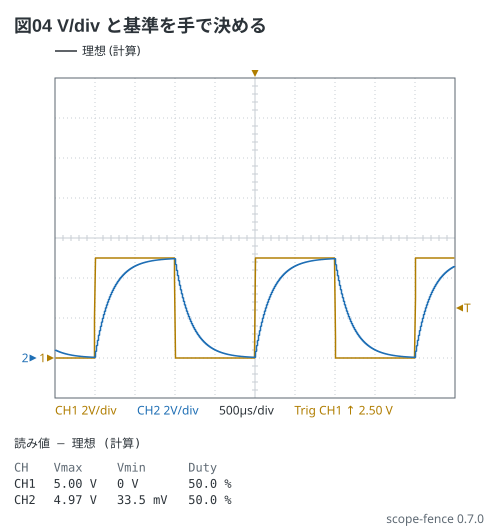
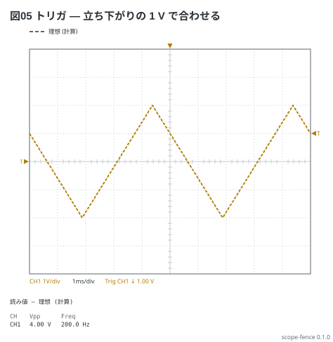
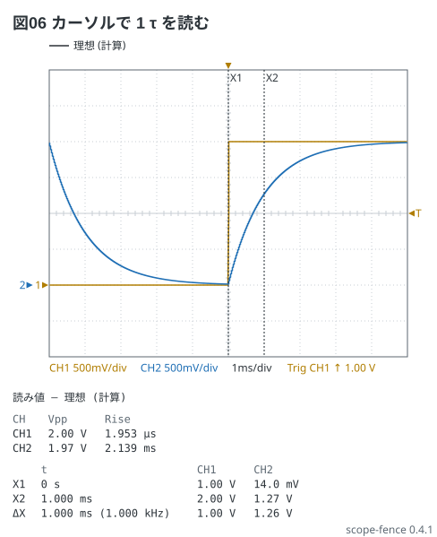
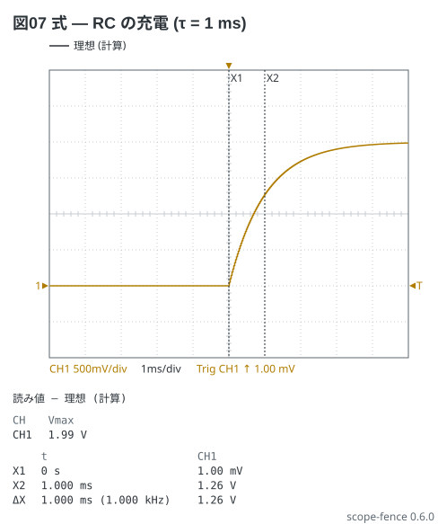
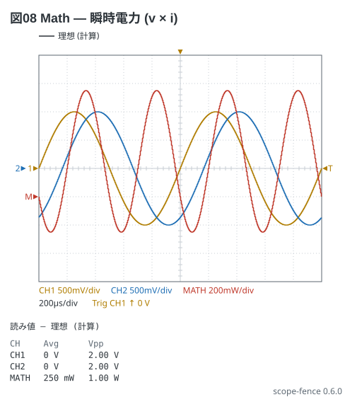
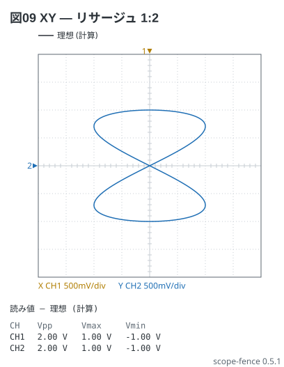

# scope フェンスの書き方

Markdown の ` ```scope ` フェンスに YAML を書くと、Markdown プレビューで
**オシロスコープの画面**になる — 時間波形・トリガ・カーソル・Measurements。
**波形発生器の波と通す操作** (`square 100Hz 1V offset 1V`、`ch1 | rc 1ms`) を書けば
測る前の「見えるはずの画面」が破線で、**測った CSV** (`data:`) を書けば実線で重なる。
ここは文法の全部。1 画面にまとめた物は [02-cheatsheet.md](02-cheatsheet.md)、
形ごとの例は [examples/](../examples/README.md) にある。

## 目次

- [画面と時間軸 (`time:`)](#画面と時間軸-time)
- [題 (`title:`)](#題-title)
- [ch と波 (`ch1:` 〜 `ch4:`)](#ch-と波-ch1--ch4)
- [操作 (`|`)](#操作-)
- [V/div と基準 (`range:` `position:`)](#vdiv-と基準-range-position)
- [トリガ (`trigger:`)](#トリガ-trigger)
- [測った値 (`data:`)](#測った値-data)
- [カーソルと Measurements (`cursors:` `measure:`)](#カーソルと-measurements-cursors-measure)
- [式 (`= …`)](#式--)
- [Math (`math:`)](#math-math)
- [XY (`view: xy` `xy:`)](#xy-view-xy-xy)
- [まだ書けないもの (注釈)](#まだ書けないもの-注釈)
- [見た目 (`style:`)](#見た目-style)
- [読み値](#読み値)
- [言われること](#言われること)
- [上限](#上限)

## 画面と時間軸 (`time:`)

画面は**横 10 目盛・縦 8 目盛**。`time:` は横の 1 目盛の時間で、**`/div` を付ける**
(`1ms/div` `200us/div` `200µs/div` `1s/div`)。`/div` の無い `1ms` は時刻と紛れるので断る。
t = 0 (トリガの点) が画面の真ん中に来る。

```scope
title: 図01 1 kHz の正弦 — 200 µs/div で 2 周期
time: 200us/div
trigger: ch1 rising 0V
ch1: sine 1kHz 1V
```



`time:` を書かなければ**一番遅い波の 2 周期が 10 目盛に入る** 1-2-5 の値で描き、
そう描いたことをお知らせで言う。

画面の上の行 (状態の行) に ch ごとの V/div、time/div、トリガ (`Trig CH1 ↑ 0 V`) が出る。
左の縁の ▶ と番号は、その ch の 0 V の高さ。

## 題 (`title:`)

図の左上に出る。本文から「図01 を見る」と指せるよう、例と文書の図には
`title: 図NN …` を付けてある (ほかのフェンスと同じ作法)。60 字まで。

## ch と波 (`ch1:` 〜 `ch4:`)

ch は 4 本まで (実機と同じ)。値は**波形発生器の波**か**前の ch の参照**に、
[操作](#操作-) を `|` で繋いだ 1 行。

```yaml
ch1: sine 1kHz 1V offset 1V phase 90deg     # 波
ch2: ch1 | rc 1ms                           # 前の ch を操作に通す
```

**波は `形 周波数 振幅` の順** (周波数と振幅は位置で決まる)。その後ろに
`offset` `phase` `duty` を順不同で足せる。

| 形 | 書き方 | t = 0 の形 |
| --- | --- | --- |
| `sine` | `sine 1kHz 1V` | 0 から上る |
| `square` | `square 100Hz 1V` | 立ち上がる |
| `triangle` | `triangle 1kHz 1V` | 底 (−振幅) |
| `sawtooth` | `sawtooth 1kHz 1V` | 底 (−振幅) |
| `pulse` | `pulse 1kHz 2.5V duty 20%` | 立ち上がる。duty を書かなければ 25 % (お知らせで言う) |
| `dc` | `dc 3.3V` | 値だけ (周波数も offset も書かない。負も 0 も書ける) |

- **周波数は接頭辞か `Hz` を付ける** (`1kHz` でも `1k` でもよい。`100Hz` `2.5MHz` `2.5M`)。
  素の `1000` は 1 kHz か 1000 Hz か決まらないので断る
- **振幅は peak** (発生器の Amplitude)。`2Vpp` と書けば半分、`0.707Vrms` は √2 倍
  (sine だけ)、`-10dBm` は 50 Ω に入れた正弦の電力を peak に直した値 (0.1 V)。
  素の `1` は 1 V か 1 Vpp か決まらないので断る
- `offset 1V` は直流を足す。`phase -58deg` (`-58°` も可) は**負が遅れ**。
  `duty 25%` は square と pulse だけ (0 % と 100 % は書けない)
- 参照できるのは**自分より前の ch だけ** (`ch2: ch1 | …` は書けて、`ch1: ch2 | …` は書けない)

```scope
title: 図02 振幅の書き方 — 1V・2Vpp・0.707Vrms は同じ高さ
time: 200us/div
trigger: ch1 rising 0V
ch1: sine 1kHz 1V
ch2: sine 1kHz 2Vpp phase -60deg
ch3: sine 1kHz 0.707Vrms phase -120deg
measure: [vpp, rms, phase]
```



3 本とも Vpp 2.00 V・RMS 707 mV。Phase は CH2 が −60.0°、CH3 が −120.0°
(基準は一番上の ch)。

## 操作 (`|`)

波や参照の後ろに `|` で繋ぎ、**書いた順に**掛ける。1 つの ch に 8 つまで。

| 操作 | 書き方 | すること |
| --- | --- | --- |
| `rc` | `rc 1ms` | 1 次の低域 (τ)。RC の C の電圧 |
| `peak` | `peak 150ms` | 山で充電して τ で放電する (`y = max(x, y·e^(−dt/τ))`)。**整流の後ろのコンデンサ入力の平滑** (τ = RL·C) |
| `clip` | `clip -0.7V 0.7V` / `clip 0V` | 頭打ち。値を 2 つ書けば両側、1 つなら下だけ (半波整流) |
| `offset` | `offset -1.4V` | 直流をずらす (ダイオードの落ち、クランパ) |
| `gain` | `gain 0.5` / `gain -1` | 倍率。**単位の無い数を受ける唯一の所** (`2dB` は断る) |
| `abs` | `abs` | 絶対値 (全波整流) |

```scope
title: 図03 操作 — 頭打ち・絶対値・RC
time: 2ms/div
trigger: ch1 rising 0V
ch1: sine 100Hz 5V
ch2: ch1 | clip -0.7V 0.7V
ch3: {wave: ch1 | abs | offset -1.4V | clip 0V, range: 1V/div, position: -3div}
ch4: {wave: ch3 | rc 20ms, range: 1V/div, position: -3div}
measure: [vmax, vmin, avg]
```



CH2 は ±0.7 V で切れる (Vmax 700 mV)。CH3 は全波整流からブリッジの 2 本ぶん 1.4 V を
引いた波 (Vmax 3.60 V、Avg 1.91 V)、CH4 はそれを τ = 20 ms で均した波 (1.83〜1.98 V)。
CH3 と CH4 は V/div と基準を揃えて重ねてある ([並びの形](#vdiv-と基準-range-position)。
Auto のままだと CH4 は脈動だけを 50 mV/div で大きく見せる)。

`rc` と `peak` の違い: `rc` は 1 次の低域 (抵抗を通して充電する)、`peak` は理想のダイオード越しに
山で一気に充電し、負荷で放電する。全波整流 (5 V の山、ブリッジで 1.2 V 落ちる) を 100 µF・1.5 kΩ で
平滑するなら `ch1 | abs | offset -1.2V | clip 0V | peak 150ms` — Vdc 3.69 V・リップル 222 mVpp
(数値解と同じ)。`rc 150ms` では形も数も違う。

理想の波は画面の幅を 8192 点で標本化して計算する。`rc` か `peak` があれば **10 τ + 1 周期の助走**
を回し、定常に入ってから画面に入る (毎回ほぼ同じ所から始まる実機の画面と同じ)。
τ が画面に比べて長すぎて定常まで回しきれないとき、τ が点の間隔より短いときはお知らせで言う。

## V/div と基準 (`range:` `position:`)

書かなければ **Auto**: V/div は Vpp が 6 目盛に入る 1-2-5 の最小、0 V の基準は
波の真ん中に近い目盛。手で決めるときは ch を**並びの形**で書く。

```yaml
ch1: {wave: square 500Hz 2.5V offset 2.5V, range: 2V/div, position: -3div}
```

| 項目 | 書き方 | 意味 |
| --- | --- | --- |
| `wave` | 1 行の書き方そのまま (操作も) | 並びの形では必ず要る |
| `range` | `500mV/div` `2V/div` (`/div` が要る) | V/div |
| `position` | `-3div` | 0 V の基準の高さ (中央が 0、上が正) |

```scope
title: 図04 V/div と基準を手で決める
time: 500us/div
trigger: ch1 rising 2.5V
ch1: {wave: square 500Hz 2.5V offset 2.5V, range: 2V/div, position: -3div}
ch2: {wave: ch1 | rc 200us, range: 2V/div, position: -3div}
measure: [vmax, vmin, duty]
```



基準の高さの差が 0.25 目盛未満の ch は、▶ と番号の組を横にずらして並べる (`2▶1▶`)。

手で書いた尺度が読みにくいときはお知らせで言う (Auto では言わない)。値は実測があれば実測、
無ければ理想の、画面の中の点で見る。

- `range:` を書いた ch の振れが **2 目盛未満** — 振れが 7 目盛以下に入る一番細かい
  1-2-5 の V/div と、波の中央を画面の中央に置く `position:` (0.5 目盛に丸める) を言う。
  例: `CH2 の振れは 1.2 目盛です (range: 200mV/div と position: -12.5div なら 6.1 目盛で中央に来ます)`。
  ただし**同じ尺度で重ねて比べる ch** (同じ `range:` と `position:` で、振れが 2 目盛以上の
  相手がいる) には言わない。入力と平滑後を重ねて小さいことを見せる図 (図03 の CH4) は
  そう書くのが正しい (比べる 2 本は同じ尺度)。同じ尺度の ch がどれも 2 目盛未満なら言う
- `range:` か `position:` を書いた ch が**画面の上か下からはみ出す** — どれだけか (目盛) と、
  入る直し方を言う。今の V/div で入るなら `position:`、入らなければ `range:` (基準はそのまま)、
  それでも入らなければ両方。例: `CH1 は画面の上に 1.0 目盛はみ出しています (position: -2.5div なら入ります)`

## トリガ (`trigger:`)

`trigger: ch 向き 水準`。向きは `rising` か `falling`、水準は単位を付ける (`1V` `-500mV`)。
水準を省けば**波形の中央** ((最大 + 最小) ÷ 2)。横切りを探して t = 0 を画面の真ん中に置く。

```scope
title: 図05 トリガ — 立ち下がりの 1 V で合わせる
time: 1ms/div
trigger: ch1 falling 1V
ch1: triangle 200Hz 2V
measure: [vpp, freq]
```



- 書かなければ**最初の ch の立ち上がり、水準は中央**で合わせ、そう言う
- 水準が波形の外なら合わせずに描き、そう言う
- 格子の右の縁の ◀ T がトリガの水準、上の縁の ▼ が t = 0
- `data:` の実測にはトリガを掛けない (WaveForms の CSV の t = 0 がトリガの点)

## 測った値 (`data:`)

`data:` に **WaveForms の Scope の Export** (`.csv` / `.txt`) のファイル名を書くと、
同じ色の**実線**で重なり、読み値は測った値になる (見出しが「実測」に変わる)。

```yaml
data: 5-1-rc.csv
```

- **`.md` と同じ場所の通常のファイルだけ**。`/` や `..` は書けず、**シンボリック
  リンクも辿らない**。1 MB・100001 行・16 列まで
- 読むのは**宿主** — CLI は入力の `.md` の隣、VS Code の拡張はプレビューしている
  文書の隣。**playground と web 版の VS Code では読めない** (お知らせで言い、理想だけ描く)
- 1 列目が `Time (s)` (`(ms)` `(us)` も)、続く列が `Channel 1 (V)` / `C1 (V)` / `CH1 (mV)`。
  `Channel N` の N で chN に当てる。`Math 1 (V)` などほかの列は読み捨てて言う。
  見出しが無ければ 2 列目から ch1、ch2 …
- `#` で始まる頭書き (機種・日時) は読み捨てる。区切りは `,` / タブ / `;`
- 時刻が戻る・間隔が揃わない (Record の分割)・小数点がコンマ、は断る (お知らせ)
- 描くのは画面の中だけ、Measurements は記録全体から (実機のバッファと同じ)。
  `time:` を書かず ch も無ければ、記録の幅 ÷ 10 を 1-2-5 に丸めた time/div で描く

例 ([examples/00-rc-charging.md](../examples/00-rc-charging.md)) に計算で作った CSV がある。

## カーソルと Measurements (`cursors:` `measure:`)

`cursors:` は時刻を 2 つまで (X1 と X2)。単位を付ける (`0` だけは単位が要らない)。
`measure:` は測る物の名前 (WaveForms の Measurements の名前)。8 つまで。

```yaml
cursors: [0, 1ms]          # - 0 / - 1ms の並びでも、1 つなら cursors: 1ms でも
measure: [vpp, freq]       # 書かなければ vpp と freq
```

| 名前 | 見出し | 測るもの |
| --- | --- | --- |
| `vpp` | Vpp | 最大 − 最小 |
| `vmax` `vmin` | Vmax Vmin | 最大・最小 |
| `avg` | Avg | 平均 (整数の周期の中で) |
| `rms` | RMS | 実効値 (整数の周期の中で。直流分も含む) |
| `freq` `period` | Freq Period | 上向きの横切りの間隔の平均。1 周期に満たなければ `—` |
| `duty` | Duty | 中央より上にいる時間の割合 |
| `phase` | Phase | **一番上の ch** に対する遅れ (−180° より上 〜 180°。負は遅れ。ちょうど半周期は 180°)。基準の ch 自身は `—` |
| `rise` | Rise | 10〜90 % の立ち上がり時間 |

横切りの水準は (最大 + 最小) ÷ 2 で、ノイズで数が増えないよう Vpp の 5 % の
ヒステリシスを付ける。**理想も実測も同じ算法**で測る。

```scope
title: 図06 カーソルで 1 τ を読む
time: 1ms/div
trigger: ch1 rising 1V
ch1: square 100Hz 1V offset 1V
ch2: ch1 | rc 1ms
cursors: [0, 1ms]
measure: [vpp, rise]
```



X1 (0) から X2 (1 ms) で CH2 は 14.0 mV から 1.27 V まで上がる (ΔX の行で 1.26 V =
2 V の 63 %)。Rise は 2.139 ms (≒ 2.2 τ)。

## 式 (`= …`)

ch の行を **`=` で始めると式**になる。波形発生器の波で書けない形 (RC の充電の式、ダイオードの式) を
そのまま書く。式の後ろにも `|` で操作を繋げる。並びの形なら `wave: = …`。

```scope
title: 図07 式 — RC の充電 (τ = 1 ms)
time: 1ms/div
trigger: ch1 rising 1mV
ch1: = 2V * step(t) * (1 - exp(-t/1ms))
cursors: [0, 1ms]
measure: [vmax]
```



X2 (1 τ) で 1.26 V (2 V の 63 %)。トリガを段の直後 (1 mV) で合わせたので、t = 0 が段の位置に来る。

| 書けるもの | 書き方 |
| --- | --- |
| 数 | **単位つき** `1V` `500mV` `1ms` `20us` `1kHz` (`Hz` まで書く)。素の数は**無次元の倍率だけ** (`2 * pi`、`/ 10`) |
| 名前 | `t` (秒)、`pi`、`ch1`〜`ch4` (**自分より前の ch だけ**) |
| 演算 | `+ - * / ^` と括弧。強い順に `^` > 単項の `-` > `* /` > `+ -` (`-2^2` は −4、`2^3^2` は 512) |
| 関数 | `sin` `cos` `exp` `abs` `sqrt` `min` `max` (2 つ以上) `clip(x, lo, hi)` `step(x)` (x ≥ 0 で 1、負で 0) |

**単位 (V と s) を数える。** `sin` `cos` `exp` の中は無次元、`+ -` と `min` `max` `clip` の中は同じ単位、
**ch の式の結果は V**。合わなければ断る — 周波数を素の数で書いた `sin(2*pi*1000*t)` は
「sin の中は無次元にします (いまは s)」、`5 * exp(-t/1ms)` は「電圧 (V) にします」と言われる。
`0` も `max(ch1, 0V)` のように単位を付ける。

計算できない点 (0 で割る・負の平方根・桁あふれ) は 0 で描き、何点あったかをお知らせで言う。
式は 200 字・入れ子 (括弧・符号・`^`) 16 段まで。`t` は波の t と同じ (トリガで同じだけずれる)。

## Math (`math:`)

**5 本目の線。** 実機の Math チャンネルと同じで、ch の後に 1 回計算する。**`math:` はいつも式**
(`=` は付けない)。参照できるのは書いた ch 全部。色は ch の 4 色と別、基準の印は `M`。
並びなら `{expr: …, unit: …, range: …, position: …}`。

```scope
title: 図08 Math — 瞬時電力 (v × i)
time: 200us/div
trigger: ch1 rising 0V
ch1: sine 1kHz 1V
ch2: sine 1kHz 1V phase -60deg
math: {expr: ch1 * ch2, unit: W, range: 200mW/div, position: -1div}
measure: [avg, vpp]
```



MATH の Avg 250 mW = (1 × 1 / 2) × cos 60°。

**単位は書き手が `unit:` で言う** — `V` (既定)・`W`・`1` (無次元)。道具は掛け算の結果の単位を
推定しない。式の単位 (`ch1 * ch2` は V^2) と `unit:` が合わなければ、どの単位で出したかをお知らせで言う
(W は V^2 — 抵抗を素の数で割った `ch1 * ch2 / 10` のような式)。`range:` は unit の単位で書く
(`200mW/div`、無次元は `0.5/div`)。Measurements とカーソルの表の `MATH` の行も unit の単位で出る。
`data:` があっても Math は理想の ch から計算する (見出しに「MATH は理想」と出る)。

## XY (`view: xy` `xy:`)

`view: xy` で**横と縦に 2 本の線を取る画面**になる — リサージュ、ダイオードの V–I の曲線。
軸は `xy: 横 縦` (ch1〜ch4 か math)。書かなければ横 ch1・縦 ch2 (お知らせで言う)。

```scope
title: 図09 XY — リサージュ 1:2
view: xy
ch1: sine 2kHz 1V
ch2: sine 1kHz 1V
xy: ch1 ch2
```



- 格子は **8 × 8**。軸ごとに Auto の 1-2-5 (ch の `range:` `position:` を書けばそれ)。0 の基準は
  縦が左の `▶`、横が上の `▼`
- 読み値は各軸の **Vpp・Vmax・Vmin** (V–I の曲線は端の値 — 順電圧・最大電流 — を読む)
- 標本化するのは**周波数の揃う最短の時間** (1 kHz と 1.5 kHz なら 2 ms)。閉じた曲線はちょうど 1 周する
- XY に時間軸は無いので `time:` `trigger:` `cursors:` `measure:` は断る。実測の XY はまだ重ねられない
  (`data:` も断る)

## まだ書けないもの (注釈)

`notes:` は**キーの名前だけ予約してあり、書くと「まだ書けません」と断る** (黙って捨てない)。

## 見た目 (`style:`)

| 項目 | 書くもの | 既定 |
| --- | --- | --- |
| `theme` | `light` `dark` `mono` (白黒で刷る) | `light` |
| `width` | 図の幅 (px、120〜4000) | 描いた大きさ |
| `stamp` | 右下に処理系の版を刻む (`on` / `off`) | `on` |
| `debug` | お知らせを図の下の帯に出す (`on` / `off`) | `on` |

テーマだけなら `style: dark` と 1 語で書ける。ch の色は実機の並び
(黄・水色・緑・桃。白い地では濃くしてある)。

## 読み値

図の下の表は、ch ごとに**`data:` に列があれば測った値**、無ければ**理想の波から
測った値**。見出しにどちらかを書く
(「読み値 — 理想 (計算)」「読み値 — 実測 (5-1-rc.csv)」。混ざれば「… CH3 は理想」と足す)。書式は WaveForms と
同じ (電圧は有効 3 桁 `2.00 V` `700 mV`、時間と周波数は有効 4 桁 `1.000 ms` `100.0 Hz`、
位相は `-58.0°`、duty は `50.0 %`)。測れない値は `—`。

カーソルの表は X1・X2 の時刻と各 ch の電圧、ΔX の行に時間差 (と `1 / ΔX`) と電圧の差。

CLI の `check` / `render` は同じ表を標準出力に出す。**図を見る前に、この数を本文の
「見るべき値」の表と突き合わせる**。

```bash
npx scope-fence check examples
```

## 言われること

読めなかった行は図の下の帯に、**行番号・行の中身・綴りを指す印**つきで出る。
格子は必ず描く (読めた所まで)。お知らせ (読めているが思ったとおりに出ない) は
同じ帯に、弱く出る。

| 言われること | 種類 |
| --- | --- |
| 知らないキー・知らない波や操作や測り方・単位の無い数・範囲の外 | 読めない |
| 後ろの ch の参照、読めない ch の参照、書かれていない ch へのトリガ | 読めない |
| 同じキーが 2 つ | 読めない |
| 式の単位が合わない (`sin` の中に s、ch の式が V でない、`+` の両側が別の単位)・知らない関数や名前 | 読めない |
| `view: xy` で `time:` `trigger:` `cursors:` `measure:` `data:`、`view: time` で `xy:`、書かれていない軸 | 読めない |
| `time:` `trigger:` `xy:` を書かなかった (何で描いたか)、pulse の duty の既定 | お知らせ |
| 式が計算できない点 (0 で割るなど)、Math の式の単位と `unit:` が合わない | お知らせ |
| トリガの水準が波形の外、カーソルが画面の外 | お知らせ |
| `rc` `peak` の τ が長すぎて定常まで回らない・点の間隔より短い | お知らせ |
| 手で書いた `range:` で振れが 2 目盛未満 (同じ尺度で振れの大きい相手と重ねた ch は除く)、`range:` `position:` で画面の上か下からはみ出す (直す値つき) | お知らせ |
| `data:` が読めない・見つからない・画面の中に点が無い・読み捨てた列 | お知らせ |

わざと読めなく書いた例は [examples/errors/](../examples/errors/01-unreadable.md)。

## 上限

| 何 | 上限 |
| --- | --- |
| ch | 4 (実機と同じ) |
| 1 つの ch の操作 | 8 |
| 式 | 200 字・入れ子 16 段 |
| 画面の点 | 8192 (WaveForms の既定の Buffer) |
| time/div | 1 ns/div〜60 s/div |
| V/div | 1 µV/div〜10 kV/div |
| 周波数 | 1 GHz |
| 電圧 (振幅 + offset) | ±1 MV |
| カーソル | 2 (X1 と X2) |
| Measurements | 8 |
| `data:` | 1 MB・100001 行・16 列 |
| 題 | 60 字 |
