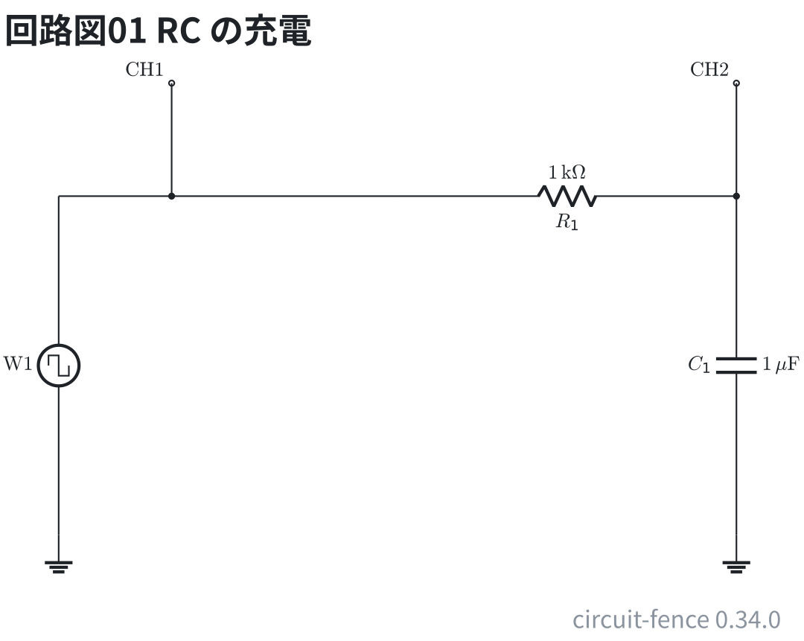
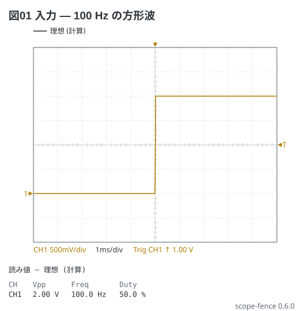
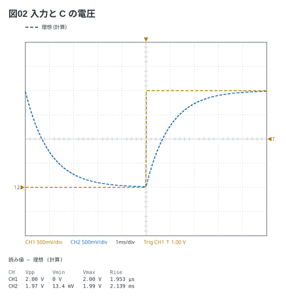
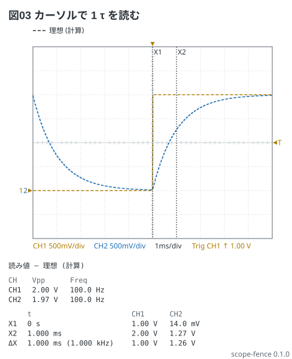
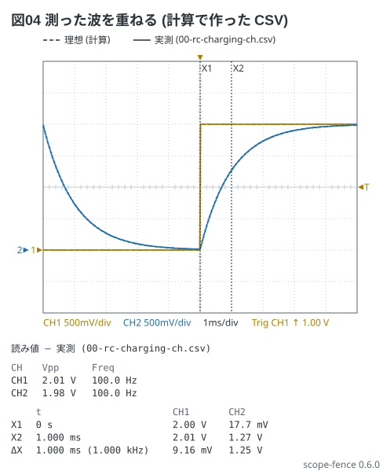

# RC の充電 — 見えるはずの画面

電験 5-1 の題。方形波 (0〜2 V、100 Hz) を τ = 1 ms の RC に入れ、CH1 に入力、CH2 に
C の電圧を見る。**計器の設定の表と同じ語**で書くと、フェンスが波形を計算して破線で描く。

入力だけ。0〜2 V の方形波が 500 mV/div で 4 目盛の高さに出る (0 V の基準 ▶1 は中央から −2 目盛)。

回路は 1 kΩ と 1 µF の RC (τ = 1 ms) で、方形波は Analog Discovery の Wavegen (W1) から入れる。CH1 は入力、CH2 は C の電圧に当てる。

```circuit
title: 回路図01 RC の充電
parts:
  W1: square 1,2 1,5 l=$\mathrm{W1}$
  G1: ground 1,5
  CH1: port 2,1
  R1: resistor 4,2 7,2 1k
  C1: capacitor 7,2 7,5 1u
  G2: ground 7,5
  CH2: port 7,1
wires:
  - 1,2 -- 2,2
  - 2,2 -- 4,2
  - 2,1 -- 2,2
  - 7,1 -- 7,2
```



```scope
title: 図01 入力 — 100 Hz の方形波
time: 1ms/div
trigger: ch1 rising 1V
ch1: square 100Hz 1V offset 1V
measure: [vpp, freq, duty]
```



入力と出力。CH2 は `ch1 | rc 1ms` — CH1 を τ = 1 ms の RC に通した波。半周期 (5 ms = 5 τ) で
ほぼ 0 V まで戻るので、Vpp は 2 V に少し届かない (1.97 V)。

```scope
title: 図02 入力と C の電圧
time: 1ms/div
trigger: ch1 rising 1V
ch1: square 100Hz 1V offset 1V
ch2: ch1 | rc 1ms
measure: [vpp, vmin, vmax, rise]
```



カーソルで 1 τ の値を読む。X1 を立ち上がり (0)、X2 を 1 ms に置くと、CH2 は
0.014 V から 1.27 V まで上がる (差 1.26 V = 2 V の 63 %)。

```scope
title: 図03 カーソルで 1 τ を読む
time: 1ms/div
trigger: ch1 rising 1V
ch1: square 100Hz 1V offset 1V
ch2: ch1 | rc 1ms
cursors: [0, 1ms]
measure: [vpp, freq]
```



測った波を重ねる。WaveForms の Scope で **Export → CSV** したファイルを `.md` の隣に置き、
`data:` に名前を書くと実線で重なり、読み値の帯は**測った値**になる (見出しが「実測」に変わる)。
ここの `00-rc-charging-ch.csv` は**計算で作った値** (理想にノイズ ±5 mV と ADC の刻みを足した物。
`scripts/fakeData.mjs`) で、実測ではない。

```scope
title: 図04 測った波を重ねる (計算で作った CSV)
time: 1ms/div
trigger: ch1 rising 1V
ch1: square 100Hz 1V offset 1V
ch2: ch1 | rc 1ms
data: 00-rc-charging-ch.csv
cursors: [0, 1ms]
measure: [vpp, freq]
```


