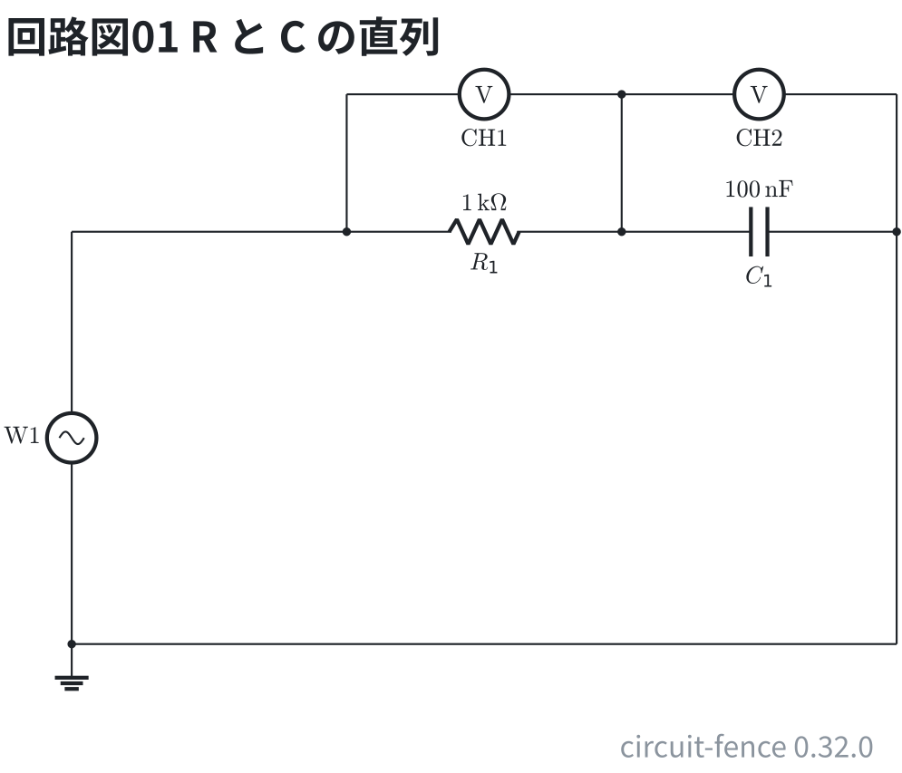
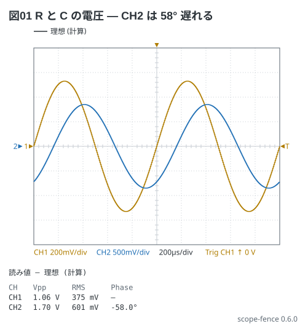
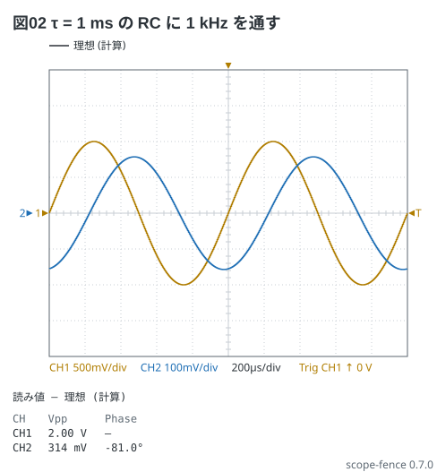

# RC 直列の位相 — CH2 は 58° 遅れる

電験 3-4 の題。1 kHz の正弦を R と C の直列に入れ、CH1 に R の電圧、CH2 に C の電圧を
見る。見るべき値の表 (0.53 V、0.85 V、−58°) をそのまま書く。`phase -58deg` は**遅れ**。

回路は 1 kΩ と 100 nF の直列 (1 kHz で R の電圧 : C の電圧 = 1 : 1.6)。CH1 は R、CH2 は C の電圧に当てる。

```circuit
title: 回路図01 R と C の直列
parts:
  W1: sine b1 e1 l=$\mathrm{W1}$
  G1: ground e1
  R1: resistor b3 b5 1k
  C1: capacitor b5 b7 100n
  M1: voltmeter a3 a5 l=$\mathrm{CH1}$
  M2: voltmeter a5 a7 l=$\mathrm{CH2}$
wires:
  - b1 -- b3
  - a3 -- b3
  - a5 -- b5
  - a7 -- b7
  - b7 -- e7
  - e7 -- e1
```



```scope
title: 図01 R と C の電圧 — CH2 は 58° 遅れる
time: 200us/div
trigger: ch1 rising
ch1: sine 1kHz 0.53V
ch2: sine 1kHz 0.85V phase -58deg
measure: [vpp, rms, phase]
```



同じことを RC で計算させる。`ch2: ch1 | rc 1ms` は τ = 1 ms の低域 — 1 kHz では
利得 0.157、位相 −81°。

```scope
title: 図02 τ = 1 ms の RC に 1 kHz を通す
time: 200us/div
trigger: ch1 rising
ch1: sine 1kHz 1V
ch2: ch1 | rc 1ms
measure: [vpp, phase]
```


