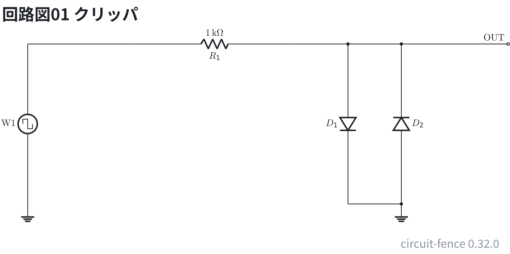
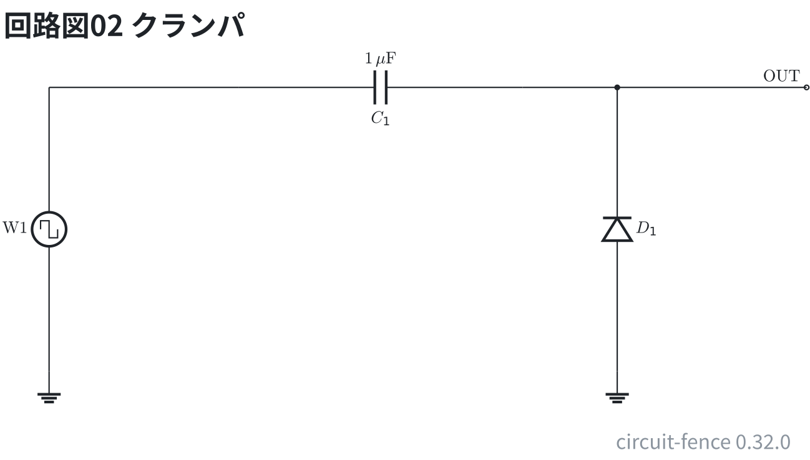

# クリッパとクランパ — 方形波を加工する

回路 1-9 の題。±5 V の方形波をダイオードで加工する。ダイオードの順電圧は 0.7 V とみる。

クリッパ: 2 本のダイオードで ±0.7 V に頭を打つ (`clip -0.7V 0.7V`)。

クリッパは 1 kΩ の後ろにダイオードを逆向きに 2 本並べて地へ落とす。

```circuit
title: 回路図01 クリッパ
parts:
  W1: square b1 e1 l=$\mathrm{W1}$
  G1: ground e1
  R1: resistor b3 b6 1k
  D1: diode b7 e7
  D2: diode e8 b8
  G2: ground e8
  OUT: port b10
wires:
  - b1 -- b3
  - b6 -- b7
  - b7 -- b8
  - e7 -- e8
  - b8 -- b10
```



```scope
title: 図01 クリッパの入出力
time: 200us/div
trigger: ch1 rising
ch1: square 1kHz 5V
ch2: ch1 | clip -0.7V 0.7V
measure: [vmax, vmin]
```


クランパ: C とダイオードで下の端を −0.7 V に揃える (`offset 4.3V`)。
CH2 は −0.7〜9.3 V。0 V の基準が違うので、ch ごとの V/div と ▶ の位置を見て読む。

クランパはコンデンサを直列に入れ、出力と地の間にダイオードを 1 本つなぐ。

```circuit
title: 回路図02 クランパ
parts:
  W1: square b1 e1 l=$\mathrm{W1}$
  G1: ground e1
  C1: capacitor b3 b6 1u
  D1: diode e7 b7
  G2: ground e7
  OUT: port b9
wires:
  - b1 -- b3
  - b6 -- b7
  - b7 -- b9
```



```scope
title: 図02 クランパの入出力
time: 200us/div
trigger: ch1 rising
ch1: square 1kHz 5V
ch2: ch1 | offset 4.3V
measure: [vmax, vmin]
```


