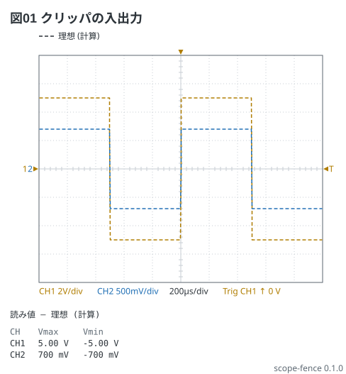
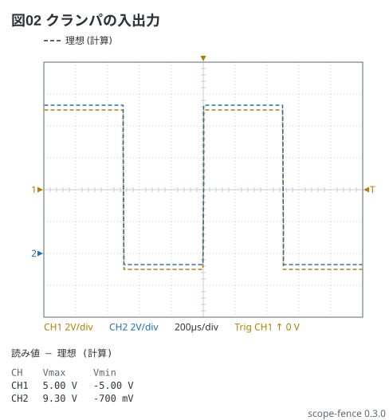

# クリッパとクランパ — 方形波を加工する

回路 1-9 の題。±5 V の方形波をダイオードで加工する。ダイオードの順電圧は 0.7 V とみる。

クリッパ: 2 本のダイオードで ±0.7 V に頭を打つ (`clip -0.7V 0.7V`)。

```scope
title: 図01 クリッパの入出力
time: 200us/div
trigger: ch1 rising
ch1: square 1kHz 5V
ch2: ch1 | clip -0.7V 0.7V
measure: [vmax, vmin]
```



クランパ: C とダイオードで下の端を −0.7 V に揃える (`offset 4.3V`)。
CH2 は −0.7〜9.3 V。0 V の基準が違うので、ch ごとの V/div と ▶ の位置を見て読む。

```scope
title: 図02 クランパの入出力
time: 200us/div
trigger: ch1 rising
ch1: square 1kHz 5V
ch2: ch1 | offset 4.3V
measure: [vmax, vmin]
```


