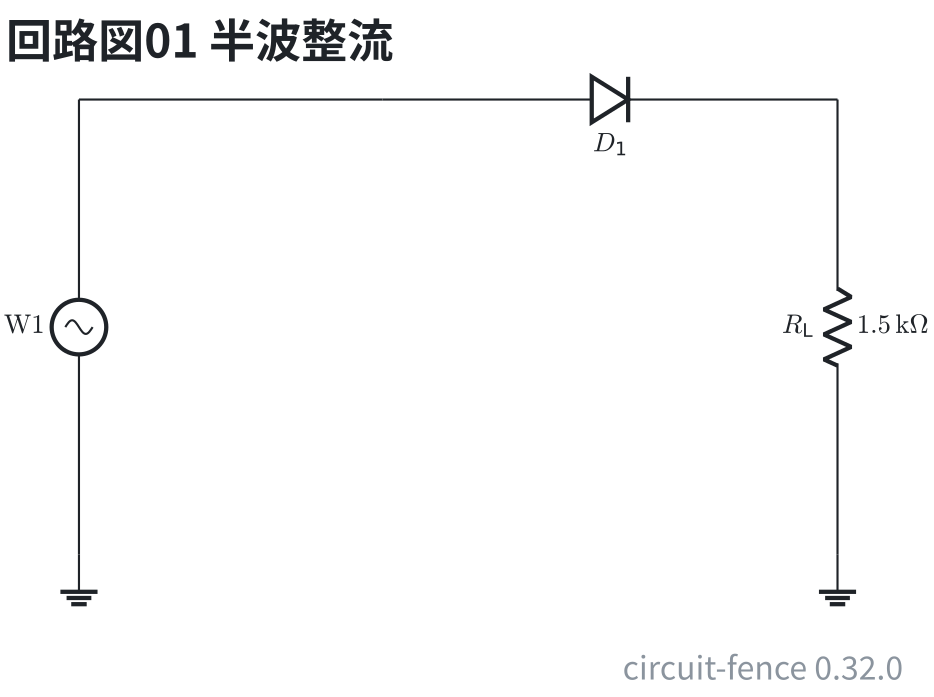
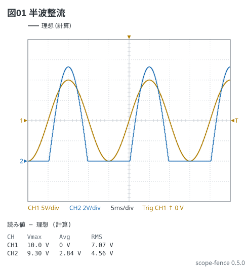
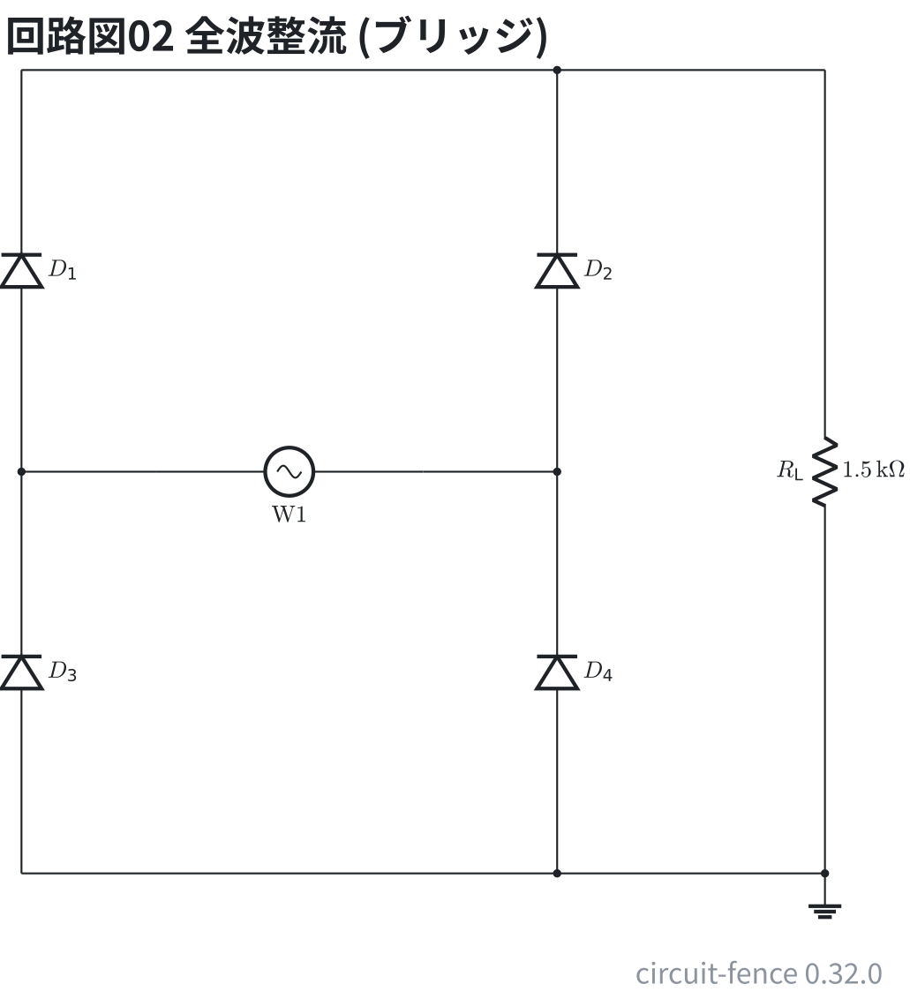
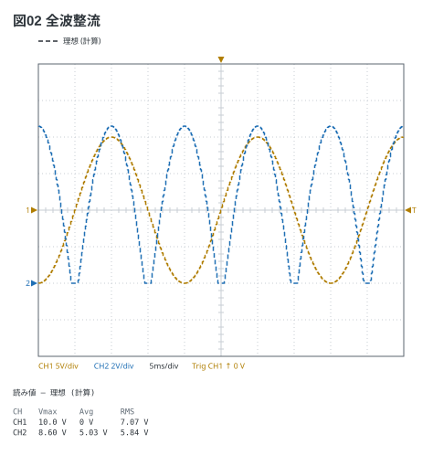
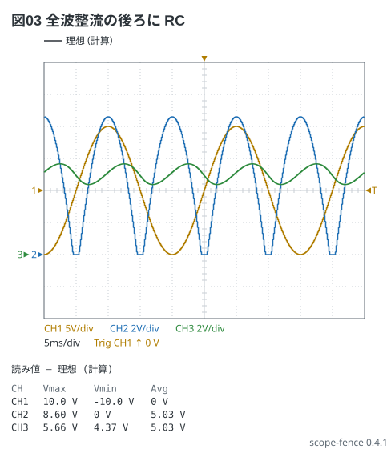
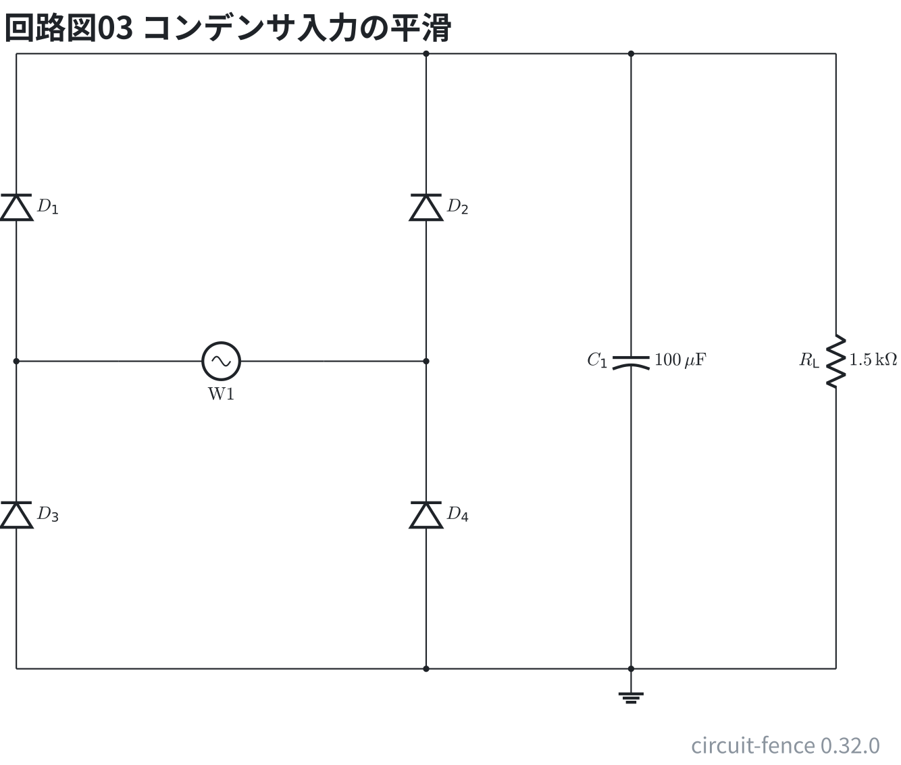
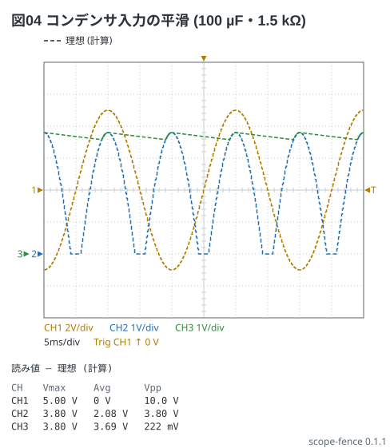

# 整流と平滑

50 Hz、10 V の正弦を整流する。ダイオードの順電圧 (0.7 V) は `offset -0.7V` で引く。

半波整流: 負の側を切る (`clip 0V` は下だけを切る)。

```circuit
title: 回路図01 半波整流
parts:
  W1: sine b1 e1 l=$\mathrm{W1}$
  G1: ground e1
  D1: diode b3 b6
  RL: resistor b6 e6 1.5k
  G2: ground e6
wires:
  - b1 -- b3
```



```scope
title: 図01 半波整流
time: 5ms/div
trigger: ch1 rising
ch1: sine 50Hz 10V
ch2: ch1 | clip 0.7V | offset -0.7V
measure: [vmax, avg, rms]
```



全波整流 (ブリッジ): 絶対値からダイオード 2 本ぶん (1.4 V) を引く。

ブリッジはダイオード 4 本で、交流の両方の向きを同じ向きの電流にそろえる。

```circuit
title: 回路図02 全波整流 (ブリッジ)
parts:
  W1: sine e4 e6 l=$\mathrm{W1}$
  D1: diode e3 b3
  D2: diode e7 b7
  D3: diode h3 e3
  D4: diode h7 e7
  RL: resistor b9 h9 1.5k
  G1: ground h9
wires:
  - e3 -- e4
  - e6 -- e7
  - b3 -- b7
  - b7 -- b9
  - h3 -- h7
  - h7 -- h9
```



```scope
title: 図02 全波整流
time: 5ms/div
trigger: ch1 rising
ch1: sine 50Hz 10V
ch2: ch1 | abs | clip 1.4V | offset -1.4V
measure: [vmax, avg, rms]
```



平滑: 全波整流の後ろに τ = 10 ms の RC を置いた目安 (`| rc 10ms`)。実際の平滑コンデンサは
充電が速く放電が遅いが、ここでは 1 次の RC で形だけを見る。CH2 と CH3 は**同じ V/div と基準**に
揃えて重ねる (Auto のままだと CH3 はリプルだけを拡大して 0 V が画面の外に出る)。

```scope
title: 図03 全波整流の後ろに RC
time: 5ms/div
trigger: ch1 rising
ch1: sine 50Hz 10V
ch2: {wave: ch1 | abs | clip 1.4V | offset -1.4V, range: 2V/div, position: -2div}
ch3: {wave: ch2 | rc 10ms, range: 2V/div, position: -2div}
measure: [vmax, vmin, avg]
```



コンデンサ入力の平滑: 全波整流 (5 V の山、ブリッジで 1.2 V 落ちる) を 100 µF で受け、1.5 kΩ に
流す。コンデンサは山で一気に充電され、谷の間は τ = RL·C = 150 ms で放電する — これが
`| peak 150ms` (上の RC の目安と違い、形も数も数値解と合う: Vdc 3.69 V・リップル 222 mVpp)。

次の図 04 の回路は、ブリッジの後ろに 100 µF と 1.5 kΩ を並べたもの。

```circuit
title: 回路図03 コンデンサ入力の平滑
parts:
  W1: sine e4 e6 l=$\mathrm{W1}$
  D1: diode e3 b3
  D2: diode e7 b7
  D3: diode h3 e3
  D4: diode h7 e7
  C1: ecap b9 h9 100u
  RL: resistor b11 h11 1.5k
  G1: ground h9
wires:
  - e3 -- e4
  - e6 -- e7
  - b3 -- b7
  - b7 -- b9
  - b9 -- b11
  - h3 -- h7
  - h7 -- h9
  - h9 -- h11
```



```scope
title: 図04 コンデンサ入力の平滑 (100 µF・1.5 kΩ)
time: 5ms/div
trigger: ch1 rising
ch1: sine 50Hz 5V
ch2: {wave: ch1 | abs | offset -1.2V | clip 0V, range: 1V/div, position: -2div}
ch3: {wave: ch2 | peak 150ms, range: 1V/div, position: -2div}
measure: [vmax, avg, vpp]
```


