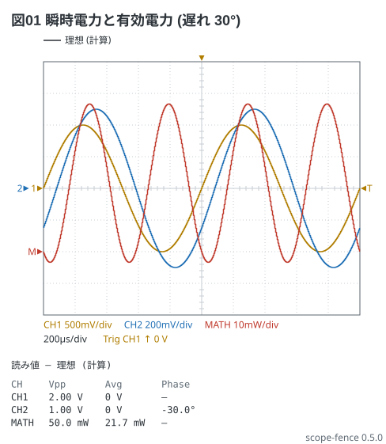
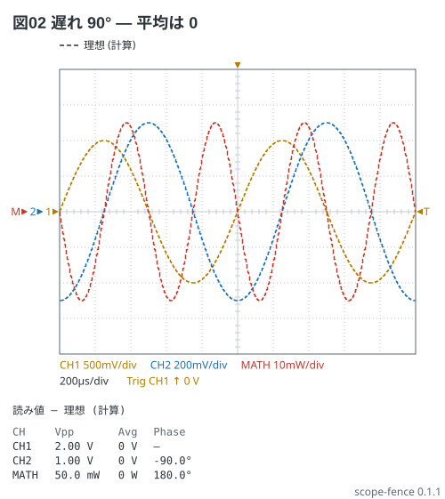

# 交流の電力 (Math)

電験 3-6。負荷の電圧 v を CH1、10 Ω の電流検出抵抗の電圧を CH2 で測ると、電流は
i = CH2 / 10 Ω。瞬時電力 p = v × i は **Math** (`math: ch1 * ch2 / 10`) で描き、
**その平均 (Avg) が有効電力 P** になる。単位は道具が推定しないので `unit: W` と書く
(書かなければ V で出て、式が V^2 だとお知らせが出る)。

電流は電圧より 30° 遅れる (誘導性の負荷)。P = (1 V × 50 mA / 2) × cos 30° = 21.7 mW。

```scope
title: 図01 瞬時電力と有効電力 (遅れ 30°)
time: 200us/div
trigger: ch1 rising 0V
ch1: sine 1kHz 1V
ch2: sine 1kHz 500mV phase -30deg
math: {expr: ch1 * ch2 / 10, unit: W, range: 10mW/div, position: -2div}
measure: [vpp, avg, phase]
```



MATH の Avg が P (21.7 mW)。p は電源の 2 倍の周波数で振れ、遅れがあると一部の時間で負になる
(負荷から電源へ返す)。遅れ 90° なら Avg は 0 (無効電力だけ)。

```scope
title: 図02 遅れ 90° — 平均は 0
time: 200us/div
trigger: ch1 rising 0V
ch1: sine 1kHz 1V
ch2: sine 1kHz 500mV phase -90deg
math: {expr: ch1 * ch2 / 10, unit: W, range: 10mW/div, position: 0div}
measure: [vpp, avg, phase]
```


