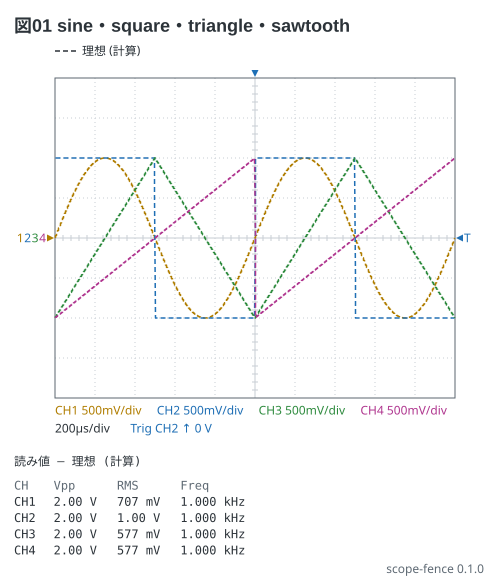
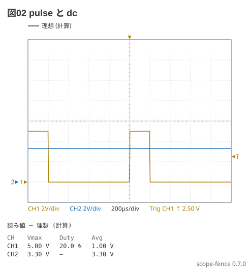

# 波形発生器の波 6 種

波は **sine / square / triangle / sawtooth / pulse / dc**。振幅は peak (発生器の
Amplitude) — `2Vpp` と書けば半分、`0.707Vrms` は sine だけ。`offset` `phase` `duty` は順不同。
t = 0 の形は発生器に揃えてある: sine は 0 から上る、square と pulse は t = 0 で立ち上がる、
triangle と sawtooth は t = 0 で底。

```scope
title: 図01 sine・square・triangle・sawtooth
time: 200us/div
trigger: ch2 rising
ch1: sine 1kHz 1V
ch2: square 1kHz 1V
ch3: triangle 1kHz 1V
ch4: sawtooth 1kHz 1V
measure: [vpp, rms, freq]
```



pulse は duty を書く (書かなければ 25 %)。dc は値だけ。V/div と 0 V の基準を手で決めるときは
並びで書く (`range:` と `position:`)。

```scope
title: 図02 pulse と dc
time: 200us/div
trigger: ch1 rising
ch1: {wave: pulse 1kHz 2.5V offset 2.5V duty 20%, range: 2V/div, position: -3div}
ch2: {wave: dc 3.3V, range: 2V/div, position: -3div}
measure: [vmax, duty, avg]
```


